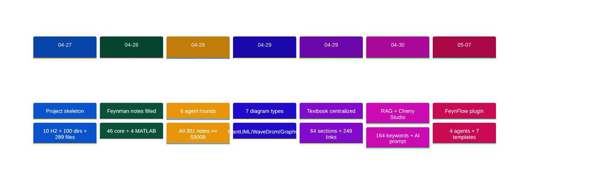
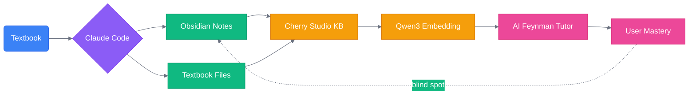
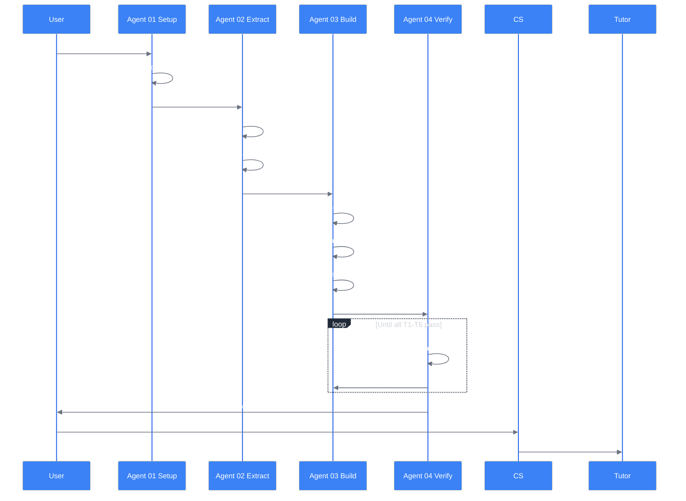
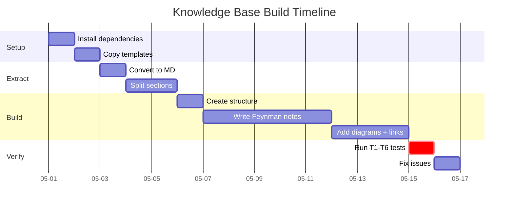
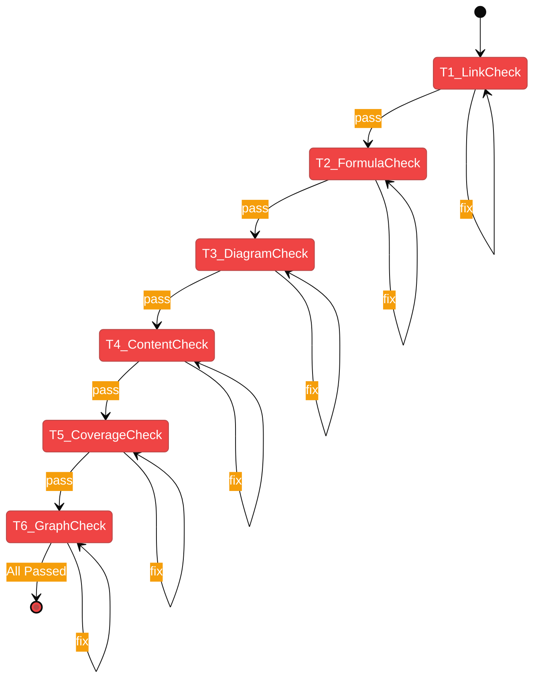
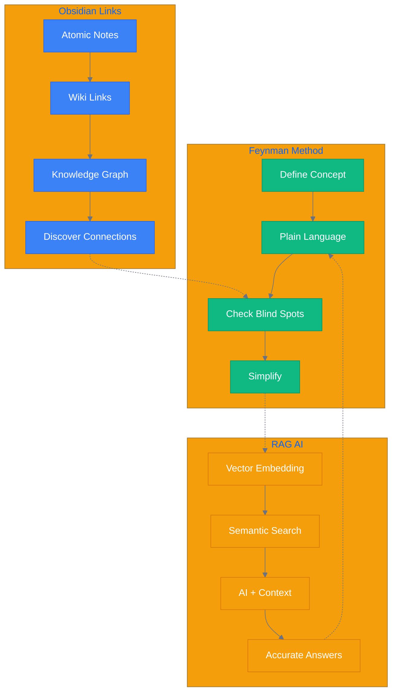

[English](README.en.md) | [中文](README.md) | [Español](README.es.md)

---

# FeynFlow — Feynman + Workflow

> **Feynman + Workflow**: Claude Code generates Obsidian notes → Cherry Studio RAG → AI Feynman Tutor interactive teaching.
>
> Turn any textbook into an AI Feynman tutor knowledge base. Full toolchain out of the box.

---

## 🧠 What is FeynFlow

FeynFlow is an **automated textbook-to-AI-knowledge-graph toolchain**. It transforms linear textbook content into an interactive knowledge network that AI can search and teach from.

| Traditional Learning | FeynFlow Way |
|--------------------|-------------|
| Read, highlight, take notes yourself | AI auto-generates Feynman notes, you just learn |
| Check answers or ask teachers | AI tutor guides you with Feynman method |
| Knowledge is isolated | Every concept has `[[bidirectional links]]` forming a knowledge graph |
| Review the whole book | AI precisely retrieves knowledge via RAG |
| Notes are for yourself only | Notes are also teaching material for AI |

### Comparison

| Method | Requires | Effect | Cost |
|--------|----------|--------|------|
| Manual Obsidian notes | Time + discipline | Depends on person | $0 |
| Raw ChatGPT | No knowledge base | May hallucinate | $20/mo |
| RAG + textbook PDF | Vector DB | Imprecise retrieval | Varies |
| **FeynFlow** ✅ | **Textbook only** | **Feynman+Graph+AI** | **Nearly free** |

---

## 📖 Origin Story

> I found the Feynman-method AI prompts incredibly effective: first life analogies, then questions to make you think, then diagrams based on my responses. When I struggled with my electromagnetic fields course, I thought: can AI help me learn systematically? So Claude Code generates Obsidian notes from the textbook → Cherry Studio reads it as a knowledge base → local embedding models (nearly free) → AI Feynman tutor teaches interactively.

**Core idea**: You're not just building a note library — you're building an **interactive knowledge graph** that an AI tutor can search and teach from.

### Development Timeline



---

## 🔧 Toolchain



### Agent Sequence



### Pipeline Breakdown

| Stage | Tool | Output | Description |
|-------|------|--------|-------------|
| 1. Setup | `01-setup` + Pandoc | Project skeleton | Check deps, search materials |
| 2. Extract | `02-extract` | `Textbook Originals/` | Split into section files |
| 3. Build | `03-build` | Notes + diagrams + MOC | Feynman fill + 7 diagram types |
| 4. Verify | `04-verify` | Quality report | 6 tests T1-T6, auto-fix |
| 5. Teach | Cherry Studio + AI | Interactive learning | Local embedding + AI tutor |

### Build Timeline



---

## 📦 Package Contents

```
FeynFlow/
├── README.md / .en.md / .es.md   # Multi-language docs
├── plugin.json                    # Plugin metadata
├── agents/
│   ├── 01-setup.agent.md          # Environment setup
│   ├── 02-extract.agent.md        # Extract textbook
│   ├── 03-build.agent.md          # Build notes + diagrams
│   └── 04-verify.agent.md         # 6 tests T1-T6 + auto-fix
├── templates/                     # 7 Obsidian templates
├── hooks/
└── examples/
    └── 电磁场与电磁波/              # Full example (511 files)
```

---

## 🚀 Quick Start

### Prerequisites

| Software | Purpose | Install |
|----------|---------|---------|
| **Pandoc** ⚠️ Required | Textbook → Markdown | `winget install pandoc`(Win) / `brew install pandoc`(Mac) |
| **Claude Code** | Run agents | `npm install -g @anthropic-ai/claude-code` |

```bash
git clone https://github.com/3229218431/FeynFlow.git
cd FeynFlow
cp -r skeleton/* ../my-subject/
cd ../my-subject
claude ../FeynFlow/agents/01-setup.agent.md
claude ../FeynFlow/agents/02-extract.agent.md
claude ../FeynFlow/agents/03-build.agent.md
claude ../FeynFlow/agents/04-verify.agent.md
```

---

## 🧠 Note Quality Standards

| Level | Size | Cognitive | Feynman Step | Usage |
|-------|------|-----------|-------------|-------|
| ★ Basic | 3000-6000 B | Remember+Understand | 1-2 | Advanced topics |
| ★★ Applied | 6000-10000 B | Understand+Apply | 1-3 | Core concepts |
| ★★★ Master | 10000-15000 B | Analyze+Synthesize | 1-4 | Hub chapters |

Every note structure:
```
**Keywords**: tags → RAG optimization
## Textbook Original → [[§link]]
## Concept Definition (Feynman Step 1) → one sentence
## Analogy (Feynman Step 2) → life metaphor
## Core Formula ($$ + symbol table)
## Derivation (Mermaid/PlantUML)
## Common Mistakes (Feynman Step 3)
## Feynman Check (Feynman Step 4) → self-test
## Concept Navigation → [[wiki links]]
## My Understanding → user fills in
```

---

## 🧪 6 Quality Tests (T1-T6)



---

## 📊 Example: EM Fields & Waves

`examples/电磁场与电磁波/` is a complete working example:

| Metric | Value |
|--------|-------|
| Textbook chapters | 1-8 |
| Textbook original files | **64** § files |
| Concept notes | **328** |
| RAG keywords | **166** |
| Bidirectional links | **262** |
| Mermaid diagrams | **112** |
| PlantUML diagrams | **30** |
| Total diagrams | **~250** |
| Min note size | 5000+ bytes |
| Git commits | 45 |
| Build iterations | 6 agent loops |

---

## 🎯 Why Feynman + Obsidian + RAG Works



---

## 📐 Quality Dimensions

| Dimension | Requirement | Enforcement |
|-----------|-------------|-------------|
| Completeness | Every § has a note | Agent 02 + T5 |
| Accuracy | Based on textbook original | `## Textbook → [[§link]]` |
| Connectivity | ≥3 `[[links]]` per note | Agent 03 + T1 |
| Searchability | `**Keywords**` in every note | Agent 03 |
| Visualization | ≥1 diagram per note | Agent 03 |
| Testability | Feynman self-test questions | Template enforced |

---

## 🔗 Links

- GitHub: [https://github.com/3229218431/FeynFlow](https://github.com/3229218431/FeynFlow)
- Example: `examples/电磁场与电磁波/`

---

[English](README.en.md) | [中文](README.md) | [Español](README.es.md)
