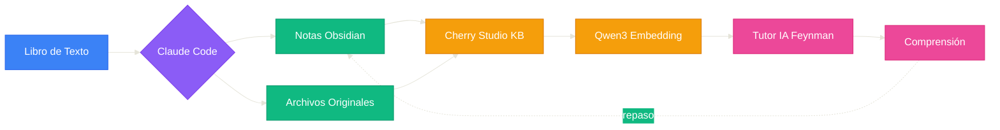

[English](README.en.md) | [中文](README.md) | [Español](README.es.md)

---

# FeynFlow — Feynman + Workflow

> **Feynman + Workflow**：Claude Code genera notas Obsidian → Cherry Studio RAG → Tutor IA Feynman interactivo.
>
> Convierte cualquier libro de texto en una base de conocimiento con tutor IA.

---

## 🧠 Qué es FeynFlow

FeynFlow es un **generador automatizado de libros de texto a grafos de conocimiento IA**. Transforma el texto lineal de un libro en una red de conocimiento interactiva que la IA puede buscar y usar para enseñar.

| Aprendizaje tradicional | Con FeynFlow |
|------------------------|-------------|
| Leer, subrayar, tomar notas | IA genera notas Feynman automáticamente |
| Buscar respuestas en soluciones | Tutor IA guía con método Feynman |
| Conceptos aislados | `[[enlaces bidireccionales]]` forman grafo |
| Repasar todo el libro | IA recupera conocimiento preciso vía RAG |

---

## 📖 Historia

> Descubrí que los prompts IA con método Feynman son muy efectivos: analogías cotidianas, preguntas para pensar, diagramas según mis respuestas. Cuando tuve dificultades con campos electromagnéticos, pensé: ¿puede la IA ayudarme a aprender sistemáticamente? Claude Code genera notas Obsidian → Cherry Studio las lee como base de conocimiento → embedding local (gratis) → tutor IA Feynman.

---

## 🔧 Flujo de Trabajo



## 📦 Contenido

| Componente | Propósito |
|-----------|-----------|
| `agents/` | 4 agentes: Setup, Extraer, Construir, Verificar |
| `templates/` | 7 plantillas para notas Obsidian |
| `examples/` | Ejemplo completo (campos electromagnéticos) |

## 🚀 Inicio Rápido

```bash
# Requisito: Pandoc
winget install pandoc  # Windows
brew install pandoc    # macOS

git clone https://github.com/3229218431/FeynFlow.git
cd FeynFlow
cp -r skeleton/* ../mi-tema/
cd ../mi-tema
claude ../FeynFlow/agents/01-setup.agent.md
claude ../FeynFlow/agents/02-extract.agent.md
claude ../FeynFlow/agents/03-build.agent.md
claude ../FeynFlow/agents/04-verify.agent.md
```

## 📊 Ejemplo

`examples/电磁场与电磁波/` es un ejemplo completo:

| Métrica | Valor |
|---------|-------|
| Libros de texto original | 64 archivos § |
| Notas conceptuales | 328 |
| Diagramas | ~250 |
| Enlaces | 262 |
| Commits | 45 |

---

[English](README.en.md) | [中文](README.md) | [Español](README.es.md)
