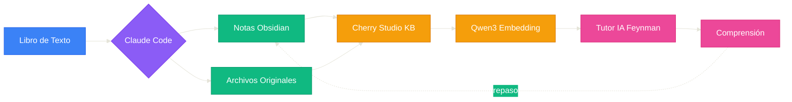
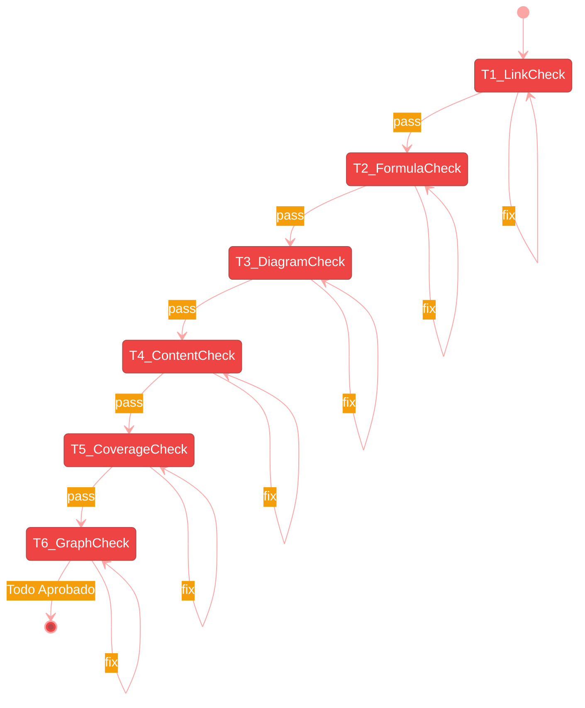

[English](README.en.md) | [中文](README.md) | [Español](README.es.md)

---

# FeynFlow — Feynman + Workflow

> **Feynman + Workflow**：Claude Code genera notas Obsidian → Cherry Studio RAG → Tutor IA Feynman interactivo.
>
> Convierte cualquier libro de texto en una base de conocimiento con tutor IA.

---

## 🧠 Qué es FeynFlow

FeynFlow es un **generador automatizado de libros de texto a grafos de conocimiento IA**. Transforma el texto lineal de un libro en una red de conocimiento interactiva que la IA puede buscar y usar para enseñar.

| Aprendizaje tradicional | Con FeynFlow |
|------------------------|-------------|
| Leer, subrayar, tomar notas | IA genera notas Feynman automáticamente |
| Buscar respuestas en soluciones | Tutor IA guía con método Feynman |
| Conceptos aislados | `[[enlaces bidireccionales]]` forman grafo |
| Repasar todo el libro | IA recupera conocimiento preciso vía RAG |

---

## 📖 Historia

> Descubrí que los prompts IA con método Feynman son muy efectivos: analogías cotidianas, preguntas para pensar, diagramas según mis respuestas. Cuando tuve dificultades con campos electromagnéticos, pensé: ¿puede la IA ayudarme a aprender sistemáticamente? Claude Code genera notas Obsidian → Cherry Studio las lee como base de conocimiento → embedding local (gratis) → tutor IA Feynman.

---

## 🔧 Flujo de Trabajo



## 📦 Contenido del Paquete

```
FeynFlow/
├── README.md / .en.md / .es.md
├── plugin.json
├── agents/
│   ├── 01-setup.agent.md
│   ├── 02-extract.agent.md
│   ├── 03-build.agent.md
│   └── 04-verify.agent.md
├── templates/   # 7 plantillas
├── hooks/
└── examples/
    └── 电磁场与电磁波/
```

## 🚀 Inicio Rápido

### Requisitos

| Software | Propósito | Instalar |
|----------|-----------|----------|
| **Pandoc** ⚠️ Obligatorio | Libro de texto → Markdown | `winget install pandoc`(Win) / `brew install pandoc`(Mac) |
| **Claude Code** | Ejecutar agentes | `npm install -g @anthropic-ai/claude-code` |

```bash
git clone https://github.com/3229218431/FeynFlow.git
cd FeynFlow
cp -r skeleton/* ../mi-tema/
cd ../mi-tema
claude ../FeynFlow/agents/01-setup.agent.md
claude ../FeynFlow/agents/02-extract.agent.md
claude ../FeynFlow/agents/03-build.agent.md
claude ../FeynFlow/agents/04-verify.agent.md
```

## 🧠 Niveles de Notas

| Nivel | Tamaño | Cognitivo | Paso Feynman |
|-------|--------|-----------|-------------|
| ★ Básico | 3000-6000 B | Recordar+Entender | 1-2 |
| ★★ Aplicado | 6000-10000 B | Entender+Aplicar | 1-3 |
| ★★★ Maestro | 10000-15000 B | Analizar+Sintetizar | 1-4 |

## 🧪 6 Pruebas de Calidad (T1-T6)



| Prueba | Verifica | Reparación |
|--------|----------|------------|
| T1 Enlaces | Sin enlaces rotos | Automática |
| T2 Fórmulas | Todo en $$ | Automática |
| T3 Diagramas | Sintaxis correcta | Automática |
| T4 Contenido | Keywords + secciones | Automática |
| T5 Cobertura | TOC completo | Automática |
| T6 Grafo | Backlinks completos | Automática |

## 📊 Ejemplo: Campos Electromagnéticos

`examples/电磁场与电磁波/` es un ejemplo completo:

| Métrica | Valor |
|---------|-------|
| Archivos de texto original | **64** § |
| Notas conceptuales | **328** |
| Diagramas totales | **~250** |
| Enlaces bidireccionales | **262** |
| Commits Git | 45 |

---

[English](README.en.md) | [中文](README.md) | [Español](README.es.md)
