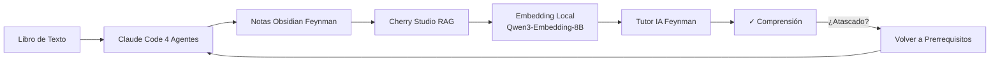

[English](README.en.md) | [中文](README.md) | [Español](README.es.md)

---

# FeynFlow — Feynman + Workflow

> **Feynman + Workflow**：Claude Code genera notas Obsidian → Cherry Studio RAG → Tutor interactivo IA Feynman.
>
> Convierte cualquier libro de texto en una base de conocimiento para tutor IA.

---

## 📖 Origen

> Descubrí que los prompts de IA con el método Feynman son muy efectivos: primero analogías cotidianas, luego preguntas para hacerte pensar, luego diagramas según mis respuestas. Cuando tuve dificultades con mi curso de campos electromagnéticos, pensé: ¿puede la IA ayudarme a aprender sistemáticamente? La solución: Claude Code genera notas Obsidian desde el libro de texto → Cherry Studio las lee como base de conocimiento → modelos de embedding locales (casi gratis) → tutor IA Feynman enseña interactivamente.

---

## 🔧 Flujo de Trabajo



## 📦 Contenido del Paquete

| Componente | Propósito |
|-----------|-----------|
| `agents/01-setup` | Preparar entorno + buscar materiales |
| `agents/02-extract` | Extraer libro de texto → archivos § |
| `agents/03-build` | Construir notas + diagramas + MOC |
| `agents/04-verify` | 6 pruebas T1-T6 + reparación automática |
| `templates/` | 7 plantillas para notas Obsidian |
| `examples/` | Ejemplo completo (campos electromagnéticos) |

## 🚀 Inicio Rápido

```bash
# Requisito: Pandoc
winget install pandoc  # Windows
brew install pandoc    # macOS

# Instalar
git clone https://github.com/3229218431/FeynFlow.git
cd FeynFlow

# Crear proyecto nuevo
cp -r skeleton/* ../mi-tema/
cd ../mi-tema

# Ejecutar agentes
claude ../FeynFlow/agents/01-setup.agent.md
claude ../FeynFlow/agents/02-extract.agent.md
claude ../FeynFlow/agents/03-build.agent.md
claude ../FeynFlow/agents/04-verify.agent.md
```

## 📊 Ejemplo: Campos Electromagnéticos

`examples/电磁场与电磁波/` es un ejemplo completo:

| Métrica | Valor |
|---------|-------|
| Archivos de texto original | **64** § |
| Notas conceptuales | **328** |
| Diagramas Mermaid | **112** |
| Enlaces bidireccionales | **262** |
| Commits Git | 45 |

---

[English](README.en.md) | [中文](README.md) | [Español](README.es.md)
