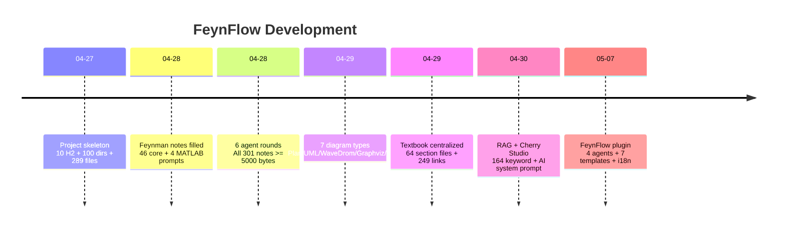
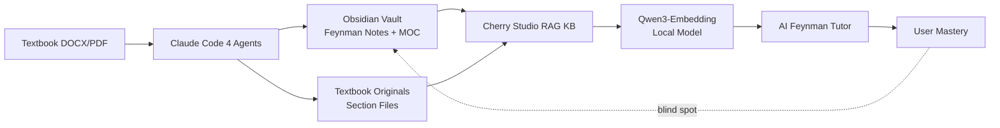
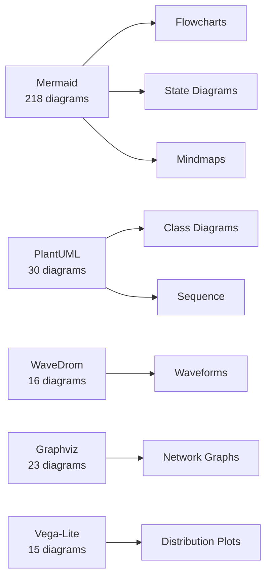
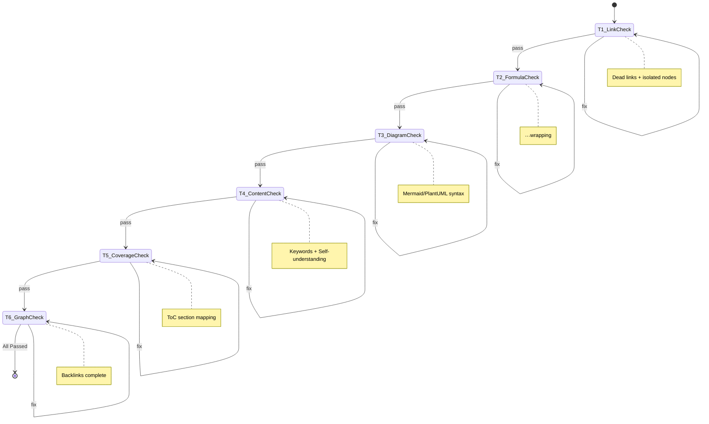
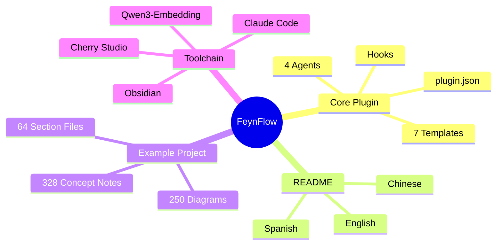
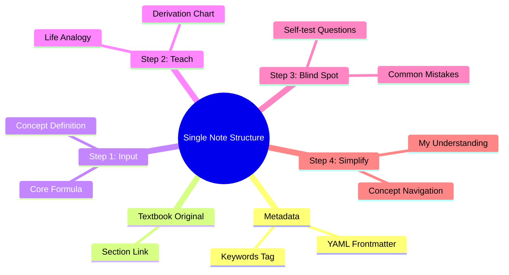
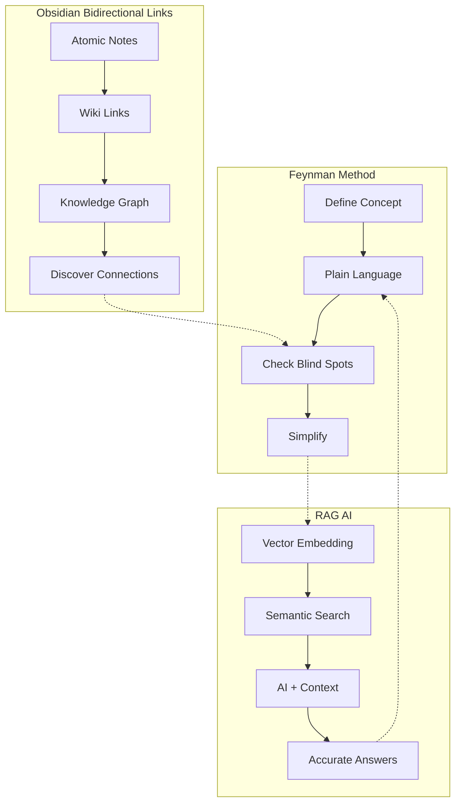
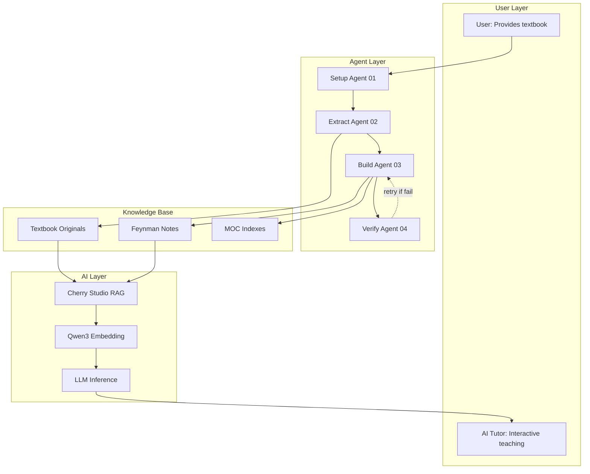

[English](README.en.md) | [中文](README.md) | [Español](README.es.md)

---

# FeynFlow — Feynman + Workflow

> **费曼+Workflow**：Claude Code 生成 Obsidian 知识库 → Cherry Studio RAG → AI 费曼导师交互式教学。
>
> 把任意教科书变成一个 AI 费曼导师知识库。全套工具链开箱即用。

---

## 🧠 FeynFlow 是什么

FeynFlow 是一个**教科书到AI知识图谱的自动化构建工具链**。它把传统教科书的线性文字，转化为 AI 可检索、可教学的交互式知识网络。

| 传统学习方式 | FeynFlow 方式 |
|-------------|-------------|
| 自己看书、划重点、做笔记 | AI 自动生成费曼式笔记，你只管学 |
| 不会的题要翻答案/问老师 | AI 导师用费曼法引导你思考 |
| 知识点是孤立的 | 每个概念都有 `[[双向链接]]` 形成知识图谱 |
| 复习要翻整本书 | AI 通过 RAG 精准检索对应知识点 |
| 笔记只给自己看 | 笔记同时是 AI 的教学素材 |

### 与其他方案对比

| 方案 | 需要 | 效果 | 成本 |
|------|------|------|------|
| 自己做 Obsidian 笔记 | 大量时间+自律 | 取决于个人 | 0 元 |
| 直接问 ChatGPT | 无知识库 | 可能幻觉 | 20$/月 |
| RAG + 教科书 PDF | 向量数据库 | 检索不精确 | 不定 |
| **FeynFlow** ✅ | **教科书原文** | **费曼式+图谱+AI教学** | **几乎免费** |

---

## 📖 开发初衷

> 我当时在使用带费曼学习法的AI提示词，发现非常好用。先通过生活例子类比，然后提出问题让你自己回答。在根据回答内容不断的画图表解释，效果很好。我当时在学习电磁场与电磁波课程时感觉听不懂，我就在想能否让AI辅助我学习。我先使用Claude Code工具去根据教科书原文生成Obsidian笔记，再把这个笔记作为知识库让cherry Studio读取，本地部署一个文本嵌入模型几乎不需要花钱。

**FeynFlow 的核心思想**：你不是在做一个普通的笔记库，你是在建一个**AI可以检索和教学的互动知识图谱**。每个笔记不仅是为你自己看的，也是为 AI 导师准备的教材。

### 开发时间线



---

## 🔧 工具链概览



### 工作流程拆解

| 阶段 | 工具 | 产出 | 说明 |
|------|------|------|------|
| 1. 准备 | `01-setup agent` + Pandoc | 项目骨架 + 辅助材料 | 检查依赖、搜索辅助资料 |
| 2. 提取 | `02-extract agent` | `教科书原文/` 目录 | 按§拆分为.md文件 |
| 3. 构建 | `03-build agent` | 概念笔记 + 图表 + MOC | 费曼填充+7种图表 |
| 4. 验证 | `04-verify agent` | 质量报告 | 6项测试+自动修复 |
| 5. 教学 | Cherry Studio + AI | 交互式学习 | 本地嵌入+AI教学 |

---

## 📦 插件包内容

```
FeynFlow/
├── README.md / .en.md / .es.md   # 多语言项目介绍（附语言切换按钮）
├── plugin.json                    # 插件元数据
│
├── agents/                        # 4个Claude Code agent
│   ├── 01-setup.agent.md          # 环境准备 + 搜索辅助材料
│   ├── 02-extract.agent.md        # 提取教科书原文
│   ├── 03-build.agent.md          # 建骨架 + 写笔记 + 加图表
│   └── 04-verify.agent.md         # 6项测试 T1-T6 + 自动修复
│
├── templates/                     # 7个 Obsidian 笔记模板
│   ├── 概念笔记模板.md              # ★/★★/★★★ 三级费曼笔记
│   ├── MOC模板.md                  # 章节导航索引
│   ├── 习题笔记模板.md              # 费曼式解题引导
│   ├── 思考题模板.md                # 预习思考引导
│   ├── 每日学习日志模板.md           # 费曼复盘
│   ├── MATLAB提示词模板.md          # 六段式提示词
│   └── AI费曼导师系统指令.md         # Cherry Studio 系统指令
│
├── hooks/
│   └── pre-build.sh               # 构建前检查
│
├── skeleton/                      # 新项目可复制骨架
│
└── examples/
    └── 电磁场与电磁波/              # ★完整示例项目（511文件）
```

---

## 🚀 快速开始

### 前置依赖

| 软件 | 用途 | 安装 |
|------|------|------|
| **Pandoc** ⚠️ 必须 | 教科书 → Markdown 转换 | `winget install pandoc`(Win) / `brew install pandoc`(Mac) |
| **Claude Code** | 运行 agent | `npm install -g @anthropic-ai/claude-code` |
| **Cherry Studio**（可选） | RAG 知识库教学 | https://github.com/CherryHQ/cherry-studio/releases |
| **Qwen3-Embedding-8B**（可选） | 本地嵌入模型 | 在 Cherry Studio 知识库设置中选择（免费） |

验证：`pandoc --version`

### 安装 FeynFlow

```bash
git clone https://github.com/3229218431/FeynFlow.git
cd FeynFlow
```

### 为新学科创建知识库

```bash
# 复制骨架到新目录
cp -r skeleton/* ../我的新学科/
cd ../我的新学科
# 把你的教科书放进项目根目录（如 教科书.docx）
# 运行 agent 1: 环境准备
claude ../FeynFlow/agents/01-setup.agent.md
```

### 运行 Agent 的顺序

```bash
claude ../FeynFlow/agents/01-setup.agent.md    # 1. 准备环境
claude ../FeynFlow/agents/02-extract.agent.md   # 2. 提取章节原文
claude ../FeynFlow/agents/03-build.agent.md     # 3. 构建笔记+图表
claude ../FeynFlow/agents/04-verify.agent.md    # 4. 测试+修复
```

### 在 Cherry Studio 中使用

1. **创建知识库** → 填入名称 → 嵌入模型选 `Qwen3-Embedding-8B`
2. **添加文件夹** → 选择 `我的新学科/` 目录
3. **系统指令** → 粘贴 `Templates/AI费曼导师系统指令.md` 的内容
4. **开始对话** → AI 会自动检索教科书原文，用费曼法回答你的问题

---

## 🧠 笔记三级标准

| 级别 | 字数 | 认知层次 | 费曼步骤 | 适用章节 |
|------|------|---------|---------|---------|
| ★ 基础 | 3000-6000 字节 | 记忆+理解 | 第1-2步 | 进阶选学、简单概念 |
| ★★ 应用 | 6000-10000 字节 | 理解+应用 | 第1-3步 | 核心概念、常规章节 |
| ★★★ 精通 | 10000-15000+ 字节 | 分析+综合 | 全部4步 | 核心枢纽（如麦克斯韦方程） |

每篇笔记的固定结构：
```
**关键词**：标签 → RAG检索优化
## 教科书原文 → [[§链接]] → 链接到集中原文文件
## 概念定义（费曼第1步） → 一句话说清
## 类比与直觉（费曼第2步） → 生活化比喻
## 核心公式详释（$$ + 符号表） → 每个符号含义
## 推导脉络（Mermaid/PlantUML等） → 可视化流程图
## 常见误区（费曼第3步） → 暴露盲区
## 费曼检验（费曼第4步） → 自测题
## 概念导航 → Wiki链接 → 双向连接
## 自己理解 → 用户填写费曼复述
```

---

## 🎨 图表工具覆盖



| 工具 | 数量 | 用途 | Obsidian 渲染 |
|------|------|------|-------------|
| Mermaid | 218+ | 推导流程、状态图、思维导图 | ✅ 原生支持 |
| PlantUML | 30+ | 场分类、边界条件、波导模式 | 需社区插件 |
| WaveDrom | 16+ | 时域波形、时谐场 | 需社区插件 |
| Graphviz | 23+ | 概念拓扑、公式依赖 | 需社区插件 |
| Vega-Lite | 15+ | 场分布曲面、参数扫描 | 需社区插件 |

---

## 🧪 6 项质量测试（T1-T6）



| 测试 | 检查项 | 自动修复 |
|------|--------|---------|
| **T1 链接** | 无死链、无孤立节点 | ✅ 自动替换 |
| **T2 公式** | 全部 `$$...$$` 包裹 | ✅ 自动包裹 |
| **T3 图表** | Mermaid/PlantUML 语法正确 | ✅ 自动修正 |
| **T4 内容** | 字节数、关键词、自己理解 | ✅ 自动补充 |
| **T5 覆盖率** | TOC逐节对应 | ✅ 自动创建 |
| **T6 图谱** | 反向链接完整 | ✅ 自动添加 |

---

## 📊 示例项目：电磁场与电磁波

`examples/电磁场与电磁波/` 是一个完整运行的示例：

| 指标 | 数据 |
|------|------|
| 教科书章节 | 第1~8章 |
| 教科书原文文件 | **64 个** §文件 |
| 概念笔记 | **328 篇** |
| RAG关键词 | **166 篇**含 `**关键词**：` |
| 教科书双向链接 | **262 处** `[[§链接]]` |
| Mermaid 图表 | **112 个** |
| PlantUML 图表 | **30 个** |
| 图表总数 | **约 250+ 个** |
| 每篇笔记字数 | ≥5000 字节 |
| Git 提交 | 45 次 |
| 构建轮次 | 6 轮 agent 循环 |

## 项目结构总览



## 每篇笔记的结构



可直接把 `examples/电磁场与电磁波/` 整个目录导入 Cherry Studio 作为知识库：
1. Cherry Studio → 知识库 → 创建
2. 添加文件夹 → 选择 `examples/电磁场与电磁波/`
3. 系统指令 → `Templates/AI费曼导师系统指令.md`
4. 开始学习

---

## 🎯 方法论：为什么费曼法 + Obsidian + RAG 有效



1. **费曼学习法**：通过"教给别人"来检测理解深度。每个笔记的「类比与直觉」强迫你用日常语言解释抽象概念。
2. **Obsidian 双链**：`[[前置概念]]` 和 `[[后续概念]]` 形成知识依赖图——理解盲区时一键回溯。
3. **RAG 检索增强生成**：Cherry Studio 将你的笔记向量化，AI 在回答前先检索相关片段，确保回答基于教科书原文。

三者的循环：费曼法的简化输出 → 向量化存入 RAG → 检索到的内容又成为费曼法新一轮的输入。

---

## 📐 知识图谱的质量标准

| 维度 | 要求 | 保证方式 |
|------|------|---------|
| **完整度** | 教科书每§至少1篇笔记 | Agent 02 逐节提取，Agent 04 T5 验证 |
| **准确度** | 所有知识以教科书原文为准 | `## 教科书原文 → [[§链接]]` |
| **链接度** | 每篇≥3个 `[[双向链接]]` | Agent 03 构造，Agent 04 T1 验证 |
| **可检索** | 每篇首行 `**关键词**：` | Agent 03 填充，Cherry Studio 直接索引 |
| **可视化** | 每篇含≥1个流程图/图表 | Agent 03 根据内容自动选择图表工具 |
| **可检验** | 每篇含费曼检验问题 | 模板强制包含 `## 费曼检验` 板块 |

---

## 🏗️ 架构设计



---

## ❓ 常见问题

**Q: 一定要用 Cherry Studio 吗？**
A: 不必须。任何支持 RAG 知识库的 AI 客户端都可以（如 Open-WebUI、AnythingLLM 等）。

**Q: 为什么用 Obsidian？**
A: Obsidian 的 `[[双向链接]]` 和 Mermaid 原生渲染最适合构建知识图谱。

**Q: 支持哪些教科书格式？**
A: Pandoc 支持 DOCX、PDF、TXT、Markdown、LaTeX、HTML 等 30+ 格式。

**Q: 嵌入模型一定要 Qwen3 吗？**
A: 推荐 Qwen3-Embedding-8B（免费且性能第一），也支持任何其他嵌入模型。

**Q: 一个学科大约要建多久？**
A: 取决于教科书篇幅。电磁场示例（8章、64节）在 6 轮 agent 循环中完成，约 2-3 小时。

**Q: 笔记中的图表需要手动画吗？**
A: 不需要。Agent 03 会根据概念自动选择并嵌入合适的图表工具。

**Q: 如果 AI 的回答我不满意怎么办？**
A: 可以通过「概念导航」中的前置链接回溯到更基础的笔记，或者直接在 Cherry Studio 中追问。

---

## 🔗 项目链接

- GitHub: [https://github.com/3229218431/FeynFlow](https://github.com/3229218431/FeynFlow)
- 示例项目：`examples/电磁场与电磁波/`

---

[English](README.en.md) | [中文](README.md) | [Español](README.es.md)
