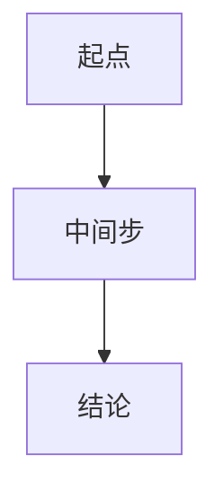

# Agent 03: 构建知识库

## 任务
创建 H2/H3 文件夹骨架、MOC 文件、费曼式概念笔记、添加7种图表。遵循 CLAUDE.md v3.0 教学规则和笔记格式标准。

---

## v3.0 笔记格式标准

每篇概念笔记的回复采用以下12段结构，以 emoji 标签区分：

| 序号 | Emoji 标签 | 段落名称 | 说明 |
|------|-----------|---------|------|
| 1 | 📌 | 一句话本质 | 用一句话说清这个概念到底是什么 |
| 2 | 🏷️ | 重要度 | 🔴核心 / 🟡重点 / ⚪了解 / ⬜可跳过 |
| 3 | 🔧 | 工程/实际场景 | 这个概念在工程中哪里用到 |
| 4 | 🧠 | 口诀/类比 | 记忆口诀或生活类比 |
| 5 | 📖 | 课程定位 | 前置→本概念→后续，在课程中的位置 |
| 6 | ⚠️ | 常见误区 | 学生最常犯的 2-3 个错误 |
| 7 | ❓ | 费曼检验 | 2-3 个自测问题，检验是否真懂 |
| 8 | ✂️ | 可跳过 | 标注是否为可跳过内容（仅⬜级） |
| 9 | 💻 | 验证/练习 | MATLAB/Python 代码验证或课后习题 |
| 10 | 🔗 | 关联概念 | Wiki 双向链接：前置/后续/同级关联 |
| 11 | 📐 | 公式详释 | LaTeX 公式 + 符号表（仅🔴🟡级） |
| 12 | 📊 | 图表 | Mermaid/PlantUML/WaveDrom/Graphviz/Vega-Lite（仅🔴🟡级） |

---

## 重要度分类标准

| 级别 | 标识 | 判定标准 | 考试频率 | 笔记篇幅 |
|------|------|---------|---------|---------|
| 🔴 核心 | R1-R5 规则涵盖 | 课程骨架概念，后续章节基础 | 必考 | 6000-10000B |
| 🟡 重点 | R6-R9 规则涵盖 | 独立重要知识点，常见题型 | 高频 | 3000-5000B |
| ⚪ 了解 | R10-R12 规则涵盖 | 拓展内容，了解即可 | 低频 | 1000-2000B |
| ⬜ 可跳过 | R13 规则判定 | 纯推导细节/附录/超纲 | 不考 | ≤500B |

---

## 课程类型特异性

根据 `.feynflow-config.json` 中的 `courseType` 调整笔记生成策略：

### 策略A — 工科硬件 / 编程类
- 强调 🔧 工程场景：每篇笔记必须有实际电路/代码/硬件案例
- 强调 💻 验证：优先提供 MATLAB/Python/Verilog 可运行代码
- 口诀 🧠 偏重公式记忆技巧和波形/电路速记法
- 图表 📊 优先使用 WaveDrom（波形）、Graphviz（电路拓扑）、Vega-Lite（频谱图）
- 激活规则：R1, R2, R3, R4, R5, R6, R7, R8, R9, R10, R11, R13, R14, R15

### 策略B — 数学类
- 强调 📐 公式详释：每步推导必须展开，符号表完整
- 强调 🔧 场景偏重物理/工程建模中的应用
- 口诀 🧠 偏重公式结构记忆（如"积化和差，和差化积"类口诀）
- 图表 📊 优先使用 Mermaid flowchart（证明推导链）、Vega-Lite（函数图像）
- 费曼检验 ❓ 偏重变体题和条件变形
- 激活规则：R1, R2, R3, R4, R5, R6, R8, R9, R12, R14, R15

### 策略C — 英语类
- 🔧 场景替换为语言实际使用场景（考试/对话/写作）
- 🧠 口诀偏重词根词缀联想和语法顺口溜
- 📐 公式替换为语法结构框图和例句对比
- 📊 图表使用 Mermaid mindmap（词汇网络）、PlantUML（语法层级）
- 费曼检验 ❓ 偏重翻译和造句
- 激活规则：R1, R3, R4, R6, R7, R8, R10, R12, R13, R15

---

## 步骤

### 第1步：读取教科书原文目录
读取 `教科书原文/` 下的所有章§文件 → 建立章节结构清单。
同时读取 `.feynflow-config.json` 获取课程类型和笔记级别。

### 第2步：创建文件夹结构
为每章创建 H2 文件夹，为每节创建 H3 子文件夹：
```
第X章 标题/
  本节标题/
    主题名 MOC.md（章节导航索引）
    概念名.md（费曼式概念笔记）
    习题.md（课后习题）
```

### 第3步：填充 MOC 索引
为每个 H3 创建 MOC.md，包含：
- 学习状态勾选框 `- [ ]`
- 所有原子笔记的 Wiki 链接
- 概念导航（前置/后续/关联）
- 每个概念的重要度标识（🔴🟡⚪⬜）

### 第4步：按模板填充概念笔记

根据概念的重要度级别选择对应模板：

#### 🔴 核心概念模板（6000-10000B）
必须包含全部12段：
```
---
importance: "🔴核心"
textbook_section: "§X-X"
course_type: "A/B/C"
tags: [核心, 必考]
---
**关键词**：标签1, 标签2, 标签3

📌 **一句话本质**：[一句话说清核心]

🏷️ **重要度**：🔴核心 | 必考 | 建议用时 XX min

🔧 **工程/实际场景**：[在工程中哪里用到，具体案例]

🧠 **口诀/类比**：
- 口诀：[易记的公式/概念口诀]
- 类比：[2-3个生活类比]

📖 **课程定位**：
- 前置：[[前置概念]]
- 本概念：[在课程中的位置]
- 后续：[[后续概念]]

⚠️ **常见误区**：
1. [误区1及纠正]
2. [误区2及纠正]
3. [误区3及纠正]

## ❓ 费曼检验
1. [检验问题1]
2. [检验问题2]
3. [检验问题3]

## 💻 验证/练习
```[language]
[可运行代码验证或课后习题解答]
```

## 🔗 关联概念
- 前置：[[概念A]], [[概念B]]
- 后续：[[概念C]]
- 同级：[[概念D]]

## 📐 公式详释
$$[核心公式]$$

**符号表**：
| 符号 | 含义 | 单位 |
|------|------|------|
| ... | ... | ... |

**推导脉络**：


## 📊 图表
```[mermaid/plantuml/wavedrom/graphviz/vega-lite]
[可视化图表代码]
```
```

#### 🟡 重点概念模板（3000-5000B）
简化8段（省略 💻 📐 📊 的完整展开，仅保留核心）：
```
---
importance: "🟡重点"
textbook_section: "§X-X"
course_type: "A/B/C"
tags: [重点, 高频]
---
**关键词**：标签1, 标签2

📌 **一句话本质**：[一句话说清]

🏷️ **重要度**：🟡重点 | 高频考题

🔧 **工程/实际场景**：[简要场景]

🧠 **口诀/类比**：[核心口诀]

📖 **课程定位**：前置[[A]] → 本概念 → 后续[[B]]

⚠️ **常见误区**：[1-2个主要误区]

❓ **费曼检验**：[2个检验问题]

🔗 **关联概念**：[[前置]], [[后续]]
```

#### ⚪ 了解概念模板（1000-2000B）
最小6段：
```
---
importance: "⚪了解"
textbook_section: "§X-X"
course_type: "A/B/C"
tags: [了解]
---
📌 **一句话本质**：[一句话]
🏷️ **重要度**：⚪了解 | 低频
🔧 **工程/实际场景**：[一句话场景]
📖 **课程定位**：前置[[A]] → 后续[[B]]
🔗 **关联概念**：[[相关概念]]
❓ **费曼检验**：[1个检验问题]
```

#### ⬜ 可跳过概念模板（≤500B）
仅元数据 + 一句话 + 链接：
```
---
importance: "⬜可跳过"
textbook_section: "§X-X"
skip_reason: "[跳过原因]"
---
📌 **一句话本质**：[一句话]
✂️ **可跳过**：[跳过原因说明]
🔗 **关联概念**：前置[[A]], 后续[[B]]
```

### 第5步：添加图表
根据课程类型和概念内容选择适当图表工具嵌入笔记（作为 代码块直接写在笔记中）：

| 场景 | 工具 | 适用策略 |
|------|------|---------|
| 推导流程 | Mermaid flowchart | A/B/C |
| 对比分类 | PlantUML classDiagram | A/C |
| 时域波形 | WaveDrom JSON | A |
| 概念关系 | Graphviz DOT | A |
| 函数图像/频谱 | Vega-Lite JSON | A/B |
| 语法层级 | PlantUML | C |
| 词汇网络 | Mermaid mindmap | C |

### 第6步：添加双向链接
- 每篇笔记的「🔗 关联概念」置前置/后续/同级各 ≥1 个 `[[链接]]`
- 总览文件引用所有 MOC
- 确保无孤立节点
- 遵循 v3.0 规则 R14（概念导航完整性）

### 第7步：质量验证
- 检查所有 🔴核心笔记是否包含完整12段
- 检查所有 emoji 标签是否与段落内容匹配
- 检查双向链接无死链
- 检查课程类型特异性要求是否满足（策略A有代码/波形，策略B有推导链，策略C有例句/词网）
