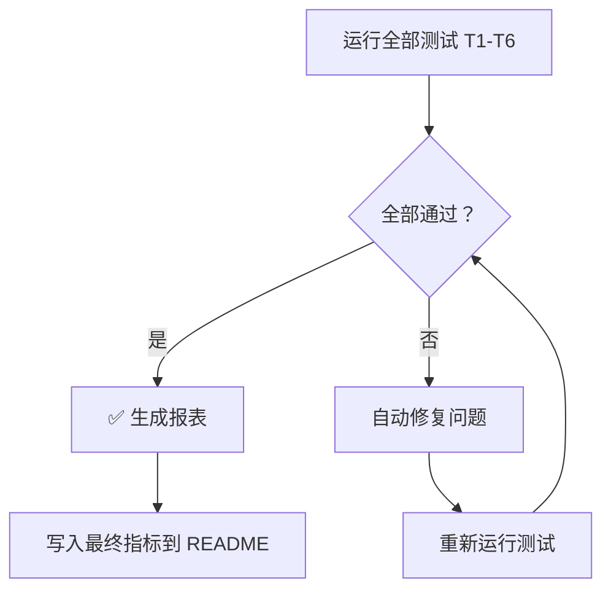

# Agent 04: 测试 + 质量检查 + 修复 + 报表

## 目的
运行所有测试，检查质量门禁，修复未达标项，输出最终报表。
未通过则循环修复 → 重测 → 直至达标。

## 输入
- 项目根目录

## 输出
- 测试报告（每项 ✅/❌）
- 已修复问题列表
- 最终指标报表

## 步骤

### 第1步：运行全部测试（T1-T6）

### 第2步：检查结果 → 若未全部通过则自动修复

### 第3步：修复后重测 → 循环直至全部通过

### 第4步：生成最终报表 → 写入 README

## 测试清单

### T1: 链接完整性测试
```bash
# 所有 [[§X-X]] 链接指向的文件必须存在
no_link=$(find . -name '*.md' -exec grep -L '\[\[' {} \; 2>/dev/null | wc -l)
# 所有 [[链接]] 不能是死链
```
- [ ] T1.1 0篇无`[[链接]]`
- [ ] T1.2 0个死链（链接指向的文件存在）

### T2: 公式渲染测试
```bash
# 所有公式必须被 $$ 包裹（非Mermaid内的）
```
- [ ] T2.1 核心概念笔记中0个裸露的数学符号
- [ ] T2.2 Mermaid代码块内无 `$` 符号（Mermaid不支持LaTeX）

### T3: 图表语法测试
```bash
# 检查Mermaid/PlantUML等代码块语法
```
- [ ] T3.1 Mermaid语法正确（flowchart/sequenceDiagram等关键字有效）
- [ ] T3.2 PlantUML块以 @startuml 开头，@enduml 结尾
- [ ] T3.3 WaveDrom JSON格式正确

### T4: 内容完整性测试
```bash
# 检查每个笔记是否包含必要板块
```
- [ ] T4.1 所有笔记 ≥ 用户指定的字节数
- [ ] T4.2 所有笔记含 `**关键词**：` 标签
- [ ] T4.3 所有笔记含 `## 自己理解` 板块
- [ ] T4.4 所有笔记含 `## 费曼检验` 板块
- [ ] T4.5 所有笔记含 `## 概念导航` 板块

### T5: 教科书全覆盖测试
```bash
# 对照TOC检查是否每个§都有对应笔记
```
- [ ] T5.1 TOC中每个§对应至少1篇概念笔记
- [ ] T5.2 教科书原文/ 覆盖率100%

### T6: 知识图谱连通性测试
- [ ] T6.1 MOC文件引用所有H3笔记
- [ ] T6.2 总览文件引用所有MOC
- [ ] T6.3 反向链接使得每个笔记被至少1篇其他笔记引用

## 测试循环



## 修复策略

| 测试失败项 | 自动修复方法 |
|-----------|-----------|
| T1 死链 | 匹配最近的同级§链接替换 |
| T2 裸露公式 | sed 包裹 `$$...$$` |
| T3 图表语法 | sed 修正关键字大小写/缺失标记 |
| T4 内容缺失 | 从模板复制缺失板块 |
| T5 章节缺失 | 创建对应笔记 |
| T6 图谱断裂 | 自动添加 `[[双向链接]]` |

无自动修复方法时输出WARNING，说明手动修复步骤。
