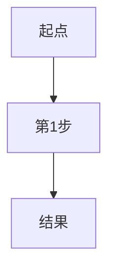

# <% tp.file.title %>

## 概念定义
（用一句话讲给12岁小孩听）

## 类比与直觉
（2-3个生活化比喻建立物理直觉）

## 核心公式
$$
（LaTeX公式）
$$
| 符号 | 含义 | 单位 |
|------|------|------|

## 教科书推导：逐步拆解
### 第1步：（起点）

### 第2步：

（教科书有几步就拆几步，每步用大白话解释WHY）

## Mermaid推导流程图

## 教科书例题
（如教科书中无例题可省略）

## MATLAB可视化提示词
（如不需要可省略）

## 常见误区
1. （误区1 + 正确理解）
2. （误区2 + 正确理解）
3. （误区3 + 正确理解）

## 费曼检验
1. （自测问题1）
2. （自测问题2）

## 概念导航
- 前置概念：[[]]
- 后续概念：[[]]
- 关联概念：[[]]

> 📖 **教科书参考**：§, p.
