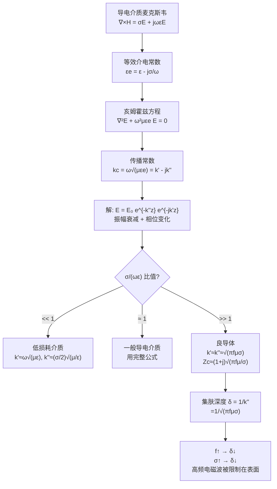

# 导电介质中的平面电磁波 MOC

## 教科书原文

> 📖 参见：[[§8-3 导电介质中的平面电磁波]]

## 概念定义

当电磁波进入像海水、湿土或金属这样的导电介质时，情况变得复杂而有趣。波不仅会衰减（能量被介质吸收变成热），而且会"色散"——不同频率的成分以不同速度传播，导致信号失真。导电介质的"身份证"是比值 $$\sigma/(\omega\varepsilon)$$：如果它远小于1（低损耗介质），波的行为接近理想介质；如果远大于1（良导体），波只能存在于表面极薄的一层——这就是"集肤效应"。对于铜在50 Hz，集肤深度约9 mm；在1 MHz只有0.066 mm。这就是为什么高频电流只在导线表面流动。

## 类比与直觉

1. **人行道上的积雪与泥泞**：冬天的街上，雪后撒了盐的人行道——雪变成了半融的泥泞。你在上面走路时，鞋子会陷进去，越走越沉（衰减），不同体重的人走得快慢不同（色散）。而干净的雪地（理想介质）就好走多了——既不陷也不滑，大家走的一样快。

2. **阳光照进海水**：当你潜水时，越深越暗——光线被海水吸收了。红色光在几米深就消失了，只剩蓝色光能到达较深的地方（不同频率衰减不同）。这种"越深越暗"就是指数衰减 $$e^{-k''z}$$ 的直接体现，而不同颜色的光衰减不同就是色散的体现。

## 核心公式详释

**关键判据：损耗角正切** $$\frac{\sigma}{\omega\varepsilon}$$

**传播常数（复数）**：
$$k_c = k' - jk'' = \omega\sqrt{\mu\left(\varepsilon - j\frac{\sigma}{\omega}\right)}$$

**电场解**：
$$\mathbf{E}(z) = \mathbf{e}_x E_{x0} e^{-k''z} e^{-jk'z}$$

**低损耗介质（$$\sigma \ll \omega\varepsilon$$）**：
$$k' \approx \omega\sqrt{\mu\varepsilon}, \quad k'' \approx \frac{\sigma}{2}\sqrt{\frac{\mu}{\varepsilon}}$$

**良导体（$$\sigma \gg \omega\varepsilon$$）**：
$$k' \approx k'' \approx \sqrt{\pi f\mu\sigma}$$
$$Z_c \approx (1+j)\sqrt{\frac{\pi f\mu}{\sigma}}$$

**集肤深度**：
$$\delta = \frac{1}{k''} = \frac{1}{\sqrt{\pi f\mu\sigma}}$$

**波阻抗（复数！）**：
$$Z_c = \sqrt{\frac{\mu}{\varepsilon_e}} = \sqrt{\frac{\mu}{\varepsilon - j\sigma/\omega}}$$

| 符号 | 含义 | 单位 |
|------|------|------|
| $k'$ | 相位常数 | rad/m |
| $k''$ | 衰减常数 | Np/m |
| $\delta$ | 集肤深度 | m |
| $Z_c$ | 波阻抗（复数） | $\Omega$ |
| $\sigma$ | 电导率 | S/m |
| $\varepsilon_e$ | 等效介电常数（复数） | F/m |

**铜的集肤深度参考**：
f=50 Hz → 9.35 mm; f=1 MHz → 0.066 mm; f=30 GHz → 0.00038 mm

## 推导脉络

## 常见误区

1. **导电介质中的平面波不是TEM波**：仍然是TEM波（$$\mathbf{E} \perp \mathbf{H} \perp \mathbf{k}$$），只是振幅衰减且E与H有相位差。

2. **集肤深度是电磁波能到达的最大深度**：错误。集肤深度是场强衰减到表面值$$1/e$$（约37%）的深度。在两倍集肤深度（$$2\delta$$）处，场强衰减到约13.5%——电磁波仍能到达，只是非常弱了。

3. **低频电磁波穿透力更强，所以在水下通信用低频**：不完全正确。虽然低频确实集肤深度更大（如海水中），但低频天线的辐射效率极低且带宽极窄。实际潜艇通信使用极低频（ELF，约76 Hz），但数据传输率极低（几个字/分钟）。

4. **$$\sigma/(\omega\varepsilon) \gg 1$$ 自动意味着良导体**：对金属通常成立。但需要注意，这个比值随频率变化——在光频段，即使金属的电导率也需要用修正的Drude模型。

## 费曼检验

1. 计算铜（$$\sigma=5.8\times10^7$$ S/m）在60 Hz、1 MHz和10 GHz时的集肤深度。
2. 5 MHz的电磁波在海水中（$$\varepsilon_r=80, \sigma=4$$ S/m）传播时，$$\sigma/(\omega\varepsilon)$$ 是多少？它是良导体还是低损耗介质？
3. 在导电介质中，为什么波阻抗是复数？其实部和虚部分别代表什么物理含义？
4. 证明：良导体中的衰减常数和相位常数近似相等。

## 概念导航

- **前置概念**：[[理想介质中的平面电磁波 MOC]]、[[相速度与波长]]、[[波阻抗]]
- **后续概念**：[[衰减常数与相位常数]]、[[良导体与低损耗介质的判据]]、[[趋肤深度]]
- **关联概念**：[[色散]]、[[涡流效应与变压器]]、[[电磁屏蔽原理]]
- **习题**：[[习题：平面波参数计算]]

## 自己理解

导电介质中的平面波分析揭示了一个关键洞见：同一个比值 $$\sigma/(\omega\varepsilon)$$ 决定了波的所有定性行为。这个比值就像一个"开关"——小于1时波的行为像在理想介质中（微波在干燥土壤中），大于1时波衰减剧烈（无线电波在海水中）。理解这个比值，你就掌握了判断任何介质中电磁波行为的能力。集肤效应更是一个深刻的概念——它不仅解释了为什么高压输电线用钢芯铝绞线（电流只在铝表面流动），也是变压器铁芯用叠片硅钢（阻止涡流）和电磁屏蔽设计的理论基础。

> 📖 参见：[[§8-3 导电介质中的平面电磁波]]
