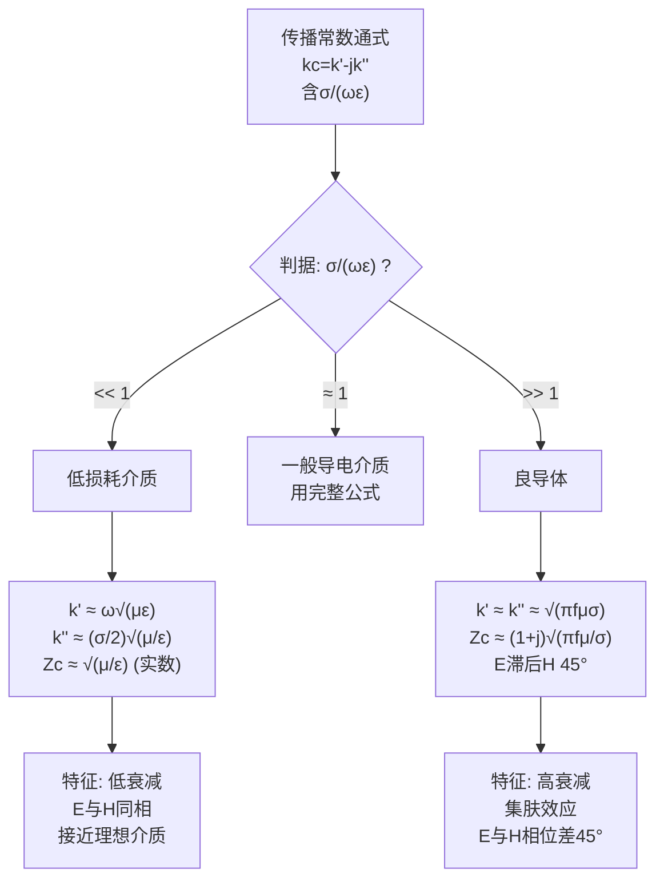

---
tags: [电磁场, 平面电磁波, 导电介质, 良导体, 低损耗介质, 判据, 损耗角正切]
chapter: "第8章"
textbook_section: "§8-3"
textbook_page: "213-214"
type: core-concept
importance: 🔴
exam_frequency: ★★★
exam_type: 计
difficulty: intermediate
created: 2026-04-27
updated: 2026-04-28
---

# 良导体与低损耗介质的判据
**关键词**：导电介质中的平面电磁波

📌 **一句话本质**：σ/ωε>>1是良导体，>>1是低损耗介质——判据决定用哪一种近似公式
🏷️ **重要度**：🔴 | 考试：★★★ | 题型：计

## 🔧工程场景

PCB介质选型——FR4的σ/ωε在1GHz时约为0.02(低损耗)，高于10GHz趋近良导体特性

## 教科书原文

> 📖 参见：[[§8-3 导电介质中的平面电磁波]]

## 概念定义

如何判断一种介质对电磁波是"透明"还是"不透明"？答案藏在比值 $$\sigma/(\omega\varepsilon)$$ 中——这称为损耗角正切。如果这个比值远小于1（$$\sigma \ll \omega\varepsilon$$），波的行为接近理想介质：衰减很小，E和H几乎同相。这就是为什么干燥的土壤、玻璃和塑料对微波是"透明"的。如果比值远大于1（$$\sigma \gg \omega\varepsilon$$），介质是良导体：波快速衰减，E和H有45°相位差（波阻抗 $$Z_c = (1+j)\sqrt{\pi f\mu/\sigma}$$）。关键启示：同一个介质在不同的频率下可以是良导体也可以是低损耗介质！海水对50 Hz电力线（极低频率）是良导体，但对可见光却是透明的。

## 🧠类比与直觉

1. **雾天的可见度**：$$\sigma/(\omega\varepsilon) \ll 1$$ 是晴天——看得远，波几乎不衰减。$$\sigma/(\omega\varepsilon) \gg 1$$ 是大雾——几米外就看不见了。而"雾的浓度"不仅取决于空气本身（$$\sigma, \varepsilon$$），还取决于你用什么光来看（$$\omega$$）——红外线在雾中比可见光传播更远。

2. **不同路面的开车体验**：低损耗介质像高速公路——车速快（相速接近$$c/\sqrt{\varepsilon_r}$$），开得远。良导体像泥泞路——车很快就陷住了（衰减极快），而且不同速度的车（不同频率）表现完全不同（色散）。

🔖 **口诀**：σ比ωε大良导体，σ比ωε小低损耗

## 核心公式详释

**核心判据——损耗角正切**：
$$\tan\delta = \frac{\sigma}{\omega\varepsilon}$$

**低损耗介质（$$\sigma \ll \omega\varepsilon$$，即 $$\tan\delta \ll 1$$）**：
$$k' \approx \omega\sqrt{\mu\varepsilon}$$ （相位常数与理想介质相同！）
$$k'' \approx \frac{\sigma}{2}\sqrt{\frac{\mu}{\varepsilon}}$$ （衰减小，与$$\sigma$$成正比）
$$Z_c \approx \sqrt{\mu/\varepsilon}$$ （波阻抗≈实数，E和H同相）

**良导体（$$\sigma \gg \omega\varepsilon$$，即 $$\tan\delta \gg 1$$）**：
$$k' \approx k'' \approx \sqrt{\pi f\mu\sigma}$$ （相位常数=衰减常数！）
$$Z_c \approx (1+j)\sqrt{\pi f\mu/\sigma}$$ （波阻抗45°相位角）
$$\delta = 1/k'' = 1/\sqrt{\pi f\mu\sigma}$$ （集肤深度极薄）

**同一介质在不同频率下的分类可能不同**：

| 介质 | f = 60 Hz | f = 1 MHz | f = 10 GHz |
|------|-----------|-----------|------------|
| 铜 ($$\sigma=5.8\times10^7$$) | 良导体 | 良导体 | 良导体(近似) |
| 海水 ($$\sigma=4, \varepsilon_r=80$$) | 良导体 | 良导体 | 过渡区 |
| 干燥土壤 ($$\sigma=10^{-4}, \varepsilon_r=3$$) | 低损耗 | 低损耗 | 低损耗 |
| 湿土壤 ($$\sigma=10^{-2}, \varepsilon_r=10$$) | 良导体 | 过渡区 | 低损耗 |

🔖 **口诀**：σ比ωε大良导体，σ比ωε小低损耗

## 📐推导脉络

## ⚠️常见误区

1. **良导体在任何频率下都是良导体**：错误。在极高频（光频段），即使金属的 $$\sigma/(\omega\varepsilon)$$ 也会变小。例如铜在可见光频段就不再是理想良导体——这就是为什么金属光泽随频率变化。

2. **损耗角正切 $$\tan\delta < 1$$ 就是低损耗**：工程中通常用 $$\tan\delta < 0.1$$ 作为低损耗判据，$$\tan\delta = 1$$ 时两者可比拟，需要精确计算。

3. **低损耗介质中波不衰减**：仍有衰减，只是很小。$$k'' \neq 0$$，只不过远小于 $$k'$$。

## ❓费曼检验

1. 计算海水（$$\varepsilon_r=80, \sigma=4$$ S/m）在1 kHz、1 MHz和10 GHz时的 $$\sigma/(\omega\varepsilon)$$，判断其类型。
2. 为什么潮湿土壤对AM广播信号（~1 MHz）的衰减远大于干燥土壤？
3. 铜在什么频率以上不再满足良导体近似（设判据为 $$\sigma/(\omega\varepsilon) > 10$$）？

## 🔗概念导航

- **前置**：[[导电介质中的平面电磁波 MOC]]、[[衰减常数与相位常数]]
- **关联**：[[趋肤深度]]、[[色散]]、[[集肤效应]]
- **习题**：[[习题：平面波参数计算]]

## 自己理解

$$\sigma/(\omega\varepsilon)$$ 这个简单的比值是整个导电介质平面波理论的"开关"。它小于1时，介质对电磁波友好（低损耗，可传播）；大于1时，介质是电磁波的杀手（衰减快，表面传播）。更深刻的是，这个比值随频率变化——所以"良导体"不是一个绝对的标签，而是一个频率依赖的属性。这解释了为什么潜艇对甚低频（VLF）电磁波勉强"可见"（低频时海水的 $$\sigma/(\omega\varepsilon)$$ 虽然仍大但集肤深度较大），而对高频雷达波则完全"隐形"（高频时集肤深度极小，电磁波无法穿透海水）。

> 📖 参见：[[§8-3 导电介质中的平面电磁波]]
