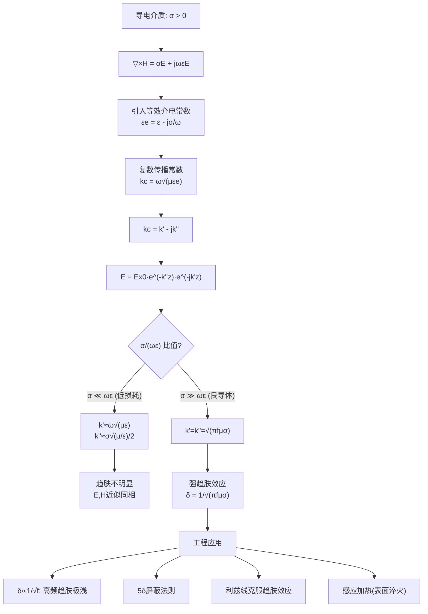

# 趋肤深度的物理意义
**关键词**：导电介质中的平面电磁波

## 概念定义

**趋肤深度（集肤深度）δ**：电磁波进入良导体后，其电场（或磁场）的振幅衰减到导体表面处振幅的 1/e（约 36.8%）时所穿透的深度。数学上：

$$\delta = \frac{1}{k''} = \frac{1}{\sqrt{\pi f \mu \sigma}}$$

它告诉我们一个反直觉的事实：**导电性越好的金属，电磁波越难穿透它**——良导体天然就是优秀的电磁屏蔽体。

## 类比与直觉

**阳光照入浑水（最直觉的类比）**：
- 清水中 → 阳光可以照到很深处（σ 小 → δ 大）
- 浑浊的泥水中 → 阳光几乎透不过表面几厘米就被散射和吸收了（σ 大 → δ 小）

电磁波进入导体就像阳光照入浑水——导体中的自由电子（就像泥水中的悬浮微粒）与电磁波剧烈相互作用，将其能量转化为焦耳热。电导率 σ 越大（"水越浑"），电磁波衰减越快，穿透越浅。

**沙滩上潮水的渗透**：
涨潮时，海水渗入沙滩。细沙（高阻抗）阻碍水渗透，水只停留在表面很薄一层；粗沙（低阻抗）让水渗入更深。频率就像潮水的速度——快速涌来的潮水（高频波）渗入更浅，缓慢升高的潮水（低频波）渗入更深。

**保温杯的双层真空**：
保温杯的金属内壁就像导电介质对电磁波的"趋肤阻挡"——电磁波刚一接触就被迅速衰减，5δ 深度之后几乎为零。高频电磁波对金属来说就像"深不见底的悬崖"——根本进不去。

> 核心反直觉：**导体越好（σ 越大），电磁屏蔽越好。** 普通人会以为"导电好 = 电磁波容易通过"，实际上恰好相反——良导体中的自由电子群起响应电磁波，将其能量迅速耗散为热。

## 教科书推导：逐步拆解

### 第1步：导电介质中麦克斯韦方程的关键修改

介质具有一定电导率 σ（σ > 0）时，无源区域中的麦克斯韦第一方程（安培全电流定律）为：

$$\nabla \times \vec{H} = \sigma\vec{E} + j\omega\varepsilon\vec{E} = j\omega\left(\varepsilon - j\frac{\sigma}{\omega}\right)\vec{E} \tag{8-3-1}$$

定义**等效介电常数**：

$$\varepsilon_e = \varepsilon - j\frac{\sigma}{\omega} \tag{8-3-2}$$

则方程形式与理想介质完全一致：

$$\nabla \times \vec{H} = j\omega\varepsilon_e \vec{E} \tag{8-3-3}$$

这个数学技巧极其聪明——引入**复数介电常数**，将导电介质"伪装"成理想介质处理。虚部 $$-j\sigma/\omega$$ 携带了电导率引起的损耗信息。

### 第2步：引入复数传播常数

导电介质中的亥姆霍兹方程也具有相同形式，只需将 k 替换为 $$k_c$$：

$$\nabla^2\vec{E} + k_c^2\vec{E} = 0 \tag{8-3-6a}$$
$$\nabla^2\vec{H} + k_c^2\vec{H} = 0 \tag{8-3-6b}$$

其中复数传播常数 $$k_c$$ 定义为：

$$k_c = \omega\sqrt{\mu\varepsilon_e} = \omega\sqrt{\mu\left(\varepsilon - j\frac{\sigma}{\omega}\right)} \tag{8-3-5}$$

将 $$k_c$$ 分解为实部和虚部（注意物理约定的符号）：

$$k_c = k' - jk'' \tag{8-3-8}$$

其中相位常数 $$k'$$ 和衰减常数 $$k''$$ 分别为：

$$k' = \omega\sqrt{\frac{\mu\varepsilon}{2}\left[\sqrt{1 + \left(\frac{\sigma}{\omega\varepsilon}\right)^2} + 1\right]} \tag{8-3-9a}$$

$$k'' = \omega\sqrt{\frac{\mu\varepsilon}{2}\left[\sqrt{1 + \left(\frac{\sigma}{\omega\varepsilon}\right)^2} - 1\right]} \tag{8-3-9b}$$

### 第3步：导电介质中平面波的解——指数衰减

沿用均匀平面波假设（$$\vec{E} = \vec{e}_x E_x(z)$$，仅与 z 有关），解的复数形式为：

$$E_x = E_{x0}e^{-jk_c z} = E_{x0}e^{-k''z}e^{-jk'z} \tag{8-3-10}$$

解读这个解的两个指数因子：

1. **$$e^{-k''z}$$**：振幅衰减因子——场强随深度 z 的增加按指数规律衰减。k'' 越大衰减越快。
2. **$$e^{-jk'z}$$**：相位传播因子——波形仍在向前传播，但伴随着衰减。

### 第4步：导电介质中波的完整特性

**相速**：

$$v_p = \frac{\omega}{k'} = \frac{1}{\sqrt{\frac{\mu\varepsilon}{2}\left[\sqrt{1 + \left(\frac{\sigma}{\omega\varepsilon}\right)^2} + 1\right]}} \tag{8-3-11}$$

相速与频率有关（色散）——携带信号的电磁波中不同频率分量以不同速度传播，导致信号失真。这就是导电介质被称为**色散介质**的原因。

**波长**：

$$\lambda = \frac{2\pi}{k'} = \frac{2\pi}{\omega\sqrt{\frac{\mu\varepsilon}{2}\left[\sqrt{1 + \left(\frac{\sigma}{\omega\varepsilon}\right)^2} + 1\right]}}$$

波长与频率的关系是非线性的。

**波阻抗**（复数）：

$$Z_c = \frac{E_x}{H_y} = \sqrt{\frac{\mu}{\varepsilon\left(1 - j\frac{\sigma}{\omega\varepsilon}\right)}} \tag{8-3-13}$$

波阻抗为**复数**意味着 E 和 H **不同相**——磁场滞后于电场。这也是导电介质与理想介质的根本区别。

**磁场解**：

$$H_y = \sqrt{\frac{\varepsilon}{\mu}\left(1 - j\frac{\sigma}{\omega\varepsilon}\right)}E_{x0}e^{-k''z}e^{-jk'z} \tag{8-3-14}$$

磁场的振幅同样随深度按指数衰减。

### 第5步：两种极端情况——比值 σ/(ωε) 的决定性作用

传播特性由参数 $$\sigma/(\omega\varepsilon)$$ 控制——这是传导电流与位移电流之比。

**情况一：低损耗介质（$$\sigma \ll \omega\varepsilon$$）**

近似 $$\sqrt{1 + (\sigma/\omega\varepsilon)^2} \approx 1 + \frac{1}{2}(\sigma/\omega\varepsilon)^2$$，代入(8-3-9)得：

$$k' \approx \omega\sqrt{\mu\varepsilon} \tag{8-3-15a}$$
$$k'' \approx \frac{\sigma}{2}\sqrt{\frac{\mu}{\varepsilon}} \tag{8-3-15b}$$
$$Z_c \approx \sqrt{\frac{\mu}{\varepsilon}} \tag{8-3-15c}$$

物理图像：E 和 H 几乎同相（Z_c 接近实数），振幅缓慢衰减。这类介质包括干燥土壤、淡水、低损耗电介质材料。

**情况二：良导体（$$\sigma \gg \omega\varepsilon$$）**

近似 $$\sqrt{1 + (\sigma/\omega\varepsilon)^2} \approx \sigma/(\omega\varepsilon)$$，代入(8-3-9)得：

$$k' = k'' = \sqrt{\frac{\omega\mu\sigma}{2}} = \sqrt{\pi f \mu \sigma} \tag{8-3-16a}$$

$$Z_c = \sqrt{\frac{j\omega\mu}{\sigma}} = (1 + j)\sqrt{\frac{\pi f \mu}{\sigma}} \tag{8-3-16b}$$

**关键结论**：良导体中 $$k' = k''$$，即衰减常数等于相位常数。波阻抗为复数且具有 45° 相角（1+j），表明 H 落后 E 约 45°。

### 第6步：趋肤深度——衰减的特征尺度

由振幅衰减到表面值的 1/e 的条件：$$e^{-k''z} = 1/e$$ → $$k''\delta = 1$$ → $$\delta = 1/k''$$。

代入良导体的 $$k'' = \sqrt{\pi f\mu\sigma}$$：

$$\delta = \frac{1}{\sqrt{\pi f \mu \sigma}} \tag{8-3-17}$$

**物理含义的逐层解读**：

1. **$$\delta \propto 1/\sqrt{f}$$**：频率越高，趋肤深度越浅。50 Hz 工频电流的趋肤深度（铜约 9.35 mm）远大于 3 GHz 微波（铜约 0.00038 mm = 0.38 μm）。
2. **$$\delta \propto 1/\sqrt{\sigma}$$**：导电性越好，趋肤越浅。铜的趋肤深度比铁小（铜 σ 更大），但铁的 μ 更大，综合效果取决于两者。
3. **$$\delta \propto 1/\sqrt{\mu}$$**：磁导率越高，趋肤也越浅。铁磁材料（μ_r >> 1）会有极浅的趋肤深度。

**教科书表8-3-1：铜的趋肤深度**

| 频率 f | 50 Hz | 1 MHz | 30 GHz |
|--------|-------|-------|--------|
| 趋肤深度 δ | 9.35 mm | 0.066 mm | 0.00038 mm |

从低频到高频跨越了 5 个数量级——这就是为什么微波炉可以用金属网（网孔远大于波长）来屏蔽的原因：电磁波只需穿透不到 1 μm 就被完全衰减了。

### 第7步：工程意义——5δ 屏蔽法则

在实际电磁屏蔽设计中，**5δ 原则**被广泛应用：屏蔽层的厚度只需要大于 5 倍的趋肤深度，电磁波就衰减到 $$e^{-5} \approx 0.67\%$$，几乎完全被阻挡。这意味着：
- 对于高频（f > 1 MHz），几微米的金属镀层就能提供良好的屏蔽
- 对于工频（50 Hz），需要数毫米的铜/铝板才能有效屏蔽磁场
- 高频导线使用多股绞线（利兹线）增大表面积来克服趋肤效应——电流只走"皮"，不走"心"

## Mermaid 推导流程图



## 教科书例题

**例8-3-1**：5 MHz 均匀平面波进入海水（ε_r = 80, μ_r = 1, σ = 4 S/m），求在海水中的相位常数、衰减常数、相速、波长、波阻抗和趋肤深度；以及在 z = 0.8 m 处的场强瞬时值。

**解题步骤**：
1. 判别介质类型：$$\sigma/(\omega\varepsilon) = 180 \gg 1$$ → 海水在 5 MHz 下可视为**良导体**
2. 良导体近似公式：
   - $$k' = \sqrt{\pi f\mu\sigma} = 8.89 \text{ rad/m}$$
   - $$k'' = k' = 8.89 \text{ Np/m}$$
   - $$\delta = 1/k'' = 0.112 \text{ m}$$
   - $$v_p = \omega/k' = 3.53 \times 10^6 \text{ m/s}$$（远小于光速！）
   - $$\lambda = 2\pi/k' = 0.707 \text{ m}$$（缩波效应显著）
3. 在 z = 0.8 m 处（大约 7δ），电场衰减到 $$100 \cdot e^{-8.89 \times 0.8} \approx 0.08 \text{ V/m}$$，几乎可以忽略。

## MATLAB 可视化提示词

```
%% 趋肤深度可视化：电磁波进入导体的指数衰减
% 1. 创建深度轴 z 从 0 到 5δ
% 2. 绘制 |E(z)|/|E₀| = e^(-z/δ) 曲线（对数坐标和线性坐标两个子图）
% 3. 标注 1/e 点（z=δ处，振幅≈37%）和 5δ 点（振幅≈0.67%）
% 4. 对比3种频率(f=50Hz, 1MHz, 1GHz)的衰减曲线
% 5. 在同一图上叠加导体内部E场方向的动画（快照）
% 6. 绘制 |H(z)|/|H₀| 同时展示（证明磁场同样衰减）
% 7. 添加阴影区域表示导体体积
% 8. 标注工程5δ屏蔽法则
```

## 常见误区

1. **趋肤深度不是电磁波"无法穿透"的深度。** 在 δ 处场强衰减到 37%，仍有相当幅值。工程上一般取 5δ 作为"近似为零"的标准（衰减到 0.67%）。对于高精度屏蔽，可能需要 7-10δ。

2. **良导体的定义是相对的，取决于频率。** $$\sigma \gg \omega\varepsilon$$ 是良导体的判据。同一介质在不同频率下可能属于不同类别：海水在 5 MHz 是良导体（σ/ωε ≈ 180），但在 100 GHz 可能只是低损耗介质。

3. **趋肤效应中电流集中在导体表面，但并非只在"一层皮"上。** 电流密度随深度指数衰减，表面电流密度最大，内部逐渐减小——这是一个连续的衰减过程，而非突变的"表层/内部"二值分布。

4. **高磁导率（铁磁材料）也会导致极浅的趋肤深度。** 变压器铁芯为了减小涡流损耗而采用叠片结构——每一片的厚度必须远小于趋肤深度（通常 0.35 mm 或 0.5 mm 厚的硅钢片），这正是利用了 $$\delta \propto 1/\sqrt{\mu}$$ 的关系。

5. **趋肤深度的公式 $$\delta = 1/\sqrt{\pi f\mu\sigma}$$ 仅对良导体（$$\sigma \gg \omega\varepsilon$$）成立。** 对于一般导电介质，需要用完整的式(8-3-9b)计算 $$k''$$，再求 $$\delta = 1/k''$$。直接套用简化公式可能高估或低估趋肤深度。

## 费曼检验

1. **问题**：铜的趋肤深度在 50 Hz 时约为 9.35 mm，在 1 MHz 时约为 0.066 mm。为什么频率提高 20000 倍，趋肤深度只减小了约 140 倍（而非 20000 倍）？**预期回答**：因为 $$\delta \propto 1/\sqrt{f}$$，而非 $$\delta \propto 1/f$$。频率提高 20000 倍，$$\sqrt{20000} \approx 141$$，趋肤深度减小为原来的 1/141，这与数据 9.35/0.066 ≈ 142 一致。平方根关系意味着趋肤深度对频率的敏感度是"温和的"。

2. **问题**：为什么电力输电线（50 Hz 工频）不需要考虑趋肤效应用绞合线，而无线电发射机的线圈（MHz 级）必须用多股绞合线（利兹线）？**预期回答**：50 Hz 时铜的趋肤深度约 9.35 mm，远大于一般导线的半径（几毫米）——电流几乎均匀分布在整个截面，趋肤效应可忽略。但在 MHz 级频率下，趋肤深度仅几十微米，电流集中在导线表面极薄一层，导线的"有效截面积"大幅减小，交流电阻急剧增大。用多股绝缘细线绞合（利兹线）可以增大总表面积，减小交流电阻。

3. **问题**：一艘潜艇想用极低频（ELF，约 76 Hz）无线电波与基地通信。这种波在海水中的趋肤深度大约是多少（海水 σ ≈ 4 S/m）？为什么潜艇通信必须用这么低的频率？**预期回答**：76 Hz 时海水为良导体，$$\delta = 1/\sqrt{\pi \cdot 76 \cdot 4\pi \times 10^{-7} \cdot 4} \approx 1/\sqrt{1.2 \times 10^{-3}} \approx 29 \text{ m}$$。趋肤深度约 29 米，意味着波可以穿透数十米的海水到达潜艇深度。若用 1 MHz，$$\delta \approx 0.25 \text{ m}$$，完全无法穿透海水到达潜艇。这就是为什么对潜通信必须使用极低频——趋肤深度与频率的平方根成反比。

## 概念导航

- 前置概念：[[从麦克斯韦到波动方程的推导]]（波动方程的建立）、[[衰减常数与相位常数]]（k' 和 k'' 的定义）
- 后续概念：[[良导体与低损耗介质的判据]]（σ/ωε 比值的工程意义）
- 关联概念：[[导电介质中的波阻抗]]（复数阻抗 → E 和 H 不同相）
- 工程应用：[[电磁屏蔽设计原理]]（5δ 法则）、[[利兹线与趋肤效应]]
- 深层概念：[[复介电常数与介质损耗]]（极化损耗与欧姆损耗的统一描述）

> 📖 **教科书参考**：§8-3, p.211-215

## 可视化图表

```vega-lite
{
  "$schema": "https://vega.github.io/schema/vega-lite/v5.json",
  "description": "趋肤深度随频率变化: δ=1/α=√(2/ωμσ)  不同材料对比",
  "width": 400,
  "height": 300,
  "mark": {"type": "line", "interpolate": "monotone"},
  "encoding": {
    "x": {
      "field": "frequency", "type": "quantitative",
      "scale": {"type": "log", "domain": [1, 1e9]},
      "title": "频率 f [Hz]"
    },
    "y": {
      "field": "skin_depth", "type": "quantitative",
      "scale": {"type": "log", "domain": [1e-6, 0.1]},
      "title": "趋肤深度 δ [m]"
    },
    "color": {"field": "material", "type": "nominal", "scale": {
      "domain": ["铜 σ=5.8e7", "铝 σ=3.5e7", "铁 σ=1.0e7", "海水 σ=4", "淡水 σ=0.01"],
      "range": ["#e74c3c", "#f39c12", "#95a5a6", "#3498db", "#2ecc71"]
    }, "title": "材料 (σ S/m)"}
  },
  "data": {
    "values": [
      {"frequency": 50, "skin_depth": 9.3e-3, "material": "铜 σ=5.8e7"},
      {"frequency": 1e3, "skin_depth": 2.1e-3, "material": "铜 σ=5.8e7"},
      {"frequency": 1e6, "skin_depth": 6.6e-5, "material": "铜 σ=5.8e7"},
      {"frequency": 1e9, "skin_depth": 2.1e-6, "material": "铜 σ=5.8e7"},
      {"frequency": 50, "skin_depth": 1.2e-2, "material": "铝 σ=3.5e7"},
      {"frequency": 1e6, "skin_depth": 8.5e-5, "material": "铝 σ=3.5e7"},
      {"frequency": 1e9, "skin_depth": 2.7e-6, "material": "铝 σ=3.5e7"},
      {"frequency": 50, "skin_depth": 2.3e-2, "material": "铁 σ=1.0e7"},
      {"frequency": 1e6, "skin_depth": 1.6e-4, "material": "铁 σ=1.0e7"},
      {"frequency": 1e3, "skin_depth": 7.1, "material": "海水 σ=4"},
      {"frequency": 1e6, "skin_depth": 0.25, "material": "海水 σ=4"},
      {"frequency": 1e9, "skin_depth": 7.9e-3, "material": "海水 σ=4"},
      {"frequency": 1e3, "skin_depth": 100, "material": "淡水 σ=0.01"},
      {"frequency": 1e6, "skin_depth": 5.0, "material": "淡水 σ=0.01"},
      {"frequency": 1e9, "skin_depth": 0.16, "material": "淡水 σ=0.01"}
    ]
  },
  "title": "趋肤深度 δ=√(2/ωμσ)  不同材料随频率变化 §8-5"
}

```


```vega-lite
{
  "$schema": "https://vega.github.io/schema/vega-lite/v5.json",
  "title": "集肤深度δ vs 频率f (铜: σ=5.8×10⁷ S/m)",
  "width": 400,
  "height": 300,
  "data": {
    "values": [
      {"frequency_Hz": 50, "skin_depth_mm": 9.35, "label": "工频50Hz"},
      {"frequency_Hz": 1000, "skin_depth_mm": 2.09, "label": "1kHz"},
      {"frequency_Hz": 10000, "skin_depth_mm": 0.66, "label": "10kHz"},
      {"frequency_Hz": 100000, "skin_depth_mm": 0.209, "label": "100kHz"},
      {"frequency_Hz": 1000000, "skin_depth_mm": 0.066, "label": "1MHz"},
      {"frequency_Hz": 10000000, "skin_depth_mm": 0.0209, "label": "10MHz"},
      {"frequency_Hz": 100000000, "skin_depth_mm": 0.0066, "label": "100MHz"},
      {"frequency_Hz": 1000000000, "skin_depth_mm": 0.00209, "label": "1GHz"},
      {"frequency_Hz": 30000000000, "skin_depth_mm": 0.00038, "label": "30GHz"}
    ]
  },
  "mark": {"type": "line", "interpolate": "monotone", "color": "steelblue", "strokeWidth": 2},
  "encoding": {
    "x": {
      "field": "frequency_Hz",
      "type": "quantitative",
      "scale": {"type": "log"},
      "title": "频率 f (Hz)"
    },
    "y": {
      "field": "skin_depth_mm",
      "type": "quantitative",
      "scale": {"type": "log"},
      "title": "集肤深度 δ (mm)"
    }
  },
  "layer": [
    {
      "mark": {"type": "line", "interpolate": "monotone", "color": "steelblue", "strokeWidth": 2}
    },
    {
      "mark": {"type": "point", "filled": true, "color": "red", "size": 60},
      "encoding": {
        "tooltip": [
          {"field": "frequency_Hz", "title": "频率(Hz)"},
          {"field": "skin_depth_mm", "title": "δ(mm)"},
          {"field": "label", "title": "说明"}
        ]
      }
    }
  ]
}

```
