# 习题：平面波参数计算
**关键词**：思考题, 预习, 概念检验, 平面电磁波

## 教材原题

> **例8-2-1** 已知均匀平面波在真空中沿正z方向传播，其电场强度的瞬时值为
> $$E(z,t) = e_x 20\sqrt{2}\cos(6\pi\times10^8 t - 2\pi z)$$
> 试求：①频率及波长；②电场强度及磁场强度的复矢量；③复能流密度矢量；④相速及能速。
>
> **例8-3-1** 已知沿正z方向传播的均匀平面波的频率为5 MHz，z=0处电场强度为x方向，其有效值为100 V/m。若z≥0区域为海水（$$\varepsilon_r=80, \mu_r=1, \sigma=4$$ S/m），试求：①该平面波在海水中的相位常数、衰减常数、相速、波长、波阻抗和集肤深度；②在z=0.8 m处的电场强度、磁场强度的瞬时值以及复能流密度矢量。
> 📖 参见：[[§8-2 理想介质中的平面电磁波]], [[§8-3 导电介质中的平面电磁波]], [[§8-2 理想介质中的平面电磁波]], [[§8-3 导电介质中的平面电磁波]]

## 概念定义

平面波参数计算是电磁波工程最基本也最重要的技能。给定介质的电磁参数（$$\varepsilon, \mu, \sigma$$）和波的频率，计算波数k、波长$$\lambda$$、相速$$v_p$$、波阻抗Z和集肤深度$$\delta$$（如果导电）。解题的关键一步是：先算 $$\sigma/(\omega\varepsilon)$$ 判断介质类型，再选用相应的简化公式。这就像医生看病——先做"分诊"（判断良导体还是低损耗），再"开药"（选用正确公式）。

## 类比与直觉

1. **汽车导航的路线规划**：波的参数计算就像规划一条路线——你要知道路面的类型（介质参数）、限速（相速）、每公里耗油（衰减常数）、路面宽度（波阻抗）。不同路面需要不同的驾驶策略（计算公式）。

2. **出国旅行前的准备清单**：波长=你能"看到"多远一周期（调整天线长度），相速=信号传播多快（计算延迟），衰减常数=信号变弱多快（计算覆盖范围），波阻抗=天线匹配参数（避免反射）。

## 解题流程

```mermaid
flowchart TD
    A["已知: εr, μr, σ, f\n求平面波各参数"] --> B["计算 ω = 2πf"]
    B --> C["计算比值 σ/(ωε)\n判断介质类型"]
    C --> D{"σ/(ωε) ?"}
    D -->|"<< 1"| E["低损耗近似"]
    D -->|"≈ 1"| F["精确公式"]
    D -->|">> 1"| G["良导体近似"]
    E --> H["k'≈ω√(με)\nk''≈(σ/2)√(μ/ε)\nZ≈√(μ/ε)\nvp≈1/√(με)\nλ≈2π/k'"]
    G --> I["k'≈k''≈√(πfμσ)\nZ≈(1+j)√(πfμ/σ)\nvp≈ω/k'\nδ≈1/√(πfμσ)"]
    H --> J["答题"]
    I --> J
    F --> J
```

## 核心公式速查

**频率→角频率**：$$\omega = 2\pi f$$

**判断介质类型**：$$\frac{\sigma}{\omega\varepsilon} = \frac{\sigma}{2\pi f\varepsilon_0\varepsilon_r}$$

**理想介质**（$$\sigma = 0$$）：
- 波数：$$k = \omega\sqrt{\mu\varepsilon}$$
- 波长：$$\lambda = 2\pi/k = c/(f\sqrt{\varepsilon_r\mu_r})$$
- 相速：$$v_p = 1/\sqrt{\mu\varepsilon}$$
- 波阻抗：$$Z = \sqrt{\mu/\varepsilon}$$

**良导体**（$$\sigma \gg \omega\varepsilon$$）：
- $$k' = k'' = \sqrt{\pi f\mu\sigma}$$
- 集肤深度：$$\delta = 1/\sqrt{\pi f\mu\sigma}$$
- 波阻抗：$$Z_c = (1+j)\sqrt{\pi f\mu/\sigma}$$

**复能流**：$$\mathbf{S}_c = \mathbf{E} \times \mathbf{H}^*, \quad S_{av} = E_{x0}^2/(2Z)$$

## 典型例题

**例8-2-1 解**（真空中理想介质）：
1. $$f = \omega/(2\pi) = 3 \times 10^8$$ Hz, $$\lambda = 2\pi/k = 1$$ m
2. $$\dot{E}(z) = e_x 20 e^{-j2\pi z}$$, $$\dot{H}(z) = e_y (1/6\pi) e^{-j2\pi z}$$
3. $$\mathbf{S}_c = e_z (10/3\pi)$$ W/m²
4. $$v_p = v_e = 3 \times 10^8$$ m/s

**例8-3-1 解**（海水，5 MHz）：
1. $$\sigma/(\omega\varepsilon) = 180 \gg 1$$ → 良导体
2. $$k' = k'' = 8.89$$ rad/m, $$v_p' = 3.53 \times 10^5$$ m/s
3. $$\lambda' = 0.707$$ m, $$\delta = 0.112$$ m
4. z=0.8 m处：$$E \approx 0.115$$ V/m (严重衰减!)

## 常见误区

1. **忘了判断介质类型就直接代公式**：如果介质是过渡区（$$\sigma/(\omega\varepsilon) \approx 1$$），近似公式误差很大。
2. **有效值与振幅混淆**：功率计算中，用振幅需要1/2因子，用有效值不需要。
3. **导电介质中仍用理想介质相速公式**：良导体中相速远小于理想介质，且与频率有关。

## 费曼检验

1. 频率为 2.4 GHz 的 WiFi 信号在真空中波长为多少？在 $$\varepsilon_r=4$$ 的介质中呢？
2. 10 kHz 电磁波在海水中的集肤深度比 10 MHz 大多少倍？
3. 验证例8-3-1中 z=0.8 m 处的电场强度计算。

## 概念导航

- **前置**：[[理想介质中的平面电磁波 MOC]]、[[导电介质中的平面电磁波 MOC]]、[[波阻抗]]
- **关联**：[[衰减常数与相位常数]]、[[良导体与低损耗介质的判据]]、[[习题：第8章 平面电磁波]]
- **工具**：[[平面波参数对照表]]

## 自己理解

平面波参数计算是电磁波最基本的"算术"。对理想介质，只需记住 $$k = \omega\sqrt{\mu\varepsilon}$$ 和 $$Z = \sqrt{\mu/\varepsilon}$$，其他参数都能推导。对导电介质，关键是先算 $$\sigma/(\omega\varepsilon)$$——这个比值就像一把钥匙，决定了你该用哪套公式。良导体中 $$k' = k'' = \sqrt{\pi f\mu\sigma}$$ 是最常考的公式，值得记住。另外注意：高频电磁波在海水中的衰减极其严重——5 MHz在0.8 m内衰减到原来的千分之一！这就是为什么潜艇通信如此困难。

> 📖 参见：[[§8-2 理想介质中的平面电磁波]], [[§8-3 导电介质中的平面电磁波]], [[§8-2 理想介质中的平面电磁波]], [[§8-3 导电介质中的平面电磁波]]
