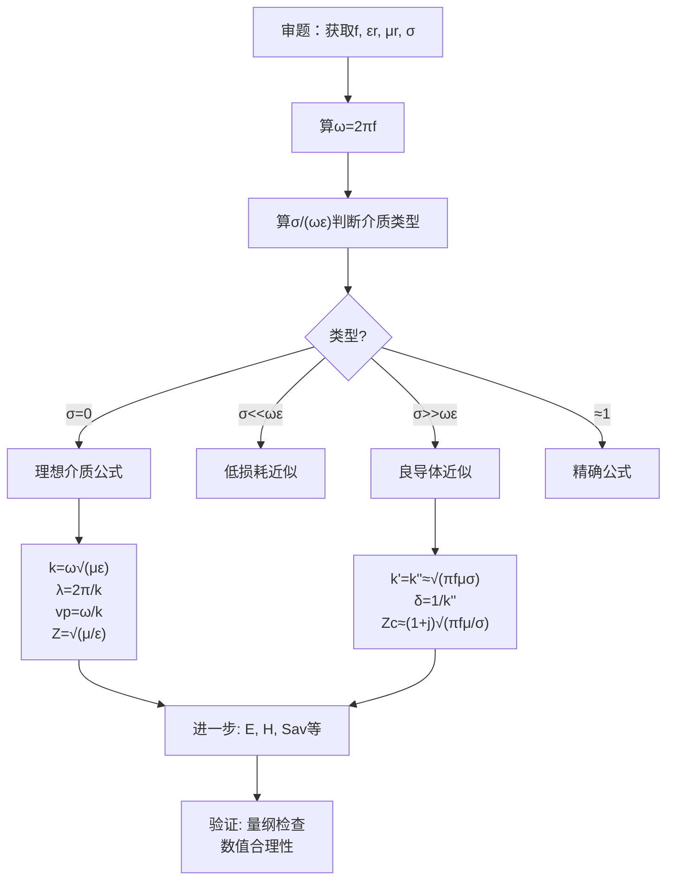

# 习题：第8章 平面电磁波（教科书p.261-264）

## 教材原题概览

第8章习题共17题（8-1至8-17），涵盖理想介质参数计算、导电介质衰减与集肤深度、极化判定、以及综合应用。这些习题是整本书中"套路性"最强的一类——掌握统一的解题框架后，所有同类型题目都可以按相同步骤解决。

| 题号范围 | 主题 | 核心公式 |
|----------|------|----------|
| 8-1~8-5 | 理想介质平面波基本参数 | $k=\omega\sqrt{\mu\varepsilon}, \lambda=2\pi/k, v_p=\omega/k, Z=\sqrt{\mu/\varepsilon}$ |
| 8-6~8-10 | 导电介质参数 | $k'=k''\approx\sqrt{\pi f\mu\sigma}, \delta=1/k'', Z_c$ |
| 8-11~8-13 | 极化特性判定 | $\Delta\psi = 0,\pi$$线极化; $$\Delta\psi=\pm\pi/2$$且$$|E_x|=|E_y|$$圆极化 |
| 8-14~8-17 | 综合：能流密度、反射折射 | $S_{av} = \frac{1}{2}\text{Re}[E\times H^*]$ |

> 📖 习题8-1~8-17, p.261-264

## 费曼4步解题法

### 第1步：明确已知和目标

**审题清单**（每题必做）：
- [ ] 提取介质参数：$$\varepsilon_r$$, $$\mu_r$$, $$\sigma$$
- [ ] 提取频率 $$f$$（或角频率 $$\omega$$）
- [ ] 提取已知场量：$$E_{x0}$$ 或 $$H_{y0}$$（标注是振幅还是有效值！）
- [ ] 明确所求量：$$k, \lambda, v_p, Z, \delta, S_{av}$$ 中的哪些？

### 第2步：判断介质类型（最关键一步！）

计算判据值：$$\frac{\sigma}{\omega\varepsilon} = \frac{\sigma}{2\pi f \varepsilon_0\varepsilon_r}$$

| 判据比值 | 介质类型 | 使用公式 |
|----------|----------|----------|
| $\ll 1$$（典型 < 0.01） | 理想介质/低损耗 | 理想介质公式 |
| $\approx 1$ | 一般导电介质 | 精确公式 |
| $\gg 1$$（典型 > 100） | 良导体 | 良导体近似 |

### 第3步：选择公式并计算

**理想介质公式套件**：
$$k = \omega\sqrt{\mu\varepsilon} = 2\pi f\sqrt{\mu_0\varepsilon_0\mu_r\varepsilon_r} = \frac{2\pi f}{c}\sqrt{\mu_r\varepsilon_r}$$
$$\lambda = \frac{2\pi}{k} = \frac{c}{f\sqrt{\mu_r\varepsilon_r}}$$
$$v_p = \frac{\omega}{k} = \frac{c}{\sqrt{\mu_r\varepsilon_r}}$$
$$Z = \sqrt{\frac{\mu}{\varepsilon}} = 377\sqrt{\frac{\mu_r}{\varepsilon_r}}\;\Omega$$

**良导体公式套件**：
$$k' \approx k'' \approx \sqrt{\pi f\mu\sigma}$$
$$\delta = \frac{1}{k''} = \frac{1}{\sqrt{\pi f\mu\sigma}}$$
$$Z_c \approx (1+j)\sqrt{\frac{\pi f\mu}{\sigma}}$$

### 第4步：验证与扩展

- $$S_{av} = \frac{E_{x0}^2}{2Z}$$（理想介质，振幅）
- 极化判定：比较 $$E_x$$ 和 $$E_y$$ 的振幅比和相位差

## 典型题目详析

**理想介质类（例题8-1风格）**：已知真空中 $$E = 30\pi e^{-j40\pi z}\; \mathbf{a}_x$$ V/m，求f, $$\lambda$$, $$v_p$$, H, $$S_{av}$$。

*第1步*：$$k=40\pi$$ rad/m，真空中 $$\varepsilon_r=\mu_r=1, \sigma=0$$
*第2步*：$$k = \omega/c \to \omega = kc = 40\pi\times3\times10^8 = 1.2\pi\times10^{10}$$ rad/s
*第3步*：$$f = \omega/(2\pi) = 6\times10^9 = 6$$ GHz；$$\lambda = 2\pi/k = 0.05$$ m；$$v_p = c = 3\times10^8$$ m/s；$$Z_0 = 377\Omega$$
$$H_y = E_x/Z_0 = 30\pi/377 \approx 0.25$$ A/m，$$\mathbf{H} = 0.25 e^{-j40\pi z}\;\mathbf{a}_y$$ A/m
$$S_{av} = E_{x0}^2/(2Z_0) = (30\pi)^2/(2\times377) \approx 3.75$$ W/m²

**导电介质类**：海水中5 MHz平面波，$$\varepsilon_r=80, \sigma=4$$ S/m，$$E_0=100$$ V/m。

*第2步*：判据 $$\sigma/(\omega\varepsilon) = 4/(2\pi\times5\times10^6\times8.854\times10^{-12}\times80) \approx 180 \gg 1$$ → **良导体**
*第3步*：$$k'=k''=\sqrt{\pi f\mu_0\sigma} = \sqrt{\pi\times5\times10^6\times4\pi\times10^{-7}\times4} \approx 8.89$$ rad/m
$$\delta = 1/k'' \approx 0.112$$ m
*扩展*：0.8 m深处 $$E \approx 100 e^{-8.89\times0.8} \approx 0.115$$ V/m ——衰减了约870倍！

**极化判定类**：$$\mathbf{E} = (2\mathbf{a}_x + j2\mathbf{a}_y)E_0 e^{-jkz}$$

*第3步*：$$|E_x| = 2E_0 = |E_y|$$，等振幅！相位差 $$\Delta\psi = \psi_y-\psi_x = \arg(j) - \arg(1) = 90^\circ - 0^\circ = 90^\circ$$
*结论*：等振幅 + 90°相位差 → **右旋圆极化**

## 解题通用流程

## 常见误区

1. **不先判断介质类型就套公式**：海水的 $$\sigma/(\omega\varepsilon) \approx 180$$，是良导体。如果用理想介质公式计算，会得到完全错误的结果。
2. **混淆振幅和有效值**：题目给的是振幅 $$E_{x0}$$ 还是有效值 $$E_x$$？$$S_{av}$$ 公式是否要加1/2？记住：振幅需1/2，有效值不需。
3. **极化判定的遗漏**：只比较振幅（$$|E_x|=|E_y|$$）忘记比较相位差（$$\Delta\psi$$），误判圆极化。必须是等振幅**且**相位差 $$\pm90^\circ$$。

## 概念导航

- **关联**：[[习题：平面波参数计算]]、[[思考题：第8章 平面电磁波（教科书p.261）]]、[[良导体与低损耗介质的判据]]
- **公式速查**：[[平面波参数对照表]]

## 自己理解

第8章习题的套路性非常强：拿到题目→算$$\sigma/(\omega\varepsilon)$$→选公式→代数值→得答案。关键是不要搞混有效值和振幅、不要忘共轭、不要选错近似公式。极化判定也只需要比较两个正交分量的振幅比和相位差。记住这个框架，17道题就是17次相同的流程。

> 📖 习题8-1~8-17, p.261-264
