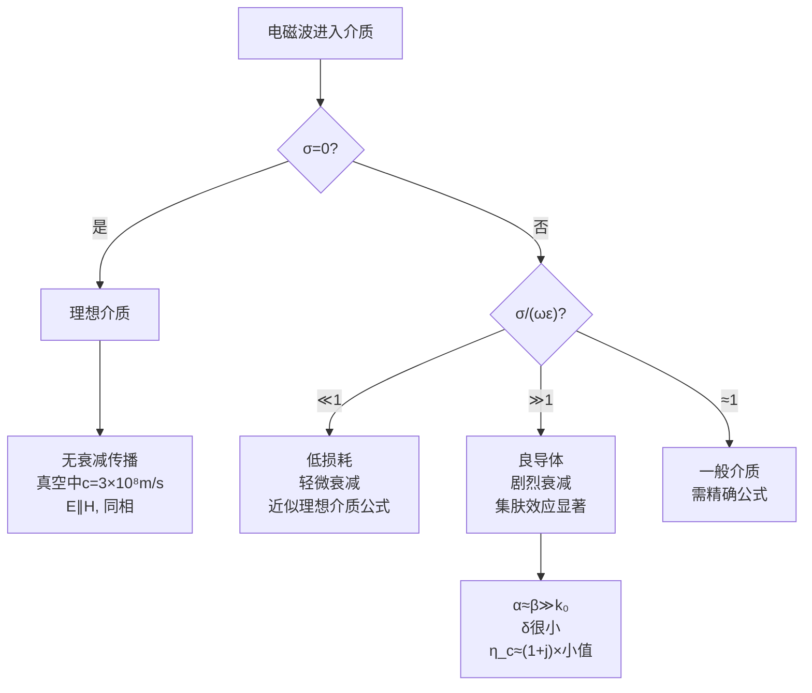

---
tags: [思考题, 电磁场, 平面电磁波, 理想介质, 导电介质]
chapter: "第8章"
textbook_section: "§8-2 ~ §8-3"
type: concept-check
importance: ⚪
exam_frequency: ★
exam_type: 简
difficulty: intermediate
created: 2026-04-28
---

# 思考题：理想介质和导电介质中平面波的本质区别
**关键词**：思考题, 预习, 概念检验, 平面电磁波

📌 **一句话本质**：理想介质vs导电介质中的平面波——前者无损等幅传播，后者有衰减且E和H有相位差
🏷️ **重要度**：⚪ | 考试：★ | 题型：简

## 教科书原题

> 8-1 理想介质和导电介质中均匀平面波的传播有何本质区别？

## 费曼4步解题法

### 第1步：明确问题核心

这道题是第8章最核心的概念题。它追问的是：当电磁波在不同类型的介质中传播时，哪些物理量发生了质的变化？本质区别在于电导率σ的有无——这导致了传播常数的虚实性变化。

### 第2步：本质区别——逐项对比

| 性质 | 理想介质（$$\sigma=0$$） | 导电介质（$$\sigma>0$$） |
|------|---------------------|---------------------|
| **传播常数** | $k = \omega\sqrt{\mu\varepsilon}$$（实数） | $\gamma = \alpha + j\beta$$（复数） |
| **衰减** | 无衰减（$$\alpha=0$$） | 指数衰减（$$\alpha>0$$） |
| **波阻抗** | 实数 $$\eta=\sqrt{\mu/\varepsilon}$ | 复数 $$\eta_c = \sqrt{\mu/(\varepsilon - j\sigma/\omega)}$ |
| **E与H相位** | 同相（$$\eta$$幅角=0） | 有相位差（$$\eta_c$$幅角$$\neq0$$） |
| **波长** | $\lambda = 2\pi/k$ | $\lambda = 2\pi/\beta$$，且短于同频率理想介质 |
| **相速度** | $v_p = 1/\sqrt{\mu\varepsilon}$$（常速） | $v_p = \omega/\beta < 1/\sqrt{\mu\varepsilon}$$（色散） |
| **能量** | 全传输，无损耗 | 部分转化为焦耳热（$$\sigma E^2$$） |
| **色散** | 无色散（$$v_p$$不随f变化） | 有色散（除良导体外） |
| **本征阻抗** | 纯电阻性 | 电阻+电感性 |

### 第3步：判据与近似

**介质类型判据**：$$\frac{\sigma}{\omega\varepsilon}$$

| 判据比值 | 类型 | 近似方法 |
|----------|------|----------|
| $\ll 1$ | 低损耗介质 | $k \approx \omega\sqrt{\mu\varepsilon}, \alpha \approx \frac{\sigma}{2}\sqrt{\frac{\mu}{\varepsilon}}$ |
| $\gg 1$ | 良导体 | $k' \approx k'' \approx \sqrt{\pi f\mu\sigma}$ |
| $\approx 1$ | 一般导电介质 | 需用精确公式 |

**良导体中的极限行为**：
- 衰减常数 = 相位常数：$$\alpha \approx \beta \approx \sqrt{\pi f\mu\sigma}$$
- 波阻抗幅角 = 45°：$$\eta_c \approx (1+j)\sqrt{\pi f\mu\sigma/(\sigma^2)}$$
- E超前H约45°
- 集肤深度：$$\delta = 1/\sqrt{\pi f\mu\sigma}$$

### 第4步：物理直觉



**数值感受**：10 MHz的电磁波在：
- 真空中：$$\lambda = 30$$ m，无损传播
- 纯水中（$$\varepsilon_r=81, \sigma\approx10^{-4}$$ S/m）：低损，$$\lambda\approx3.3$$m
- 海水中（$$\sigma\approx4$$ S/m）：良导体，$$\delta\approx0.8$$m，传播0.8m后衰减为37%
- 铜中（$$\sigma=5.8\times10^7$$ S/m）：$$\delta\approx0.02$$mm！电磁波几乎无法穿透

## 常见误区

1. **任何非零电导率都意味着良导体行为**：关键看比值$$\sigma/(\omega\varepsilon)$$，不是看$$\sigma$$的绝对值。纯水$$\sigma\approx10^{-4}$$ S/m，但在微波频段$$\sigma/(\omega\varepsilon)\ll1$$，仍可当作低损耗介质。
2. **理想介质中波阻抗 $$\eta$$ 是377Ω**：只有真空中才是377Ω。介质中 $$\eta=377/\sqrt{\varepsilon_r}$$（$$\mu_r=1$$时）。
3. **导电介质中E和H的相位差总是45°**：仅在良导体（$$\sigma\gg\omega\varepsilon$$）极限下$$\eta_c$$幅角趋近于45°。

## 概念导航

- **核心MOC**：[[理想介质中的平面电磁波 MOC]]、[[导电介质中的平面电磁波 MOC]]
- **关联**：[[波阻抗]]、[[集肤深度]]、[[良导体与低损耗介质的判据]]
- **习题**：[[习题：平面波参数计算]]

## 自己理解

理想介质和导电介质的本质区别可以浓缩为一道公式：$$\gamma = j\omega\sqrt{\mu\varepsilon}\sqrt{1 - j\sigma/(\omega\varepsilon)}$$。当 $$\sigma=0$$ 时，根号内为1，$$\gamma$$纯虚数→无衰减。当 $$\sigma>0$$ 时，根号内出现虚部，$$\gamma$$变成复数→实部代表衰减。整个第8章都可以从这个统一的复传播常数公式出发来理解。

> 📖 参见：[[§8-2 理想介质中的平面电磁波]], [[§8-3 导电介质中的平面电磁波]], [[§8-2 理想介质中的平面电磁波]], [[§8-3 导电介质中的平面电磁波]]

## 理想介质 vs 导电介质的关键对比

| 特性 | 理想介质 ($\sigma=0$) | 导电介质 ($\sigma\neq0$) |
|------|----------------------|--------------------------|
| 波数 | $k=\omega\sqrt{\mu\varepsilon}$ (实数) | $k_c=\beta-j\alpha$ (复数) |
| 衰减 | 无衰减 | $e^{-\alpha z}$ 衰减 |
| E与H相位 | 同相 | 有相位差 |
| 波阻抗 | $\eta=\sqrt{\mu/\varepsilon}$ (实数) | $\eta_c=|\eta_c|e^{j\theta}$ (复数) |

```wavedrom
{signal: [
  {name: '理想介质', wave: '2.3.4.5.6.', data: ['等幅', '', '', '', '']},
  {name: '导电介质', wave: '2.3.4.3.2.', data: ['衰减包络', '', '', '', '趋肤深度δ']},
]}
```

> 📖 参见：[[§8-2 理想介质中的平面电磁波]], [[§8-3 导电介质中的平面电磁波]], [[§8-2 理想介质中的平面电磁波]], [[§8-3 导电介质中的平面电磁波]]
