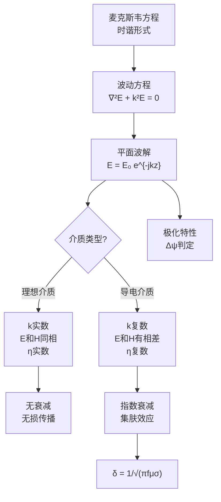

---
tags: [思考题, 电磁场, 平面电磁波, 波动方程, 均匀平面波]
chapter: "第8章"
textbook_section: "§8-1 ~ §8-5"
textbook_page: "261"
type: concept-check
importance: ⚪
exam_frequency: ★
exam_type: 简
difficulty: intermediate
created: 2026-04-28
---

# 思考题：第8章 平面电磁波（教科书p.261）

📌 **一句话本质**：第8章平面电磁波思考题——波动方程、TEM波、波阻抗、趋肤深度的概念检验
🏷️ **重要度**：⚪ | 考试：★ | 题型：简

## 教科书原题

> 8-2 均匀平面波的定义是什么？它有哪些基本特性？
> 8-3 传播常数k的物理意义是什么？色散是指什么？
> 8-4 平面波有哪几种极化方式？如何判定？
> 8-5 什么是集肤效应？集肤深度与哪些因素有关？
> 8-6 什么是缩波效应？

## 费曼4步解题法

### 第1步：明确问题核心

这5道思考题覆盖了平面电磁波传播的核心概念：从定义（8-2）→传播特性（8-3）→极化（8-4）→损耗特性（8-5）→特殊效应（8-6）。理解这些概念是解决第8章所有习题的基础。

### 第2步：逐题详解

**8-2 均匀平面波的定义与基本特性**

**定义**：等相位面是平面、且在等相位面上电场（和磁场）的振幅和方向处处相同的电磁波。

**基本特性**：
- TEM波：E和H均垂直于传播方向，且E ⟂ H，E×H沿传播方向
- E与H同相（理想介质中）
- 波阻抗：$$\eta = E/H = \sqrt{\mu/\varepsilon}$$（实数）
- 相速度：$$v_p = 1/\sqrt{\mu\varepsilon}$$
- 能流密度：$$\mathbf{S}_{av} = \mathbf{e}_k E_0^2/(2\eta)$$

**8-3 传播常数的物理意义与色散**

传播常数在导电介质中为复数：$$\gamma = \alpha + j\beta$$

- $$\alpha$$（衰减常数，Np/m）：振幅衰减因子，$$E(z) = E_0 e^{-\alpha z}$$
- $$\beta$$（相位常数，rad/m）：空间相位变化率，$$\beta = 2\pi/\lambda$$

**色散**：相速度随频率变化的现象（$$v_p = v_p(\omega)$$）。在导电介质和波导中常见。色散导致不同频率的信号分量传播速度不同——信号畸变。

**8-4 平面波的极化方式**

| 极化类型 | 条件 | 说明 |
|----------|------|------|
| 线极化 | $\Delta\psi = 0$$ 或 $$\pi$ | E的振动方向固定 |
| 圆极化 | $\Delta\psi = \pm\pi/2$$ 且 $$\|E_x\|=\|E_y\|$ | E的端点画圆 |
| 椭圆极化 | 其他情况 | E的端点画椭圆 |

判定步骤：比较两正交分量 → 算相位差 → 判断类型。

**8-5 集肤效应与集肤深度**

**集肤效应**：高频电磁波在良导体中迅速衰减，电流集中在导体表面的薄层内。

**集肤深度**：$$\boxed{\delta = \frac{1}{\alpha} = \frac{1}{\sqrt{\pi f\mu\sigma}}}$$

场强降至表面值的 $$1/e \approx 37\%$$ 的深度。铜在50Hz：$$\delta \approx 9.3$$ mm；1 MHz：$$\delta \approx 0.066$$ mm。

**8-6 缩波效应**

导电介质中波长 $$\lambda = 2\pi/\beta$$ 远小于同频率下理想介质中的波长。在良导体中：$$\lambda_c \approx 2\pi\delta \ll \lambda_0$$。

工程应用：微波电路中用高介电常数基板（如$$\varepsilon_r=10$$）缩小波长→缩小电路尺寸。

### 第3步：平面波参数计算公式速查

| 参数 | 理想介质 | 良导体（近似） |
|------|---------|--------------|
| k/$$\gamma$ | $k = \omega\sqrt{\mu\varepsilon}$ | $\gamma \approx (1+j)\sqrt{\pi f\mu\sigma}$ |
| 波长 $$\lambda$ | $2\pi/k = c/(f\sqrt{\varepsilon_r})$ | $2\pi\delta$ |
| 相速度 $$v_p$ | $c/\sqrt{\varepsilon_r}$ | $\omega/\sqrt{\pi f\mu\sigma}$ |
| 波阻抗 $$\eta$ | $\sqrt{\mu/\varepsilon}$ | $(1+j)\sqrt{\pi f\mu/\sigma}$ |

### 第4步：知识全景

## 常见误区

1. **TEM波意味着E和H是标量**：TEM表示场矢量在传播方向分量为零（横电磁），但E和H本身仍是矢量，各有方向。
2. **集肤深度随频率增大而增大**：$$\delta \propto 1/\sqrt{f}$$——频率越高，集肤深度越小！频率越高，电流越集中在表面。
3. **缩波效应仅在导电介质中发生**：在高$$\varepsilon_r$$介质中波长也会缩短（$$\lambda = \lambda_0/\sqrt{\varepsilon_r}$$），这是介质缩波，与导电介质中的缩波机制不同。

## 概念导航

- **核心MOC**：[[理想介质中的平面电磁波 MOC]]、[[导电介质中的平面电磁波 MOC]]
- **关联**：[[波阻抗]]、[[相速度与波长]]、[[趋肤深度为什么与频率有关]]
- **习题**：[[习题：第8章 平面电磁波]]

## 自己理解

第8章的核心就一句话：**频率和介质决定了波的一切**。给定f和$$\varepsilon,\mu,\sigma$$，就像给定了一把万能钥匙——它能解开波长、速度、衰减、阻抗、极化等所有参数。而"先判据后公式"的解题策略（先算$$\sigma/\omega\varepsilon$$判断介质类型，再选用对应近似公式）是整章习题的统一方法论。

> 📖 参见：[[§8-1 波动方程与平面波解]], [[§8-3 导电介质中的平面电磁波]]
