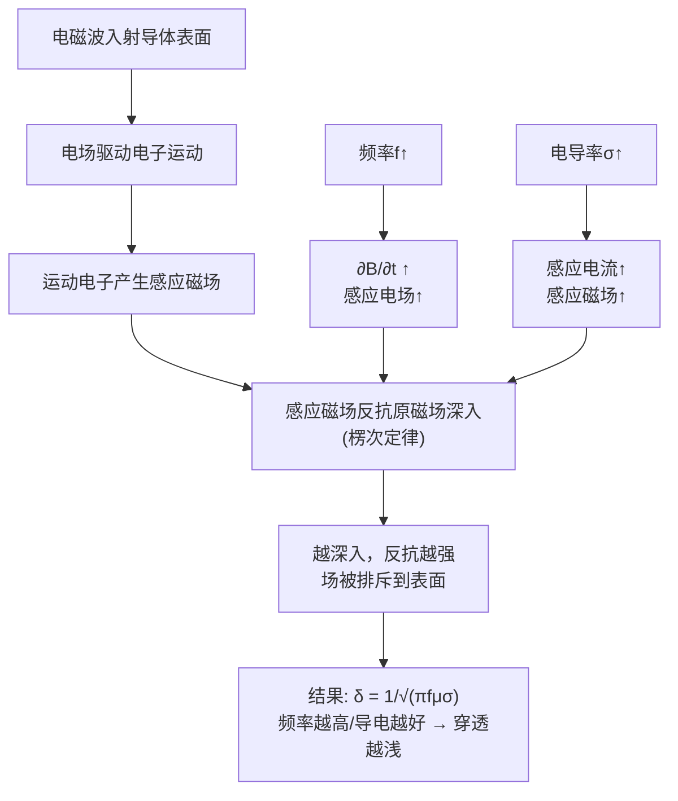

# 思考题：趋肤深度为什么与频率有关
**关键词**：思考题, 预习, 概念检验, 平面电磁波

## 教科书原文

> 📖 参见：[[§8-3 导电介质中的平面电磁波]]

## 概念定义

集肤深度 $$\delta = 1/\sqrt{\pi f\mu\sigma}$$ 告诉你电磁波能"钻入"导体多深。频率越高，电子在导体中被电场加速和减速的次数越多，每次来不及加速到高速就被反向——导致电流集中在表面极薄的一层。低频时（如50 Hz），电子有足够时间响应电场，电流分布更深。这就像你在沙滩上跑步：如果让你每秒钟来回折返一次，你会在原地踏步（电流在表面）；如果每10秒才折返一次，你能跑出一段距离（电流深入内部）。频率决定了电子"折返"的频繁程度。

## 类比与直觉

1. **荡秋千的频率响应**：推秋千时，如果你每秒推很多次（高频），秋千几乎不动——推力被"限制在表面"（接触点）。如果慢慢推（低频），秋千会大幅度摆动——"力"深入了整个系统。电磁波在导体中的穿透深度也类似：高频时场来不及深入就被"反向"了。

2. **面包烤焦的深度**：烤面包时，大火快烤（高频高功率）只会烤焦面包表面，内部还是软的。小火慢烤（低频低功率）则能把整个面包烤透。集肤深度就是"烤焦层的厚度"——频率越高，烤焦层越薄。

## 核心公式详释

$$\delta = \frac{1}{\sqrt{\pi f \mu \sigma}}$$

| 参数 | 增大方向 | 集肤深度变化 | 原因 |
|------|----------|-------------|------|
| 频率 $$f$ | $f \uparrow$ | $\delta \downarrow$$ (与$$\sqrt{f}$$成反比) | 高频→快速振荡→电流被限制在表面 |
| 电导率 $$\sigma$ | $\sigma \uparrow$ | $\delta \downarrow$ | 高导电→感应电流大→反向场强→排斥场深入 |
| 磁导率 $$\mu$ | $\mu \uparrow$ | $\delta \downarrow$ | 高磁导→强感应→强排斥 |

**铜的集肤深度数据**：
- $$f = 50$$ Hz: $$\delta \approx 9.35$$ mm → 普通导线全截面导电
- $$f = 1$$ MHz: $$\delta \approx 0.066$$ mm → 电流只在表面0.07 mm薄层！
- $$f = 30$$ GHz: $$\delta \approx 0.00038$$ mm → 几乎完全在表面

## 物理机制

## 常见误区

1. **趋肤深度是指电磁波完全不能穿透的深度**：错误。在深度 $$\delta$$ 处场强衰减到表面值的 $$1/e \approx 37\%$$。在 $$3\delta$$ 处约5%，仍然有电磁波。

2. **趋肤效应只对金属有意义**：任何导电介质都有集肤效应，只是程度不同。海水、人体组织、湿土壤都有有限的集肤深度。

3. **直流也有趋肤效应**：直流（$$f=0$$）无趋肤效应——电流均匀分布在导线截面上。趋肤效应是交流特有的现象。

## 费曼检验

1. 计算铜在60 Hz和2.4 GHz（WiFi频率）时的集肤深度，并解释两者相差多少倍及原因。
2. 如果把铜换成铝（$$\sigma$$约为铜的60%），在同样频率下集肤深度是增大还是减小？
3. 为什么高压输电线（50 Hz）的趋肤效应不显著，但微波电路必须考虑？

## 概念导航

- **前置**：[[导电介质中的平面电磁波 MOC]]、[[衰减常数与相位常数]]、[[良导体与低损耗介质的判据]]
- **关联**：[[电磁屏蔽原理]]、[[涡流效应与变压器]]、[[趋肤深度公式混淆]]

## 自己理解

集肤深度是电磁波在导体中的"有效作用范围"。它不是一个硬边界，而是一个衰减特征长度。公式 $$\delta \propto 1/\sqrt{f}$$ 中的平方根关系特别值得记住——频率提高100倍，集肤深度只减小10倍。但即便如此，从50 Hz到1 MHz（20000倍频率提升），集肤深度从9.35 mm骤降到0.066 mm（约140倍减小），这在工程上是巨大的变化。理解趋肤效应是理解以下问题的关键：为什么高压线用钢芯铝绞线？为什么微波炉的金属壁能挡住电磁波？为什么变压器铁芯要分层？——答案都是：$$\delta = 1/\sqrt{\pi f\mu\sigma}$$。

> 📖 参见：[[§8-3 导电介质中的平面电磁波]]
