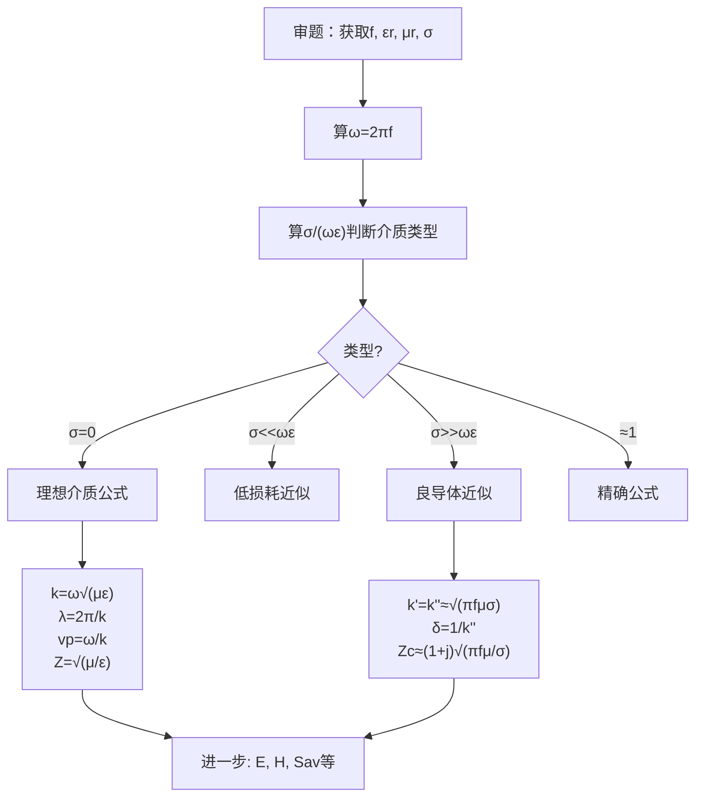

# 第8章 平面电磁波 思考题与习题 MOC

## 教科书原文

> 📖 参见：[[§8-1 波动方程与平面波解]], [[§8-2 理想介质中的平面电磁波]], [[§8-3 导电介质中的平面电磁波]]

## 概念定义

本章思考题和习题共同构成了平面电磁波理论的"实战练习"。它们的核心逻辑是：**电磁波在不同介质中传播时，其速度、波长、衰减、阻抗、极化等参数由介质的电磁本构参数（$$\varepsilon, \mu, \sigma$$）和频率 $$f$$ 唯一确定**。掌握从"审题"到"判断介质类型"再到"选择公式"的解题链路，是整个电磁场学习中最具工程价值的能力之一。

## 类比与直觉

**类比1：汽车在不同路面上的行驶参数**。电磁波在不同介质中的传播就像同一辆汽车在水泥路、泥泞路、沙漠上行驶——速度、油耗（衰减）、颠簸程度各不相同。真空/理想介质是"无限平坦的高速公路"（无衰减），导电介质是"泥泞的烂路"（信号迅速衰减），而频率越高，相当于车速越快，在烂路（良导体）上的"颠簸"（衰减）也越剧烈。

**类比2：分诊台的三色标签**。解题的"介质判据"（$$\sigma/(\omega\varepsilon)$$）就像一个分诊台——患者一来就测"体温"（算判据值），然后贴上红/黄/绿标签（良导体/一般介质/理想介质），分别送往不同的"诊室"（选用不同公式）。

## 核心公式一览（考试必背）

**理想介质平面波**：
$$k = \omega\sqrt{\mu\varepsilon}, \quad \lambda = 2\pi/k, \quad v_p = \omega/k$$
$$Z = \sqrt{\mu/\varepsilon}, \quad Z_0 = 120\pi \approx 377\Omega$$
$$H_y = E_x/Z$$ （E与H同相）

**导电介质**：
判据：$$\sigma/(\omega\varepsilon)$$
良导体判据：$$\sigma \gg \omega\varepsilon$$
良导体：$$k' \approx k'' \approx \sqrt{\pi f\mu\sigma}$$
集肤深度：$$\delta = 1/\sqrt{\pi f\mu\sigma}$$

**极化**：
线极化：$$\Delta\psi = 0,\pi$$
圆极化：$$\Delta\psi = \pm\pi/2, |E_x|=|E_y|$$

## 思考题索引

| 编号 | 主题 | 笔记链接 | 题型 |
|------|------|----------|:---:|
| 8-1 | 理想vs导电介质平面波区别 | [[思考题：理想介质和导电介质中平面波的本质区别]] | 概念对比 |
| 8-2 | 均匀平面波的定义与传播特性 | [[思考题：第8章 平面电磁波（教科书p.261）]] | 概念阐述 |
| 8-3 | 传播常数物理意义与色散 | [[思考题：第8章 平面电磁波（教科书p.261）]] | 概念阐述 |
| 8-4 | 平面波的极化特性 | [[思考题：第8章 平面电磁波（教科书p.261）]] | 概念阐述 |
| 8-5 | 集肤效应与集肤深度 | [[思考题：趋肤深度为什么与频率有关]] | 物理解释 |
| 8-6 | 缩波效应及其应用 | [[思考题：第8章 平面电磁波（教科书p.261）]] | 概念理解 |

## 习题索引

| 题号 | 主题 | 笔记链接 |
|------|------|----------|
| 8-1~8-17 | 全部习题 | [[习题：第8章 平面电磁波（教科书p.261-264）]] |
| 典型例题 | 平面波参数计算 | [[习题：平面波参数计算]] |

## 解题通用流程



## 常见误区

1. **不先判断介质类型就直接套公式**：理想介质的 $$Z=377\Omega$$ 直接用于海水（良导体），得到完全错误的结果。必须先算 $$\sigma/(\omega\varepsilon)$$！
2. **忘记区分振幅和有效值**：题目给的是有效值还是振幅？$$S_{av}$$ 公式中是否要加1/2？这是高频易错点。
3. **极化判定只比振幅不比相位差**：$$|E_x|=|E_y|$$ 但 $$\Delta\psi = 30^\circ$$ 是椭圆极化，不是圆极化。必须同时检查振幅和相位。

## 费曼检验

1. 如果某介质在100 MHz时 $$\sigma/(\omega\varepsilon) = 0.01$$，在1 kHz时这个比值会变大还是变小？这个介质在不同频率下分别可以当作什么类型处理？
2. 一个平面波在理想介质中传播，E和H同相。在良导体中E和H的相位关系如何变化？为什么？
3. 给定 $$E_x = 2\cos(\omega t - kz)$$ 和 $$E_y = 2\sin(\omega t - kz)$$，这是何种极化？旋向如何？

## 概念导航

- **核心MOC**：[[理想介质中的平面电磁波 MOC]]、[[导电介质中的平面电磁波 MOC]]
- **基础**：[[波动方程与平面波解 MOC]]
- **关联**：[[波阻抗]]、[[相速度与波长]]、[[衰减常数与相位常数]]

## 自己理解

第8章的思考题和习题围绕一个核心：给定介质和频率，求平面波的所有参数。解题的关键是"先判断，后计算"——先算 $$\sigma/(\omega\varepsilon)$$ 判断介质类型，再选用正确的近似公式。这个流程在考试和工程中反复使用，熟练掌握后，整章的计算题都可以用一个统一框架解决。

```signal
{signal: [
  {name: '理想介质', wave: 'x111111..', data: ['E和H同相传播,无衰减']},
  {name: '低损耗', wave: 'x1x1x1..', data: ['轻微衰减']},
  {name: '良导体', wave: 'z......z', data: ['E和H有相差,指数衰减']},
  {name: '判据σ/ωε', wave: '0.2..0.5..100', data: ['<<1理想→~1一般→>>1良导体']}
],
head: {text: '不同介质中平面波的行为对比'},
foot: {text: '判据σ/(ωε)决定选用哪套公式。先判断,后计算!'}}
```

> 📖 第8章思考题与习题, p.261-264
