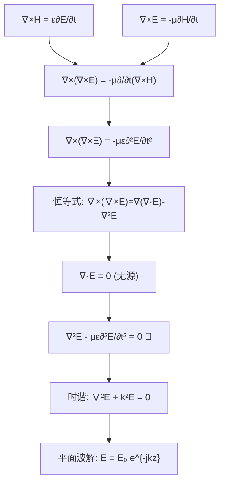

# 从麦克斯韦到波动方程的推导

## 概念定义
对无源理想介质中的麦克斯韦旋度方程取旋度，结合矢量恒等式，可推得电场和磁场分别满足齐次波动方程——证明电磁扰动以波的形式在空间中传播，传播速度 $$v = 1/\sqrt{\mu\varepsilon}$$。

## 类比与直觉
- **水波溯源**：水面扰动看似复杂，但描述它的基本方程（波动方程）只有一个；麦克斯韦方程组就是电磁场的"水动力学方程"，波动方程是从中提炼出的"波的本质"。
- **弹簧的波动**：一根长弹簧上相邻线圈通过弹性力互相影响，扰动从一处传递到另一处——电场产生磁场、磁场产生电场，电磁波就是这样一环套一环传播的。

## 核心公式

**出发点：无源（$$\mathbf{J}'=0$$）理想介质（$$\sigma=0$$）的麦克斯韦方程：**
$$\nabla \times \mathbf{H} = \varepsilon \frac{\partial \mathbf{E}}{\partial t}, \quad \nabla \times \mathbf{E} = -\mu \frac{\partial \mathbf{H}}{\partial t}$$

**对旋度方程再取旋度：**
$$\nabla \times \nabla \times \mathbf{E} = -\mu \frac{\partial}{\partial t} (\nabla \times \mathbf{H}) = -\mu\varepsilon \frac{\partial^2 \mathbf{E}}{\partial t^2}$$

**利用矢量恒等式 $$\nabla \times \nabla \times \mathbf{E} = \nabla(\nabla \cdot \mathbf{E}) - \nabla^2 \mathbf{E}$$ 及 $$\nabla \cdot \mathbf{E}=0$$：**

$$\nabla^2 \mathbf{E} - \mu\varepsilon \frac{\partial^2 \mathbf{E}}{\partial t^2} = 0 \tag{8-1-2a}$$

$$\nabla^2 \mathbf{H} - \mu\varepsilon \frac{\partial^2 \mathbf{H}}{\partial t^2} = 0 \tag{8-1-2b}$$

**时谐场 → 亥姆霍兹方程（代入 $$\partial/\partial t \to j\omega$$）：**

$$\nabla^2 \mathbf{E}(\mathbf{r}) + k^2 \mathbf{E}(\mathbf{r}) = 0 \tag{8-1-3a}$$

$$k = \omega\sqrt{\mu\varepsilon} \tag{波数}$$

**传播速度：**
$$v = \frac{1}{\sqrt{\mu\varepsilon}} = \frac{\omega}{k}$$

**真空中：**
$$c = \frac{1}{\sqrt{\mu_0\varepsilon_0}} \approx 3 \times 10^8 \, \text{m/s}$$

| 符号 | 含义 | 单位 |
|------|------|------|
| $\mathbf{E}, \mathbf{H}$ | 电场强度、磁场强度 | V/m, A/m |
| $\mu, \varepsilon$ | 介质磁导率、介电常数 | H/m, F/m |
| $k$ | 波数（相位常数） | rad/m |
| $\omega$ | 角频率 | rad/s |
| $v, c$ | 电磁波速度、真空中光速 | m/s |

## 推导脉络



## 常见误区
1. **波动方程只在真空中成立**：在任意线性、均匀、各向同性理想介质（$$\sigma=0, \mathbf{J}'=0$$）中均可导出，仅参数 $$\mu, \varepsilon$$ 不同。
2. **$$\nabla \times \nabla \times \mathbf{E} = \nabla^2 \mathbf{E}$$ 恒成立**：仅当 $$\nabla \cdot \mathbf{E}=0$$ 时成立，否则需保留梯度项。
3. **时域波动方程与亥姆霍兹方程等同**：亥姆霍兹方程是频域形式（$$\partial/\partial t \to j\omega$$），仅适用于单频时谐场。

## 费曼检验
1. 若介质有损耗（$$\sigma \neq 0$$），波动方程会多出什么项？
2. 光在玻璃中速度 $$v < c$$，从波动方程的角度如何解释？

## 概念导航
> 📖 教科书参考: §8-1, p.204

> ◀ 前置: [[麦克斯韦方程组]] | [[标量位与矢量位]]  
> ▶ 后续: [[理想介质中的平面波]] | [[导电介质中的平面波]]

## 推导的关键步骤详解

**第1步**：对$\nabla\times\mathbf{E}=-\mu\frac{\partial\mathbf{H}}{\partial t}$两边取旋度：
$$\nabla\times\nabla\times\mathbf{E} = -\mu\frac{\partial}{\partial t}(\nabla\times\mathbf{H})$$

**第2步**：将$\nabla\times\mathbf{H}=\varepsilon\frac{\partial\mathbf{E}}{\partial t}$代入：
$$\nabla\times\nabla\times\mathbf{E} = -\mu\varepsilon\frac{\partial^2\mathbf{E}}{\partial t^2}$$

**第3步**：使用矢量恒等式（关键！）：
$$\nabla\times\nabla\times\mathbf{E} = \nabla(\nabla\cdot\mathbf{E}) - \nabla^2\mathbf{E}$$

**第4步**：在无源区$\nabla\cdot\mathbf{E}=0$，因此：
$$\nabla^2\mathbf{E} - \mu\varepsilon\frac{\partial^2\mathbf{E}}{\partial t^2} = 0$$

这就是标准的**波动方程**，其波速为：$v = 1/\sqrt{\mu\varepsilon}$

## 历史意义

麦克斯韦在1865年从方程组推导出波动方程，并计算出电磁波速度 $v = 1/\sqrt{\mu_0\varepsilon_0} \approx 3\times 10^8 \text{ m/s}$——与当时已知的光速精确吻合。麦克斯韦由此大胆推断：**光就是电磁波**。这是物理学史上最伟大的统一之一。

## 波动方程的"波"性质验证

```wavedrom
{signal: [
  {name: '电场 E(z,t)', wave: '2.3.4.5.6.', data: ['t=0', 't=T/4', 't=T/2', 't=3T/4', 't=T']},
  {name: '磁场 H(z,t)', wave: '3.4.5.6.2.', data: ['t=0', 't=T/4', 't=T/2', 't=3T/4', 't=T']},
  {name: '传播方向 z', wave: '=.....', data: ['E×H方向']},
],
  foot: {text: 'E和H同相、正交、同步传播——波动方程解的基本特征'}
}
```

> 📖 参见：[[§8-1 波动方程与平面波解]]
