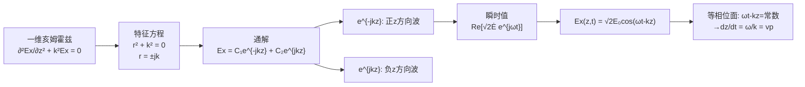
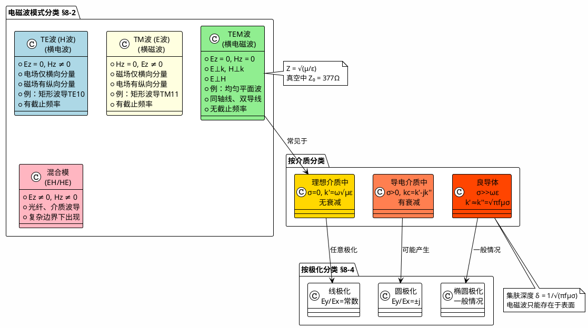

# 均匀平面波的数学形式

## 教科书原文

> 📖 参见：[[§8-2 理想介质中的平面电磁波]]

## 概念定义

$$E_x = E_{x0} e^{-jkz}$$ 这个简短的公式是电磁学中最重要的表达式之一。它用复数的语言描述了空间中向前传播的正弦波。$$e^{-jkz}$$ 看起来神秘，但它的物理含义很简单：(1) 这个因子的模永远是1，意味着波在理想介质中不衰减；(2) 它的辐角 $$-kz$$ 随距离z线性减小（更负），意味着相位在不断滞后；(3) 乘以 $$e^{j\omega t}$$ 后取实部得到 $$\cos(\omega t - kz)$$，描述了一个以相速 $$v_p = \omega/k$$ 向正z方向传播的正弦波。这就是"均匀平面波"的完整数学画像。

## 类比与直觉

1. **秒针与钟面上的时间**：秒针在钟面上匀速旋转，它在水平线上的投影做余弦运动。$$e^{-jkz}$$ 就像是冻结在空间不同位置的许多钟面——每个位置z的"钟"的指针角度不同（$$-kz$$），但旋转速度相同（$$\omega$$）。观测这些钟的投影，你就看到一个在空间传播的余弦波。

2. **多米诺骨牌倒下**：一排多米诺骨牌，每张倒下的时间都比前一张晚一点。如果你从侧面拍照，会看到骨牌的倾斜角度（相位）随位置变化。$$e^{-jkz}$$ 中的 $$kz$$ 就是这个"相位随位置的变化"——相邻两张骨牌的相位差是 $$k \cdot \Delta z$$。

## 核心公式详释

**复矢量形式（有效值）**：
$$\mathbf{E}(z) = \mathbf{e}_x E_{x0} e^{-jkz}$$
$$\mathbf{H}(z) = \mathbf{e}_y \frac{E_{x0}}{Z} e^{-jkz}$$

**瞬时值**：
$$E_x(z,t) = \sqrt{2}E_{x0}\cos(\omega t - kz)$$
$$H_y(z,t) = \sqrt{2}\frac{E_{x0}}{Z}\cos(\omega t - kz)$$

**正向波 vs 反向波判据**：
- $$e^{-jkz}$$ → 正向传播（相位随z增加而滞后）
- $$e^{+jkz}$$ → 反向传播（相位随z增加而超前）

**波参数关系**：
$$k = \frac{2\pi}{\lambda}, \quad v_p = \frac{\omega}{k} = \lambda f, \quad Z = \frac{E_x}{H_y} = \sqrt{\frac{\mu}{\varepsilon}}$$

| 符号 | 含义 | 说明 |
|------|------|------|
| $e^{-jkz}$ | 空间相位因子 | $|e^{-jkz}| = 1$$ (不衰减) |
| $e^{j\omega t}$ | 时间相位因子 | 取实部后恢复时变 |
| $\omega t$ | 时间相位 | rad |
| $kz$ | 空间相位 | rad |
| $\omega t - kz$ | 总相位 | 等相位面条件 |

**等相位面条件**：$$\omega t - kz = \text{常数} \Rightarrow z = \frac{\omega}{k}t + \text{常数}$$

## 推导脉络

## 常见误区

1. **$$e^{-jkz}$$ 表示波在衰减**：错误。$$|e^{-jkz}| = 1$$ 对所有z都成立（因为k是实数）。这个因子只表示相位变化，不表示振幅变化。振幅衰减需要 $$e^{-k''z}$$（k''为衰减常数），仅存在于导电介质中。

2. **$$e^{-jkz}$$ 总是代表正方向传播**：仅当时谐因子约定为 $$e^{j\omega t}$$ 时成立。如果教科书采用 $$e^{-j\omega t}$$ 约定，则正方向波为 $$e^{+jkz}$$。国内教材统一使用 $$e^{j\omega t}$$。

3. **平面波一定是均匀的**：非均匀平面波的振幅在波面上有变化（例如倏逝波）。均匀平面波要求波面上振幅处处相等。

## 费曼检验

1. 给定电场复矢量 $$\mathbf{E} = \mathbf{e}_x 5e^{-j(3x+4y)}$$，求传播方向和波长。
2. 证明 $$e^{-jkz}$$ 代入亥姆霍兹方程后恒成立（验证k的定义）。
3. 若电场为 $$\mathbf{E} = \mathbf{e}_x (3+j4)e^{-j20\pi z}$$，写出瞬时值和有效值振幅。

## 概念导航

- **前置**：[[波动方程与平面波解 MOC]]、[[亥姆霍兹方程]]、[[从麦克斯韦到波动方程的推导]]
- **后续**：[[理想介质中的平面电磁波 MOC]]、[[相速度与波长]]、[[波阻抗]]
- **关联**：[[导电介质中的平面电磁波 MOC]]、[[复数表示法]]

## 自己理解

$$e^{-jkz}$$ 这个看似简单的指数函数，可能是一生中最重要的数学表达式之一。它告诉我们的不只是波的形状，而是一个深刻的思维框架：任何在空间中传播的周期现象，都可以表示为 $$A e^{j(\omega t - kz)}$$ 的形式。从量子力学的平面波（$$\psi = e^{i(px-Et)/\hbar}$$）到通信中的调制信号，这个形式反复出现。掌握了 $$e^{-jkz}$$，你就掌握了描述波的语言。特别要记住：指数的虚部是相位信息（波走了多远），实指数是衰减信息（波变弱了多少），两者通过传播常数 $$k_c = k' - jk''$$ 统一描述。

> 📖 参见：[[§8-2 理想介质中的平面电磁波]]

## 可视化图表

