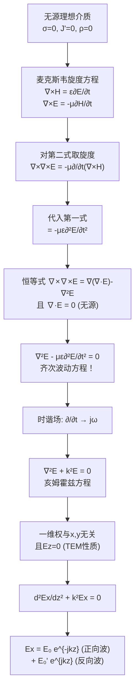
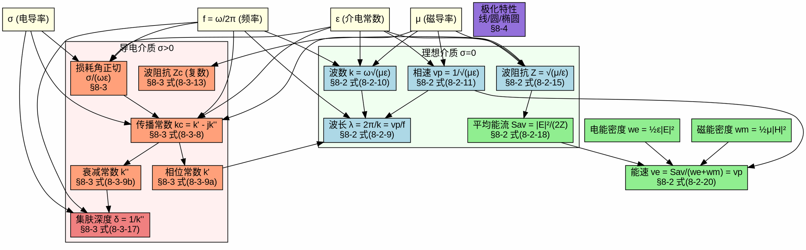

# 波动方程与平面波解 MOC

## 教科书原文

> 📖 参见：[[§8-1 波动方程与平面波解]]

## 概念定义

波动方程是描述"扰动如何传播"的最基本方程。从水波到声波到地震波，再到电磁波——它们都满足形式完全相同的方程：$$\nabla^2 f - \frac{1}{v^2}\frac{\partial^2 f}{\partial t^2} = 0$$。对电磁波来说，$$f$$ 是电场$$\mathbf{E}$$或磁场$$\mathbf{H}$$，速度$$v = 1/\sqrt{\mu\varepsilon}$$。这个方程的推导不需要任何关于"波"的假设——它完全从麦克斯韦方程组通过纯数学运算得出。这便是电磁波存在的"数学证明"：麦克斯韦方程组的解天然就是波。

## 类比与直觉

1. **多米诺骨牌**：波动方程描述的物理过程就像一排多米诺骨牌——每张骨牌的倒下（局部的场变化）触发下一张骨牌的倒下（邻近的场变化），扰动就这样一个接一个地传递下去。电磁波的传播也是这样：变化的电场（第一张骨牌）产生变化的磁场（第二张骨牌），变化的磁场又产生变化的电场（第三张）……如此环环相扣，向前传播。

2. **池塘中的涟漪**：扔一块石头到池塘中，水波以同心圆向外扩散。波动方程的"齐次"版本（无源）描述的是涟漪已经在传播的过程——不需要持续的能量输入，波一旦产生就能自行传播。而"非齐次"版本描述的是石头刚入水的那一刻——源（石头）正在驱动波。

## 核心公式详释

**非齐次波动方程（有时变源）**：
$$\nabla^2 \mathbf{E} - \mu\varepsilon\frac{\partial^2 \mathbf{E}}{\partial t^2} = \mu\frac{\partial \mathbf{J}}{\partial t} + \frac{1}{\varepsilon}\nabla\rho$$

**齐次波动方程（无源理想介质）**：
$$\nabla^2 \mathbf{E} - \mu\varepsilon\frac{\partial^2 \mathbf{E}}{\partial t^2} = 0$$

**时谐齐次亥姆霍兹方程**：
$$\nabla^2 \mathbf{E} + k^2 \mathbf{E} = 0, \quad k = \omega\sqrt{\mu\varepsilon}$$

**一维平面波解（沿+z传播）**：
$$\mathbf{E}(z) = \mathbf{E}_0 e^{-jkz}$$

| 符号 | 含义 | 单位 |
|------|------|------|
| $k$ | 波数（相位常数） | rad/m |
| $\omega$ | 角频率 | rad/s |
| $v$ | 波速 $$v = 1/\sqrt{\mu\varepsilon}$ | m/s |
| $\mu, \varepsilon$ | 磁导率、介电常数 | H/m, F/m |
| $\mathbf{J}'$ | 外源电流密度 | A/m² |

**关键：波速** $$v = 1/\sqrt{\mu\varepsilon}$$ 在真空中等于光速 $$c = 1/\sqrt{\mu_0\varepsilon_0} \approx 3 \times 10^8$$ m/s——麦克斯韦因此推断光就是电磁波。

## 推导脉络



## 常见误区

1. **波动方程假设了波的存在**：错误。波动方程完全是从麦克斯韦方程组通过纯数学推导得出的，没有引入任何关于"波"的假设。波动方程的出现是麦克斯韦方程组的内在性质，而非人为设定。

2. **$$\nabla^2 \mathbf{E} = \partial^2 \mathbf{E}/\partial x^2$$（一维情况）**：方向导数的拉普拉斯算子作用于矢量场时是分量级运算。在直角坐标系中，$$[\nabla^2 \mathbf{E}]_x = \nabla^2 E_x$$，即拉普拉斯算子作用于每个分量。

3. **亥姆霍兹方程和波动方程是同一个东西**：亥姆霍兹方程（$$\nabla^2 \mathbf{E} + k^2 \mathbf{E} = 0$$）是波动方程（$$\nabla^2 \mathbf{E} - \mu\varepsilon \partial^2 \mathbf{E}/\partial t^2 = 0$$）在时谐条件下的频域形式。前者是偏微分方程（关于空间），后者仍是关于空间和时间的偏微分方程。

## 费曼检验

1. 从麦克斯韦方程出发，完整推导出齐次波动方程，详细说明每一步的物理依据。
2. 如果介质有电导率$$\sigma \neq 0$$，波动方程的形式会如何改变？
3. 为什么一维情况下（仅与z有关）必然有$$E_z = H_z = 0$$？请从散度方程出发证明。
4. 代入平面波解$$e^{-jkz}$$到亥姆霍兹方程，验证$$-k^2 + k^2 = 0$$。

## 概念导航

- **前置概念**：[[麦克斯韦方程组 MOC]]、[[从麦克斯韦到波动方程的推导]]、[[标量位与矢量位 MOC]]
- **后续概念**：[[理想介质中的平面电磁波 MOC]]、[[导电介质中的平面电磁波 MOC]]、[[均匀平面波的数学形式]]
- **关联概念**：[[亥姆霍兹方程的导出]]、[[波数k]]、[[相速度与波长]]

## 自己理解

波动方程的推导是物理学中最优美的数学推理之一。你从四条实验定律（库仑、安培、法拉第、无磁单极）出发，加上麦克斯韦的一个天才假设（位移电流），通过纯数学运算（取旋度、代入、化简），就得到了一个预言"波"存在的方程。更令人震撼的是，这个方程的波速 $$v = 1/\sqrt{\mu_0\varepsilon_0}$$ 恰好等于当时已知的光速。这不是数值上的巧合——这是宇宙的一个深层秘密：光就是电磁波。在19世纪，没有任何人做过能产生电磁波的实验，是麦克斯韦的方程首先"看到"了电磁波。理论走在了实验前面——这是科学史上最辉煌的时刻之一。

> 📖 参见：[[§8-1 波动方程与平面波解]]

## 可视化图表




```plantuml
@startuml 平面电磁波传播序列
!theme plain
skinparam backgroundColor #FEFEFE

title 平面电磁波: 从亥姆霍兹方程到传播全过程 §8-1~§8-8

(*) --> "麦克斯韦方程组\n无源区 ∇×H=∂D/∂t\n∇×E=-∂B/∂t" as Maxwell

Maxwell --> "波动方程\n∇²E - με∂²E/∂t² = 0\n∇²H - με∂²H/∂t² = 0" as WaveEq

WaveEq --> "时谐场简化 ∂/∂t→jω\n亥姆霍兹方程\n∇²E + k²E = 0\nk = ω√(με)" as Helmholtz

Helmholtz --> "均匀平面波解\nE = E₀ e^{-jk·r}\nH = H₀ e^{-jk·r}" as PlaneWave

PlaneWave --> "色散关系\nk = ω/v_p\nv_p = 1/√(με)" as Dispersion

PlaneWave --> "波阻抗\nη = |E|/|H|\n理想介质: η = √(μ/ε)" as Impedance

PlaneWave --> "传播条件判断" as CondCheck

CondCheck --> "理想介质 σ=0\nα=0 β=k=ω√(με)\n无衰减传播" as Lossless
CondCheck --> "良导体 σ≫ωε\nα≈β≈√(πfμσ)\n快速衰减" as GoodConductor
CondCheck --> "一般导电介质\nα=ω√(με/2)[√(1+(σ/ωε)²)-1]½\nβ=ω√(με/2)[√(1+(σ/ωε)²)+1]½" as LossyDielectric

Lossless --> "垂直入射到界面" as Incidence
GoodConductor --> "趋肤效应\nδ=1/α=√(2/ωμσ)" as SkinEffect
LossyDielectric --> "衰减常数α 相位常数β" as AlphaBeta

Incidence --> "反射系数Γ\nΓ=(η₂-η₁)/(η₂+η₁)" as Reflection
Incidence --> "传输系数T\nT=2η₂/(η₂+η₁)" as Transmission

Reflection --> "驻波\nSWR=(1+|Γ|)/(1-|Γ|)" as StandingWave
Reflection --> "全反射|Γ|=1\nPEC/PMC表面" as TotalReflection
Transmission --> "全透射Γ=0\n阻抗匹配η₁=η₂" as TotalTransmission

StandingWave --> "波腹(1+|Γ|)|E₀|" as Antinode
StandingWave --> "波节(1-|Γ|)|E₀|\n间距λ/2" as Node

SkinEffect --> "导体损耗\n导体表面功率\nP=½Rs|H_tan|²" as ConductorLoss

TotalReflection --> "行驻波/纯驻波" as MixedWave

AlphaBeta --> SkinEffect

CondCheck --> "斜入射(θᵢ≠0)" as ObliqueInc
ObliqueInc --> "斯涅尔定律\nsinθᵢ/v₁ = sinθ_t/v₂" as Snell
ObliqueInc --> "全反射临界角\nsinθ_c = √(ε₂/ε₁) ε₁>ε₂" as CriticalAngle
ObliqueInc --> "布儒斯特角\ntanθ_B = √(ε₂/ε₁)\nΓ∥=0 TM波无反射" as Brewster

note right of Lossless
  理想介质传播特征:
  E⊥H⊥k 三者正交
  E和H同相
  S=½Re[E×H*] 单向能流
  |E/H|=η 恒定
end note

note right of GoodConductor
  良导体特征:
  E相位超前H约45°
  波长变短: λ=2π/β≪λ₀
  波速变慢: v_p=ω/β≪c
  趋肤深度δ极小
end note

note bottom of StandingWave
  驻波参数:
  SWR=1: 行波(无反射)
  SWR=∞: 纯驻波(全反射)
  1<SWR<∞: 行驻波
  波节处|E|最小≠0(行驻波)
end note

@enduml

```
