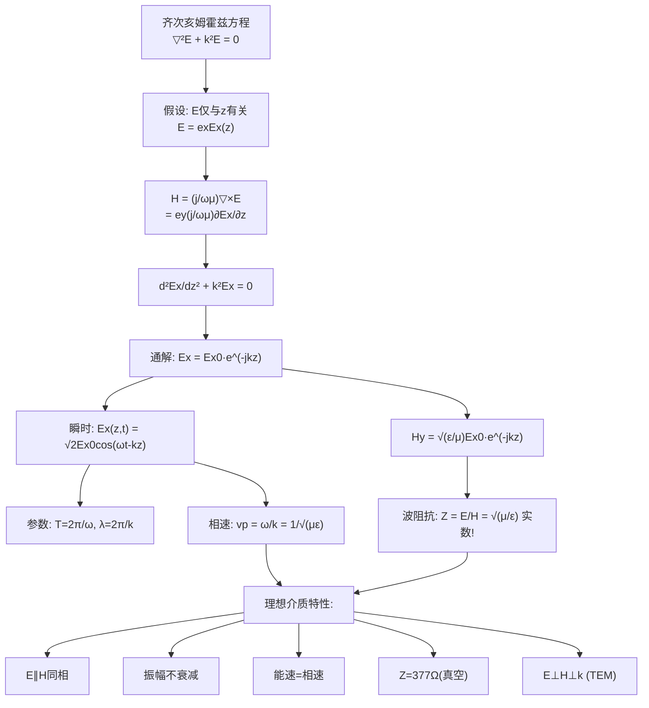
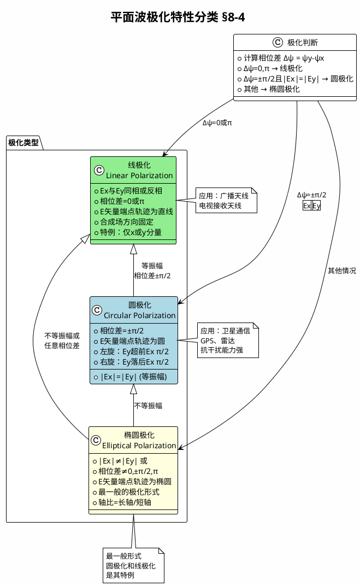

---
tags: [电磁场, 平面电磁波, TEM波, 理想介质]
chapter: "第8章"
textbook_section: "§8-2"
textbook_page: "p.205-210"
type: core-concept
importance: 🔴
exam_frequency: ★★★
exam_type: 简
difficulty: intermediate
created: 2026-04-28
---

# TEM 波特性：横电磁波
**关键词**：理想介质中的平面电磁波


📌 **一句话本质**：均匀平面波——横电磁波TEM，E和H都垂直于传播方向且互相垂直
🏷️ **重要度**：🔴 | 考试：★★★ | 题型：简

## 🔧工程场景

卫星通信天线——抛物面天线辐射的是TEM波，极化方向由E场方向决定，极化失配会导致信号完全丢失

## 概念定义

**TEM波（Transverse Electromagnetic Wave，横电磁波）**是一种电场 E 和磁场 H 都完全垂直于传播方向 k、且 E 与 H 本身也互相垂直的电磁波。在理想介质中传播时，均匀平面波是最典型、最基本的TEM波——在垂直于传播方向的平面（波面）上，场强处处相等，E 和 H 同相，能量单向流动。

$$ \vec{k} \perp \vec{E} \perp \vec{H} \perp \vec{k}, \quad |\vec{E}|/|\vec{H}| = \eta = \sqrt{\mu/\varepsilon} $$

## 🧠类比与直觉

**三根垂直筷子的模型（最直观的类比）**：
取三根筷子，使它们两两互相垂直：
- 第一根筷子指向东——这是传播方向 k（电磁波前进的方向）
- 第二根筷子上下振动——这是电场 E（在传播过程中上下起伏）
- 第三根筷子南北振动——这是磁场 H（与电场和传播方向都垂直）

用橡皮筋让第二根和第三根筷子以相同的节奏振动——这就是理想介质中TEM波的形象：E 和 H 同相地、同步地振荡，乘着相位速度一同向前推进。

**水波推板子的类比**：
将一块木板竖在水中，向前划——水面上下起伏（E），水压左右传播（H），而波本身水平前进（k）。三个方向互相垂直。理想介质就像没有阻力的理想流体——波传播时能量不损耗，E 和 H 的振幅保持恒定。

**跳绳运动的类比**：
两个人甩一条长绳，绳波的传播方向（k）是水平的，绳的上下振动（E）是垂直的，而垂直于绳传播方向和振动方向的横向张力变化（H）则是左右方向的。三个方向永远保持右手正交关系。

## 📐教科书推导：逐步拆解

### 第1步：齐次矢量亥姆霍兹方程

无外源、理想介质（σ = 0）中的时谐电磁场满足齐次矢量亥姆霍兹方程：

$$\nabla^2\vec{E}(r) + k^2\vec{E}(r) = 0 \tag{8-2-1a}$$
$$\nabla^2\vec{H}(r) + k^2\vec{H}(r) = 0 \tag{8-2-1b}$$

其中 $$k = \omega\sqrt{\mu\varepsilon}$$ 为波数（相位常数）。

### 第2步：还原为一维问题 —— 均匀平面波的假设

设电场仅与坐标 z 有关（$$\partial/\partial x = \partial/\partial y = 0$$），且只考虑沿正 z 方向传播的波。由§8-1的结论：当场量仅与 z 有关时，Ez = Hz = 0（不可能有纵向分量）。令 $$\vec{E} = \vec{e}_x E_x$$（电场沿 x 方向）。

由麦克斯韦方程确定磁场：

$$\vec{H} = \frac{j}{\omega\mu}\nabla \times \vec{E} = \frac{j}{\omega\mu}\nabla \times (\vec{e}_x E_x)$$

利用矢量恒等式展开：

$$\vec{H} = \frac{j}{\omega\mu}\left[ (\nabla E_x) \times \vec{e}_x + E_x \nabla \times \vec{e}_x \right]$$

因为 $$\nabla \times \vec{e}_x = 0$$（常矢量旋度为零），且 $$\nabla E_x = \vec{e}_z \frac{\partial E_x}{\partial z}$$（E_x 仅依赖于 z），得：

$$\vec{H} = \vec{e}_y \frac{j}{\omega\mu}\frac{\partial E_x}{\partial z} = \vec{e}_y H_y \tag{8-2-2}$$

即：

$$H_y = \frac{j}{\omega\mu}\frac{\partial E_x}{\partial z} \tag{8-2-3}$$

**关键结果**：磁场仅具有 y 分量——E 沿 x，H 沿 y，传播方向为 z。三者两两正交，这正是 TEM 波的特征。

### 第3步：求解电场的一维亥姆霍兹方程

E_x 满足标量亥姆霍兹方程（考虑到 $$\partial E_x/\partial x = \partial E_x/\partial y = 0$$）：

$$\frac{d^2 E_x}{dz^2} + k^2 E_x = 0 \tag{8-2-4}$$

这是一个简单的二阶常系数齐次微分方程，其通解为：

$$E_x = E_{x0} e^{-jkz} + E'_{x0} e^{jkz} \tag{8-2-5}$$

- 第一项 $$E_{x0} e^{-jkz}$$：相位随 z 增加而**滞后**——代表沿 +z 方向传播的波
- 第二项 $$E'_{x0} e^{jkz}$$：相位随 z 增加而**超前**——代表沿 -z 方向传播的波（反射波）

只考虑沿正 z 方向传播的行波（令 $$E'_{x0} = 0$$）：

$$E_x = E_{x0} e^{-jkz} \tag{8-2-6}$$

### 第4步：电场的瞬时表达式与波参数

对应的瞬时值为：

$$E_x(z, t) = \sqrt{2}E_{x0}\cos(\omega t - kz) \tag{8-2-7}$$

从相位 $$\omega t - kz$$ 定义的波参数：

**周期 T 和频率 f**：时间相位 ωt 变化 2π 所需的时间。由 $$\omega T = 2\pi$$：

$$T = \frac{2\pi}{\omega} = \frac{1}{f} \tag{8-2-8}$$

**波长 λ**：空间相位 kz 变化 2π 所经过的距离。由 $$k\lambda = 2\pi$$：

$$\lambda = \frac{2\pi}{k} \tag{8-2-9}$$

**相位常数 k**：$$k = 2\pi/\lambda$$，表示单位长度内的相位变化（单位 rad/m）。因为一个全波对应 2π 的空间相位变化，k 的大小也衡量单位长度内包含的全波数目，所以 k 又称为**波数**。

### 第5步：相速 —— 等相位面移动的速度

固定相位点满足 $$\omega t - kz = \text{常数}$$，对时间求导：

$$\omega dt - k dz = 0 \quad \Rightarrow \quad v_p = \frac{dz}{dt} = \frac{\omega}{k}$$

代入 $$k = \omega\sqrt{\mu\varepsilon}$$：

$$v_p = \frac{\omega}{k} = \frac{1}{\sqrt{\mu\varepsilon}} \tag{8-2-11}$$

**重要结论**：理想介质中均匀平面波的相速仅取决于介质参数 ε 和 μ。在真空中 $$v_p = c = 1/\sqrt{\varepsilon_0\mu_0} \approx 3 \times 10^8 \text{ m/s}$$。

由相速、频率和波长的关系：

$$v_p = \lambda f \tag{8-2-12}$$

介质中的波长与真空波长的关系：

$$\lambda = \frac{\lambda_0}{\sqrt{\varepsilon_r\mu_r}} < \lambda_0$$

介质中的波长短于真空中波长——这就是**缩波效应**，在微带天线和埋地天线设计中必须考虑。

### 第6步：磁场的完整解与波阻抗

由式(8-2-3)和式(8-2-6)求出磁场：

$$H_y = \sqrt{\frac{\varepsilon}{\mu}}E_{x0}e^{-jkz} = H_{y0}e^{-jkz} \tag{8-2-14a}$$

其中 $$H_{y0} = \sqrt{\frac{\varepsilon}{\mu}}E_{x0} \tag{8-2-14b}$$

定义**波阻抗** Z（电场振幅与磁场振幅之比）：

$$Z = \frac{E_x}{H_y} = \sqrt{\frac{\mu}{\varepsilon}} \tag{8-2-15}$$

理想介质中波阻抗为**实数**——意味着 E 和 H **同相**。

真空波阻抗：

$$Z_0 = \sqrt{\frac{\mu_0}{\varepsilon_0}} = 377 \, \Omega \approx 120\pi \, \Omega \tag{8-2-16}$$

矢量形式表达电场与磁场的关系：

$$\vec{H}_y = \frac{1}{Z}\vec{e}_z \times \vec{E}_x \tag{8-2-17a}$$
$$\vec{E}_x = Z \vec{H}_y \times \vec{e}_z \tag{8-2-17b}$$

**E、H、k 构成右手正交系**：$$\vec{e}_E \times \vec{e}_H = \vec{e}_k$$。

### 第7步：能量传播 —— 能流密度与能量速度

TEM 波的复能流密度矢量（坡印亭矢量）：

$$\vec{S}_c = \vec{E}_x \times \vec{H}_y^* = \vec{e}_z\frac{E_{x0}^2}{Z} = \vec{e}_z Z H_{y0}^2 \tag{8-2-18}$$

复能流密度矢量为**纯实数**——虚部为零。这意味着能量仅沿 +z 方向单向流动，空间中不存在来回振荡的交换能量（无功功率为零）。

电场能量密度平均值：$$w_{eav} = \frac{1}{2}\varepsilon E_{x0}^2$$

磁场能量密度平均值：$$w_{mav} = \frac{1}{2}\mu H_{y0}^2$$

由波阻抗关系 $$E_{x0} = Z H_{y0}$$，可知：

$$w_{eav} = w_{mav}$$

**理想介质中电能密度与磁能密度处处相等**——能量在电场与磁场之间完美均衡。

定义能量速度 $$v_e$$（能流密度平均值与总储能密度之比）：

$$v_e = \frac{S_{av}}{w_{av}} = \frac{E_{x0}^2/Z}{2 \cdot (\varepsilon E_{x0}^2/2)} = \frac{1}{\sqrt{\mu\varepsilon}} = v_p \tag{8-2-20}$$

**在理想介质中，能量传播速度等于相位速度。** 这与导电介质中的情况截然不同（导电介质中两者不相等）。

## Mermaid 推导流程图



## 教科书例题

**例8-2-1**：均匀平面波在真空中沿 +z 方向传播，已知电场强度瞬时值，求频率、波长、相速、磁场强度等参数。解题关键：从瞬时表达式提取 ω 和 k，再套用 $$f = \omega/(2\pi)$$、$$\lambda = 2\pi/k$$、$$H = E/Z_0$$ 等关系。

**例8-2-2**：已知 3 GHz 均匀平面波在理想介质中的 E=20 V/m、H=0.1 A/m、λ=3 cm，求介质的 ε_r 和 μ_r。解题逻辑：
1. $$Z = 20/0.1 = 200 \, \Omega$$
2. $$Z = 200 = \sqrt{\mu/\varepsilon} = 377\sqrt{\mu_r/\varepsilon_r}$$
3. $$v_p = f\lambda = 9 \times 10^7 \text{ m/s}$$
4. $$v_p = 1/\sqrt{\mu\varepsilon} = c/\sqrt{\mu_r\varepsilon_r}$$
5. 联解得 $$\varepsilon_r = 6.28, \, \mu_r = 1.77$$

## 💻MATLAB 可视化提示词

```
%% TEM波三维可视化：E⊥H⊥k
% 1. 创建z轴传播方向的空间网格 (z从0到2λ)
% 2. 计算Ex(z,t) = E0·cos(ωt - kz)，t取0, T/4, T/2, 3T/4
% 3. 在同一图中绘制E(红色, x方向)和H(蓝色, y方向)
% 4. 使用 quiver3 在图右侧展示三根垂直筷子 (k, E, H)
% 5. 用 plot3 绘制电场和磁场的空间分布曲线
% 6. 添加动画功能展示波的前进
% 7. 标注: "E×H = k方向"（坡印亭矢量）
% 8. 在子图中显示E和H的相位关系（同相）
```

## ⚠️常见误区

1. **TEM波不等于所有电磁波。** 只有 TE（无 Ez）和 TM（无 Hz）的混合波也是电磁波，但 TEM 要求 E 和 H 都完全垂直于传播方向。在波导中传播的电磁波通常不是 TEM 波（截止频率以下无法传播，波导中至少有一个纵向分量）。

2. **377 Ω 不是随便记的数字。** 它是真空的"特征阻抗"，源于 μ₀ 和 ε₀ 这两个基本物理常数之比。任何理想介质中的波阻抗 = $$377\sqrt{\mu_r/\varepsilon_r} \, \Omega$$。这个数字在电磁兼容、天线设计中频繁出现。

3. **理想介质中 E 和 H 同相，但导电介质中不同相。** 理想介质中波阻抗为实数（纯电阻性），E 和 H 步调一致。导电介质中波阻抗为复数（含电抗分量），H 滞后于 E——这是因为导电介质中的传导电流消耗了部分能量，改变了电磁场之间的能量交换关系。

4. **均匀平面波是理想化的数学模型。** 实际中不存在无限大波面上场强完全相同的波。但在远离波源的局部区域（远场区），球面波可近似为平面波——这是天线理论和电磁兼容分析的基础。

5. **相速不一定等于能量传播速度。** 在理想介质中两者相等是特例。在导电介质（色散介质）中，相速和群速（能量速度）分离；在某些特殊媒质中（如反常色散区），相速甚至可以超过光速——但这不违反相对论，因为信息/能量的传播速度是群速而非相速。

## ❓费曼检验

1. **问题**：一个均匀平面波在真空中传播，电场为 $$\vec{E} = \vec{e}_x 10\cos(\omega t - kz) \text{ V/m}$$。请写出对应的磁场表达式（大小和方向）。**预期回答**：$$H = E/Z_0 = 10/377 \approx 0.0265 \text{ A/m}$$，方向为 $$\vec{e}_y$$（因为 $$\vec{e}_k \times \vec{e}_E = \vec{e}_z \times \vec{e}_x = \vec{e}_y$$，然后除以 Z 得到 H）。完整表达式：$$\vec{H} = \vec{e}_y 0.0265\cos(\omega t - kz) \text{ A/m}$$。

2. **问题**：在理想介质中传播的 TEM 波，电场的空间分布是 $$\cos(\omega t - kz)$$。在固定时刻 t₀，电场在空间上每隔多少距离重复一次？**预期回答**：每隔一个波长 λ。因为当 kz 变化 2π 时 cos 函数重复，即 $$k(z+\lambda) = kz + 2\pi$$，所以 $$\lambda = 2\pi/k$$。

3. **问题**：为什么在理想介质中电能密度等于磁能密度（$$w_e = w_m$$）是一个必然结果，而非巧合？**预期回答**：这是波传播的平衡条件。如果 $$w_e \neq w_m$$，能流密度的虚部就不为零，意味着存在来回交换的能量——对应着反射波或驻波分量。对于纯行波（无反射），电磁场必须满足 $$E/H = \sqrt{\mu/\varepsilon}$$ 的波阻抗关系，而代入能量密度公式必然导致 $$w_e = w_m$$。这是电磁波作为自持传播系统的内在一致性。

## 🔗概念导航

- 前置概念：[[从麦克斯韦到波动方程的推导]]（波动方程的来源）、[[时谐电磁场的复数表示]]
- 后续概念：[[衰减常数与相位常数]]（导电介质中 k 变为复数，α 和 β 分离）
- 关联概念：[[坡印亭矢量的物理意义]]（$$\vec{S} = \vec{E} \times \vec{H} \parallel \vec{k}$$）
- 平行概念：[[波导中的TE波与TM波]]（非 TEM 波——纵向分量存在时的传播模式）
- 深层概念：[[相速与群速的区别]]（色散介质中两者分离的物理根源）

> 📖 **教科书参考**：§8-2, p.205-210

## 可视化图表

```wavedrom
{
  "signal": [
    {"name": "Ex(z,t) t=0", "wave": "cos", "period": 4},
    {"name": "Hy(z,t) t=0", "wave": "cos", "period": 4},
    {"name": "Ex(z,t) t=T/4", "wave": "sin", "period": 4},
    {"name": "Hy(z,t) t=T/4", "wave": "sin", "period": 4},
    {"name": "S(z,t) 能流", "wave": "|.cos|", "period": 2}
  ],
  "head": {
    "text": "理想介质中均匀平面波: E/H同相振荡 §8-2",
    "tick": 0
  },
  "foot": {
    "text": "kz变化2π=一个波长λ vp=ω/k=1/√(με)"
  }
}

```



