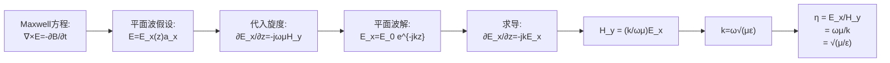
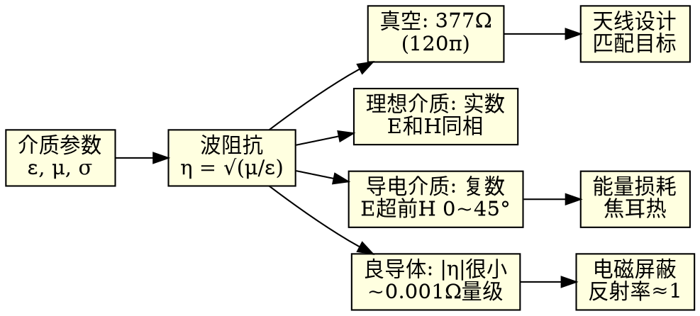

# 波阻抗 η = √(μ/ε)
**关键词**：理想介质中的平面电磁波

## 教科书原文

> 📖 参见：[[§8-2 理想介质中的平面电磁波]]

## 概念定义

波阻抗是平面电磁波中横电场分量与横磁场分量的振幅之比，表征介质对电磁波传播的"阻力"。它是介质的本征属性（仅取决于 $$\mu$$ 和 $$\varepsilon$$），与波的频率和振幅无关——就像一段传输线的特性阻抗由其几何结构和填充介质决定，而与传输的信号无关。

## 类比与直觉

**类比1：水管的水压-流量比**。水流中压强与流速的比值取决于管道的粗细和粗糙度——这就是管道的"水力阻抗"。波阻抗 $$\eta = \sqrt{\mu/\varepsilon}$$ 类似地刻画了介质中"电场压强"和"磁场流速"之间的比例关系。真空的377Ω是"最标准的水管"的阻抗。

**类比2：传输线的特性阻抗**。同轴电缆的特性阻抗 $$Z_0 = \frac{1}{2\pi}\sqrt{\frac{\mu}{\varepsilon}}\ln(b/a)$$ 依赖于几何尺寸（$$b/a$$）和填充介质的 $$\sqrt{\mu/\varepsilon}$$。自由空间中的平面波可以看作是一条"无限大的传输线"，其特性阻抗回归到纯材料参数 $$\sqrt{\mu/\varepsilon}$$，在真空中恰好为377Ω。

## 核心公式详释

**波阻抗（本征阻抗）**：
$$\eta = Z = \sqrt{\frac{\mu}{\varepsilon}} \quad (\Omega)$$

**真空波阻抗**：
$$\eta_0 = Z_0 = \sqrt{\frac{\mu_0}{\varepsilon_0}} = \sqrt{\frac{4\pi\times10^{-7}}{8.854\times10^{-12}}} = 120\pi \approx 377\Omega$$

**一般介质（$$\mu_r\approx1$$时）**：
$$\eta = \eta_0\sqrt{\frac{\mu_r}{\varepsilon_r}} \approx \frac{377}{\sqrt{\varepsilon_r}}$$

**导电介质（复数波阻抗）**：
$$\eta_c = \sqrt{\frac{\mu}{\varepsilon - j\sigma/\omega}}$$

良导体近似：$$\eta_c \approx (1+j)\sqrt{\frac{\pi f\mu}{\sigma}}$$

| 介质 | $\varepsilon_r$ | $\mu_r$ | $\eta (\Omega)$ |
|------|:---:|:---:|:---:|
| 真空 | 1 | 1 | 377 |
| 空气 | ~1 | ~1 | ~377 |
| 聚乙烯 | 2.25 | 1 | 251 |
| 玻璃 | 4~7 | 1 | 142~189 |
| 纯水 | 81 | 1 | 42 |
| 海水（1 MHz） | 80 | 1 | 复数，$$\mid Z_c\mid \ll 377$ |

**矢量关系**：
$$\mathbf{H} = \frac{1}{\eta}\mathbf{e}_k \times \mathbf{E}$$
$$\mathbf{E} = \eta\;\mathbf{H} \times \mathbf{e}_k$$

E、H、k三个矢量相互正交，构成右手螺旋关系：$$\mathbf{e}_E \times \mathbf{e}_H = \mathbf{e}_k$$

## 推导脉络

## 常见误区

1. **$$\eta = 377\Omega$$ 对所有介质都适用**：仅适用于真空/空气。介质中 $$\eta = 377/\sqrt{\varepsilon_r}$$（当 $$\mu_r=1$$）。水的 $$\eta \approx 42\Omega$$，远小于377Ω！

2. **波阻抗和电路阻抗直接比较**：虽然单位都是欧姆，但波阻抗表征的是"场比值"（V/m 除以 A/m），不是"电压除以电流"。两者维度相同但物理来源不同。

3. **良导体中波阻抗很小但未理解原因**：对的——对铜在1 MHz，$$|Z_c| \approx 0.001\Omega$$。这意味着在导体中，同样振幅的电场只伴随很小的磁场（因为能量主要以焦耳热形式耗散）。

4. **忽略复数波阻抗的幅角含义**：$$\eta_c$$ 的幅角 = $$\frac{1}{2}\arctan(\sigma/\omega\varepsilon)$$，其最大值趋近于45°（良导体极限）。45°的相位角意味着E超前H 45°。

## 费曼检验

1. 为什么水的波阻抗（~42Ω）远小于真空（377Ω）？从 $$\eta = 377/\sqrt{\varepsilon_r}$$ 的公式出发，纯水 $$\varepsilon_r=81$$，那么 $$\eta = 377/9 = 42\Omega$$。这是否意味着相同电场下，水中的磁场比真空中强9倍？
2. 如果一种磁介质 $$\mu_r=100, \varepsilon_r=1$$，其波阻抗是多少？与真空相比有何不同？
3. 良导体中波阻抗的实部和虚部相等（各为 $$\sqrt{\pi f\mu/\sigma}$$），为什么？

## 概念导航

- **关联**：[[波阻抗]]、[[理想介质中的平面电磁波 MOC]]、[[导电介质中的平面电磁波 MOC]]、[[相速度与波长]]
- **延伸**：[[平面导体表面上的反射与折射]]、[[TEM波的能流密度]]
- **习题**：已知某介质中 $$E=10$$ V/m, $$H=0.04$$ A/m，求 $$\eta$$ 和 $$\varepsilon_r$$。（答：$$\eta=250\Omega, \varepsilon_r\approx 2.27$$）

## 自己理解

377是电磁学中最神奇的数字之一。它告诉我们：在真空中，每1 V/m的电场必然伴随着1/377 A/m的磁场。这个数由两个最基本的宇宙常数决定——$$\mu_0$$（真空磁导率）和 $$\varepsilon_0$$（真空介电常数）。当你设计天线时，377Ω就是你要匹配的目标——天线阻抗应该接近377Ω（或其变换值）才能高效地辐射和接收电磁波。任何不匹配都会产生反射，就像说话有回音一样。

> 📖 参见：[[§8-2 理想介质中的平面电磁波]]
