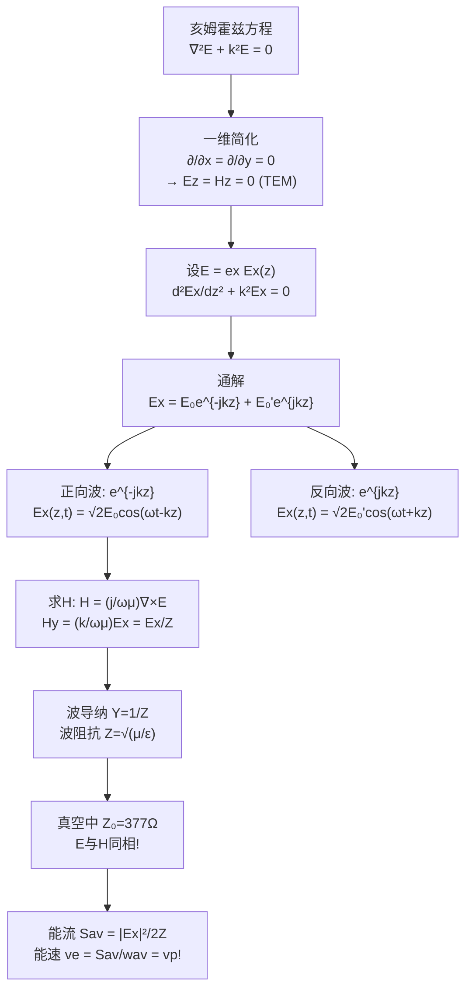
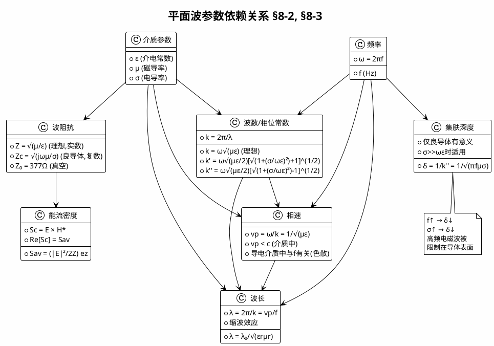

# 理想介质中的平面电磁波 MOC

## 教科书原文

> 📖 参见：[[§8-2 理想介质中的平面电磁波]]

## 概念定义

理想介质中的平面电磁波是最简单、最纯粹、最美丽的电磁波。想象你站在一望无际的平静湖面上，有人从远方推来一排整齐的波浪——波峰是一条条平行的直线，所有波峰都一样高。这就是"均匀平面波"：在垂直于传播方向的平面上，电场（或磁场）的强度和相位完全相同。电场和磁场互相垂直，都垂直于传播方向（所以叫TEM波），而且它们完美同步（同相），没有衰减（理想介质$$\sigma=0$$）。波阻抗$$Z=\sqrt{\mu/\varepsilon}$$是一个实数，在真空中恰好是$$377\Omega$$——这是宇宙的一个基本常数。

## 类比与直觉

1. **整齐前进的阅兵方阵**：想象天安门前阅兵的方阵——每一排士兵步伐完全一致，所有人在同一时刻到达同一位置（等相位面），每一排的间距就是波长。这个方阵笔直向前走，不散不乱（无衰减），这正是均匀平面波在理想介质中的样子。

2. **海浪与冲浪板**：均匀平面波的电场和磁场就像冲浪者和他的冲浪板——两者始终垂直（冲浪者站在板上），同速前进（冲浪者和板一起移动），大小之比固定（波阻抗）。在深水中，波的能量以固定的速度传播（相速=能速），就像一组整齐的海浪拍向岸边。

## 核心公式详释

**电场解（沿+z）**：
$$\mathbf{E}(z) = \mathbf{e}_x E_{x0} e^{-jkz}$$
瞬时值：$$E_x(z,t) = \sqrt{2}E_{x0}\cos(\omega t - kz)$$

**磁场解（沿+z）**：
$$\mathbf{H}(z) = \mathbf{e}_y \frac{E_{x0}}{Z} e^{-jkz}$$
$$H_y = \sqrt{\frac{\varepsilon}{\mu}}E_{x0} e^{-jkz}$$

**波数（相位常数）**：
$$k = \omega\sqrt{\mu\varepsilon} = \frac{2\pi}{\lambda}$$

**相速**：
$$v_p = \frac{\omega}{k} = \frac{1}{\sqrt{\mu\varepsilon}}$$

**波长**：
$$\lambda = \frac{2\pi}{k} = \frac{v_p}{f}$$

**波阻抗（实数！）**：
$$Z = \frac{E_x}{H_y} = \sqrt{\frac{\mu}{\varepsilon}}$$

**真空中**：
$$Z_0 = 120\pi \approx 377\Omega, \quad c = 3\times10^8 \text{ m/s}$$

| 符号 | 含义 | 说明 |
|------|------|------|
| $k$ | 波数/相位常数 | $k = 2\pi/\lambda$$, rad/m |
| $v_p$ | 相速 | 等相位面移动速度 |
| $Z$ | 波阻抗 | $E/H$$, 实数$$\Omega$ |
| $\lambda$ | 波长 | $2\pi/k$ |
| $\mathbf{E}, \mathbf{H}$ | 场矢量 | $\mathbf{E} \perp \mathbf{H} \perp \mathbf{k}$ |

**缩波效应**：介质中 $$\lambda = \lambda_0/\sqrt{\varepsilon_r\mu_r}$$，波长在介质中缩短。

## 推导脉络

## 常见误区

1. **平面波必须是均匀的**：错误。存在非均匀平面波（虽然本教材不深入讨论），其等振幅面和等相位面不重合。均匀平面波是等振幅面和等相位面重合的特例。

2. **波阻抗和电路阻抗是一回事**：虽然单位都是欧姆，但波阻抗 $$Z = \sqrt{\mu/\varepsilon}$$ 仅取决于介质本身的性质（$$\mu, \varepsilon$$），与波源和频率无关。电路阻抗则取决于电路元件的具体参数。

3. **$$\mathbf{E}$$ 和 $$\mathbf{H}$$ 在任何介质中都同相**：仅在理想介质（$$\sigma=0$$）中同相。在导电介质中，由于损耗，两者之间有相位差，波阻抗变为复数。

4. **能速总是等于相速**：仅在理想介质中成立（无耗散）。在导电介质中，由于色散，相速和能速可能不相等。

## 费曼检验

1. 一均匀平面波在真空中频率为1 GHz，求其波长、波数、相速和波阻抗。
2. 证明：在理想介质中，均匀平面波的电能密度平均值等于磁能密度平均值。
3. 如果均匀平面波的电场为 $$\mathbf{E} = \mathbf{e}_x 10e^{-j20\pi z}$$ V/m，介质为真空，求磁场强度复矢量和平均能流密度。
4. 解释为什么一维情况下（仅与z有关）必有 $$E_z = H_z = 0$$。

## 概念导航

- **前置概念**：[[波动方程与平面波解 MOC]]、[[从麦克斯韦到波动方程的推导]]、[[亥姆霍兹方程]]
- **后续概念**：[[导电介质中的平面电磁波 MOC]]、[[波阻抗]]、[[相速度与波长]]
- **关联概念**：[[TEM波]]、[[缩波效应]]、[[能量速度]]
- **进阶话题**：[[均匀平面波的数学形式]]、[[波阻抗eta_equal_sqrt_mu_div_eps]]

## 自己理解

理想介质中的均匀平面波是电磁学教科书中最"干净"的解——无衰减、无畸变、E和H完美同相，一切参数都简洁明了。虽然现实中不存在真正的均匀平面波（因为真正的平面波需要无限大的波面和无穷大的能量），但远离天线的局部区域可以很好地近似为平面波。更重要的是，任何复杂的电磁波都可以通过傅里叶变换分解为许多不同方向、不同频率的平面波之和——所以理解平面波就是理解一切电磁波的钥匙。真空波阻抗 $$377\Omega$$ 是宇宙的"特征电阻"——当你设计天线、分析电磁兼容时，这个数字无处不在。

> 📖 参见：[[§8-2 理想介质中的平面电磁波]]

## 可视化图表

