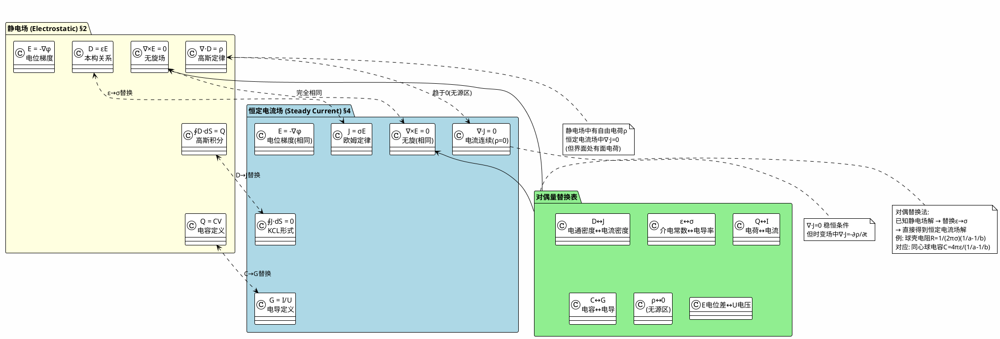

# 恒定电流场与静电场的对偶关系完整表格
**关键词**：电流密度, J=σE, 欧姆定律, 恒定电流场

📌 **一句话本质**：静电场与恒定电流场的数学结构完全相同——把D换成J、ε换成σ，静电场的解直接变成电流场的解

🏷️ **重要度**：🟡 | 考试：★★ | 题型：选

## 🔧 工程场景

集成电路衬底耦合分析——用静电比拟法将衬底电阻网络等效为电容网络再换回，快速估算衬底噪声耦合。若误将静电比拟的结果直接代回（忘记σ的非均匀性），数字电路开关噪声的模拟域耦合量级低估10倍，ADC精度从12位降至8位。

## 🧠 类比与直觉

**类比：中英翻译的双语对照表**。对偶关系就像一本电磁场的"双语词典"——静电场说"电荷Q，电容C，介电常数ε"，电流场说"电流I，电导G，电导率σ"。只要你掌握了这本词典的替换规则，任何静电场的"句子"（解）都能翻译成电流场的"句子"。这就是工程中"已知电容算电阻"的数学根源。

**口诀**：D换J，ε换σ，静电场的解直接变电流场

## 教科书原文

> 📖 参见：[[§4-6 恒定电流场与静电场的比拟]]

## 可视化图表

## ✂️ 可跳过

> 本节是对偶关系的速查表，若已熟记D↔J, ε↔σ, C↔G, Q↔I的替换规则和静电比拟三条件，可直接跳至下一个概念。
