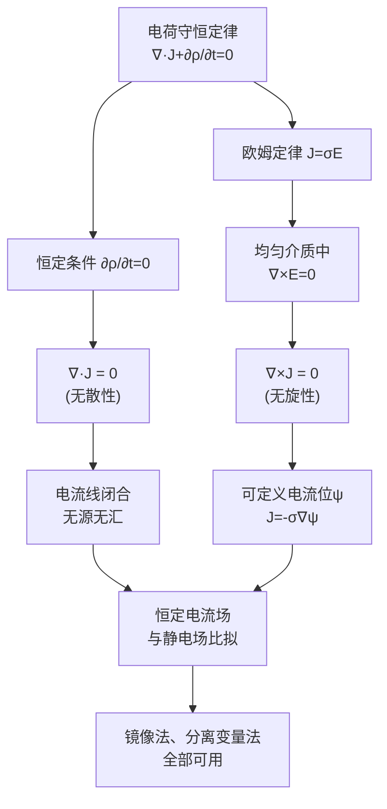

# 恒定电流场的基本方程 MOC

## 教科书原文

> 📖 参见：[[§4-1 电流与电流密度]], [[§4-2 电动势]], [[§4-3 恒定电流场的基本方程]]

## 概念定义（费曼第1步）

## 类比与直觉

**类比1：不可压缩流体的定常流动**。恒定电流场 $$\nabla \cdot \mathbf{J} = 0$$ 完全类似于不可压缩流体的连续性方程 $$\nabla \cdot \mathbf{v} = 0$$——流入任何闭合面的电流必等于流出的电流。电流线就像闭合的流线，永不中断。

**类比2：静电场在无源区的翻版**。在无源区 $$\nabla \times \mathbf{E} = 0, \nabla \cdot \mathbf{D} = 0$$ 对比恒定电流场 $$\nabla \times \mathbf{J} = 0, \nabla \cdot \mathbf{J} = 0$$。两者在数学形式上完全相同，因此静电场的所有解法（镜像法、分离变量法）都可以直接用于恒定电流场，只需将 $$\mathbf{E} \leftrightarrow \mathbf{J}$$, $$\varepsilon \leftrightarrow \sigma$$ 做替换即可。

## 核心公式一览

| 方程 | 积分形式 | 微分形式 | 物理意义 |
|------|---------|---------|---------|
| 无旋性 | $\oint_l \mathbf{J} \cdot d\mathbf{l} = 0$ | $\nabla \times \mathbf{J} = 0$ | 可定义电流位 $$\psi$$，$$\mathbf{J} = -\sigma\nabla\psi$ |
| 无散性 | $\oint_S \mathbf{J} \cdot d\mathbf{S} = 0$ | $\nabla \cdot \mathbf{J} = 0$ | 电流线闭合，无源无汇 |
| 欧姆定律 | $U = IR$ | $\mathbf{J} = \sigma\mathbf{E}$ | 局域场-流关系 |
| 电荷守恒 | $\oint_S \mathbf{J} \cdot d\mathbf{S} = -\partial q/\partial t$ | $\nabla \cdot \mathbf{J} = -\partial\rho/\partial t$ | 电荷不灭（时变情况） |

**电流位函数**（对标静电位的纯数学工具）：
$$\mathbf{J} = -\sigma\nabla\psi$$
$$\nabla^2\psi = 0$$（均匀导电介质中，$$\nabla\cdot\mathbf{J} = -\sigma\nabla^2\psi = 0$$）

## 本章知识图谱



本文件夹包含恒定电流场的核心物理规律：
1. **电流密度J的定义**——描述电荷流动的矢量场
2. **欧姆定律的微分形式**——$$\mathbf{J} = \sigma\mathbf{E}$$，局域场-流关系
3. **电流连续性方程**——电荷守恒定律在电流场的体现
4. **恒定电流场的基本定律**——无旋无散性及其物理含义

## 常见误区

1. **认为 $$\nabla\cdot\mathbf{J}=0$$ 意味着没有电荷流动**：恰恰相反！无散意味着电流线连续不断，流入=流出。直流电路中电流处处相等（基尔霍夫电流定律）正是这一性质的体现。

2. **混淆恒定电流场中的 $$\nabla\cdot\mathbf{J}=0$$ 和时变电流连续性方程**：时变时有 $$\nabla\cdot\mathbf{J} = -\partial\rho/\partial t$$，无散性仅在恒定（$$\partial\rho/\partial t=0$$）时成立。

3. **认为恒定电流场与静电场完全等价**：数学形式上等价，但物理本质上不同——恒定电流场涉及真实的能量耗散（焦耳热 $$\mathbf{J}\cdot\mathbf{E} = \sigma E^2$$），而静电场不涉及能量持续损耗。

## 费曼检验

1. 在恒定电流场中，$$\nabla\times\mathbf{J} = 0$$ 的物理含义是什么？如果在一个电阻网络中，$$\nabla\times\mathbf{J} \neq 0$$ 意味着什么？
2. 为什么均匀导电介质中的恒定电流场是无旋的，但不均匀介质中可能不是？
3. 如何从电流的连续性方程推导出电流管的"截面大→电流密度小"的结论？

## 概念导航
- **前置**：[[静电场的高斯定律]] | [[电位与电位梯度]]
- **后继**：[[恒定电流场的边界条件 MOC]] | [[恒定电流场与静电场的比拟 MOC]]
- **核心**：[[电流密度J的定义]] | [[欧姆定律的微分形式]] | [[电流连续性方程]] | [[恒定电流场的基本定律]]
- **应用**：[[跨步电压分析]] | [[接地电阻计算]]

## 自己理解（费曼复述）

> 恒定电流场的基本方程告诉我们：在没有外源的均匀导电介质中，电流的流动必须满足两个条件——(1)它不能"打转"（无旋），(2)它不能"断流"（无散）。这两个条件使恒定电流场在数学上和静电场在无源区完全相同，从而可以互相借用解法和结果。但千万不要忘记物理区别：恒定电流场在持续耗散能量，而静电场不耗散。

## 静电比拟表

| 静电场（无源区） | 恒定电流场（均匀介质） |
|:---|:---|
| $\nabla\times\mathbf{E}=0$ | $\nabla\times\mathbf{J}=0$ |
| $\nabla\cdot\mathbf{D}=0$ | $\nabla\cdot\mathbf{J}=0$ |
| $\mathbf{D}=\varepsilon\mathbf{E}$ | $\mathbf{J}=\sigma\mathbf{E}$ |
| $\mathbf{E}=-\nabla\phi$ | $\mathbf{J}=-\sigma\nabla\psi$ |
| $\nabla^2\phi=0$ | $\nabla^2\psi=0$ |
| 电位 $$\phi$ | 电流位 $$\psi$ |

```signal
{signal: [
  {name: '∇×J', wave: '0........', data: ['=0 无旋 → 可定义电流位ψ']},
  {name: '∇·J', wave: '0........', data: ['=0 无散 → 电流线闭合']},
  {name: 'J', wave: 'x2..4x6..', data: ['电流密度矢量,方向沿∇ψ']},
],
head: {text: '恒定电流场的两大基本性质'},
foot: {text: '无旋→有势,无散→封闭。类比静电场处处可对应。'}}
```

> 📖 第4章, p.108-114
