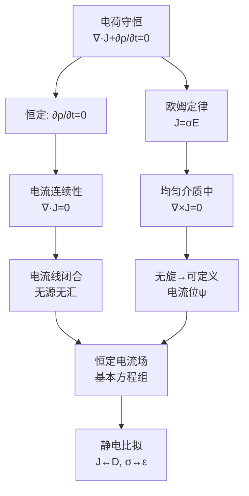

# 思考题：4-1至4-6 电流与电动势

📌 **一句话本质**：恒定电流场前六道基础概念题——从电流密度定义到欧姆焦耳定律，再到电动势和基本方程体系

🏷️ **重要度**：⚪ | 考试：★ | 题型：简

## 教科书原题

> 4-1 电流和电流密度的定义是什么？
> 4-2 写出电流连续性方程的积分形式和微分形式。
> 4-3 欧姆定律的微分形式如何表示？
> 4-4 焦耳定律的微分形式是什么？
> 4-5 什么是电动势？它与电位差有什么不同？
> 4-6 恒定电流场的基本方程是什么？

## 费曼4步解题法

### 第1步：明确问题结构

这6题构建了恒定电流场的基础框架：电流密度（4-1）→ 连续性方程（4-2）→ 欧姆定律（4-3）→ 焦耳定律（4-4）→ 电动势（4-5）→ 基本方程（4-6）。前三题是"场-流关系"，中间是"能量转换"，最后是完整的场方程体系。

### 第2步：逐题详解

**4-1 电流和电流密度的定义**

电流 $$I$$ = 单位时间通过某截面的电荷量：$$I = \frac{dq}{dt}$$（单位：A）

电流密度 $$\mathbf{J}$$ = 通过垂直于流动方向的单位面积的电流（矢量）：$$\mathbf{J} = \rho\mathbf{v}$$（$$\rho$$ 为电荷体密度，$$\mathbf{v}$$ 为漂移速度）。单位：A/m²。

两者的关系：$$I = \int_S \mathbf{J}\cdot d\mathbf{S}$$

**4-2 电流连续性方程**

积分形式：$$\oint_S \mathbf{J}\cdot d\mathbf{S} = -\frac{dq}{dt}$$

微分形式：$$\boxed{\nabla\cdot\mathbf{J} = -\frac{\partial\rho}{\partial t}}$$

物理含义：电荷守恒定律——流出闭合面的净电流 = 闭合面内电荷的减少率。对恒定电流（$$\partial\rho/\partial t = 0$$）：$$\nabla\cdot\mathbf{J} = 0$$。

**4-3 欧姆定律的微分形式**

$$\boxed{\mathbf{J} = \sigma\mathbf{E}}$$

其中$$\sigma$$为电导率（S/m）。这是"每点"的局域欧姆定律——电场在该点驱动局域电流密度。

对比积分形式 $$U = IR$$：积分形式是全局关系（对整个导体），微分形式是局域关系（对每个点）。

**4-4 焦耳定律的微分形式**

$$\boxed{p = \mathbf{J}\cdot\mathbf{E} = \sigma E^2}$$

其中p为焦耳损耗功率密度（W/m³）。全部功率损耗为：$$P = \int_V \mathbf{J}\cdot\mathbf{E}\,dV = I^2R$$

**4-5 电动势与电位差的不同**

| | 电动势 e | 电位差 U |
|---|---------|---------|
| 定义 | 非静电力对单位电荷做的功 | 静电力对单位电荷做的功 |
| 产生 | 电池（化学能）、发电机（机械能） | 静电场分布 |
| 公式 | $e = \int\mathbf{E}'\cdot d\mathbf{l}$ | $U_{AB} = \phi_A - \phi_B = \int_A^B\mathbf{E}\cdot d\mathbf{l}$ |
| 方向 | 提升电位（负→正） | 沿电场方向电位降低 |

**4-6 恒定电流场的基本方程**

积分形式：
$$\oint_l \mathbf{J}\cdot d\mathbf{l} = 0$$（或 $$\oint_l \mathbf{E}\cdot d\mathbf{l} = 0$$）
$$\oint_S \mathbf{J}\cdot d\mathbf{S} = 0$$

微分形式：
$$\nabla\times\mathbf{J} = 0$$（无旋，均匀介质中）
$$\nabla\cdot\mathbf{J} = 0$$（无散，恒定条件）

### 第3步：方程体系图

### 第4步：恒定电流场 vs 静电场比拟

| 恒定电流场（无源区） | 静电场（无源区） |
|:---|:---|
| $\nabla\times\mathbf{J} = 0$ | $\nabla\times\mathbf{E} = 0$ |
| $\nabla\cdot\mathbf{J} = 0$ | $\nabla\cdot\mathbf{D} = 0$ |
| $\mathbf{J} = \sigma\mathbf{E}$ | $\mathbf{D} = \varepsilon\mathbf{E}$ |
| $\mathbf{J} = -\sigma\nabla\psi$ | $\mathbf{E} = -\nabla\phi$ |
| $\nabla^2\psi = 0$ | $\nabla^2\phi = 0$ |

## 常见误区

1. **欧姆定律的微分形式 $$\mathbf{J}=\sigma\mathbf{E}$$ 意味着电流方向总是和电场方向相同**：只在各向同性介质中成立。在各向异性介质（如晶体）中，$$\sigma$$ 是张量，$$\mathbf{J}$$ 和 $$\mathbf{E}$$ 方向可以不同。
2. **$$\nabla\cdot\mathbf{J}=0$$ 意味着电流处处为零**：它只意味着流入=流出（无电荷堆积），电流可以很大只要连续不间断。
3. **电动势 = 开路端电压**：只在开路时成立。有负载时端电压 $$U = e - Ir$$（r为内阻）。

## 概念导航

- **前置**：[[电流密度的定义]]、[[欧姆定律的微分形式]]
- **后继**：[[恒定电流场的基本方程 MOC]]、[[恒定电流场的边界条件 MOC]]
- **关联**：[[电动势 MOC]]、[[电流连续性方程]]

## 自己理解

恒定电流场的这6道思考题建立了从"微观电荷运动"（电流密度J）到"宏观场方程"（无旋无散）的完整链条。核心记忆点只有一个：**恒定 → $$\nabla\cdot\mathbf{J}=0$$ → 电流线闭合 → 配合无旋性 → 与静电场数学同构 → 所有静电场解法可借用**。

> 📖 参见：[[§4-1 电流与电流密度]], [[§4-2 电动势]]
