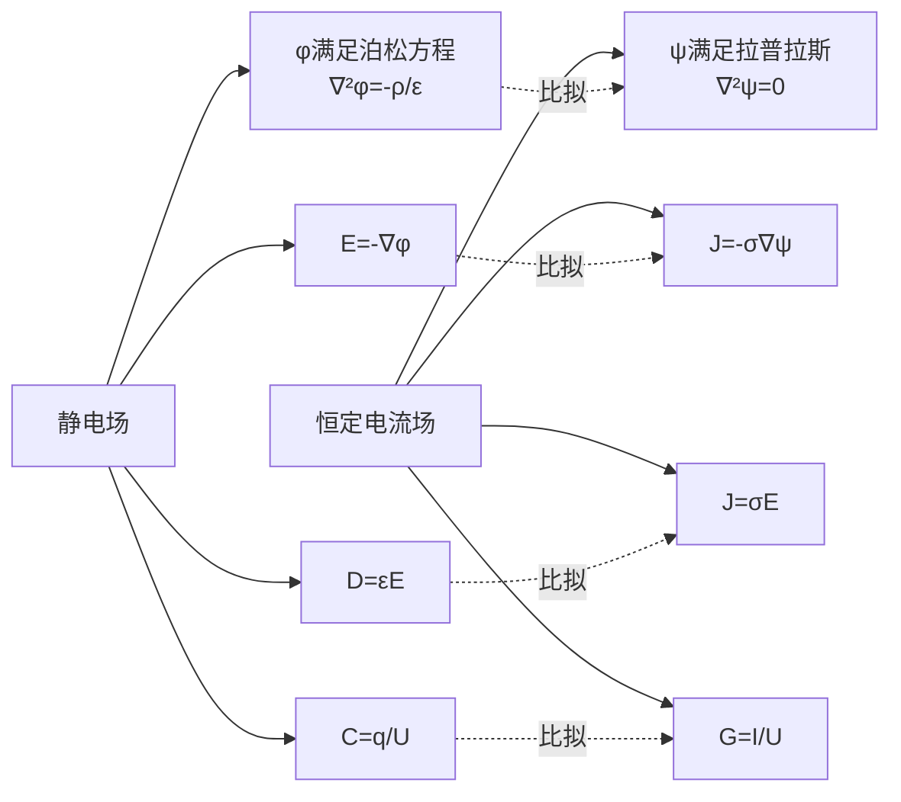

# 思考题：4-7至4-12 恒定电流场方程边界条件损耗与比拟

## 教科书原题

> 4-7 恒定电流场的基本方程是什么？
> 4-8 写出两种导电介质分界面上的边界条件。
> 4-9 导电介质中的损耗功率密度如何表示？
> 4-10 恒定电流场与静电场有哪些相似之处？这种比拟有什么用处？
> 4-11 什么是接地电阻？如何计算？
> 4-12 跨步电压是如何产生的？

## 费曼4步解题法

### 第1步：明确问题结构

这6道思考题涵盖了恒定电流场的应用核心：基本方程（4-7）→ 边界条件（4-8）→ 能量损耗（4-9）→ 静电比拟（4-10）→ 工程应用：接地（4-11）和跨步电压（4-12）。

### 第2步：逐题详解

**4-7 恒定电流场的基本方程**

积分形式：$$\oint_l \mathbf{E}\cdot d\mathbf{l} = 0$$（或 $$\oint_l \mathbf{J}\cdot d\mathbf{l}=0$$），$$\oint_S \mathbf{J}\cdot d\mathbf{S} = 0$$
微分形式：$$\nabla\times\mathbf{E}=0$$，$$\nabla\cdot\mathbf{J}=0$$
由均匀介质中 $$\mathbf{J}=\sigma\mathbf{E}$$ 得 $$\nabla\times\mathbf{J}=0$$

恒定条件下电流场满足拉普拉斯方程：$$\nabla^2\psi=0$$（$$\psi$$为电流位）。

**4-8 两种导电介质分界面的边界条件**

| | 法向条件 | 切向条件 |
|---|---------|---------|
| 电流场 | $J_{1n} = J_{2n}$ | $E_{1t} = E_{2t}$ |
| 折射定律 | $\frac{\tan\theta_1}{\tan\theta_2} = \frac{\sigma_1}{\sigma_2}$ | |

法向条件来自 $$\nabla\cdot\mathbf{J}=0$$，切向条件来自 $$\nabla\times\mathbf{E}=0$$。

**物理含义**：电流从良导体（大$$\sigma$$）进入不良导体（小$$\sigma$$）时，电流线弯向界面法线。极端情况——良导体（$$\sigma_1 \gg \sigma_2$$）→ $$\theta_1 \approx 90^\circ, \theta_2 \approx 0^\circ$$，电流几乎垂直于界面流入不良导体。

**4-9 导电介质中的损耗功率密度**

$$\boxed{p = \mathbf{J}\cdot\mathbf{E} = \sigma E^2 = \frac{J^2}{\sigma}}$$

单位：W/m³。总损耗：$$P = \int_V \mathbf{J}\cdot\mathbf{E}\,dV = I^2R$$。

**4-10 静电比拟——最强工具！**

| 静电场（无源区） | 恒定电流场（均匀介质） |
|:---|:---|
| $\mathbf{E} = -\nabla\phi$ | $\mathbf{J} = -\sigma\nabla\psi$ |
| $\nabla\cdot\mathbf{D} = 0$ | $\nabla\cdot\mathbf{J} = 0$ |
| $\nabla\times\mathbf{E} = 0$ | $\nabla\times\mathbf{J} = 0$ |
| $\nabla^2\phi = 0$ | $\nabla^2\psi = 0$ |
| $C = q/U$ | $G = I/U$$（电导） |
| $C/G = \varepsilon/\sigma$ | |

**用处巨大**：所有静电场解法（镜像法、分离变量法）可直接用于恒定电流场，仅需替换：$$\varepsilon \leftrightarrow \sigma$$，$$q \leftrightarrow I$$，$$\phi \leftrightarrow \psi$$。

**4-11 接地电阻**

接地电阻是电流从接地极流向大地时所遇到的电阻。计算时利用静电比拟：$$R = \frac{1}{G} = \frac{\varepsilon}{\sigma C}$$，其中C是同几何形状导体在$$\varepsilon$$介质中的电容。

半球接地极：$$R = \frac{1}{2\pi\sigma a}$$

**4-12 跨步电压**

跨步电压是电流经接地极流入大地时，地面两点间（人两脚间，约0.8m）的电位差。由于电流在大地中呈辐射状扩散（$$J \propto 1/r^2$$），离接地极越近，电位梯度越大，跨步电压越危险。这是电力系统安全接地设计的关键考虑因素。

### 第3步：静电比拟详解

### 第4步：工程应用价值

| 应用 | 关键参数 | 安全标准 |
|------|----------|----------|
| 接地设计 | 接地电阻 ≤ 4Ω（低压） | 确保故障电流流入大地 |
| 跨步电压 | 地面电位梯度 | 通常 ≤ 200V（0.8m间距） |
| 接触电压 | 人体接触两点电位差 | 安全限值 50V（干燥） |

## 常见误区

1. **接地电阻越小越好**：接地电阻太小会导致故障电流过大，可能损坏设备。需要根据系统要求设计合适的接地电阻值。
2. **静电比拟无条件适用**：仅当恒定电流场的导电介质是**均匀的**且区域内无外源（$$\mathbf{E}'=0$$）时，比拟才严格成立。有不均匀介质时需分别处理各区域。
3. **将导电损耗 $$p=\sigma E^2$$ 与介质损耗混淆**：导电损耗是焦耳热（导体中），介质损耗是极化弛豫损耗（介质中，$$\varepsilon''$$ 的虚部相关），两者物理机制不同。

## 概念导航

- **前置**：[[恒定电流场的基本方程 MOC]]、[[电动势 MOC]]
- **核心**：[[恒定电流场的边界条件 MOC]]、[[恒定电流场与静电场的比拟 MOC]]、[[跨步电压分析]]
- **关联**：[[接地电阻计算]]、[[导电介质的损耗 MOC]]

## 自己理解

静电比拟是工程电磁学中最实用的"取巧"之一。它让你在没有任何额外推导的情况下，直接把花了大量精力学会的静电场解法（镜像法、分离变量法、保角变换……）全部迁移到电流场。核心替换规则只有一条：$$\varepsilon \leftrightarrow \sigma$$。这个比拟如此完美，以至于很多时候工程师在设计接地系统时，脑子里想的是等效的静电问题。

> 📖 参见：[[§4-3 恒定电流场的基本方程]], [[§4-6 恒定电流场与静电场的比拟]]
