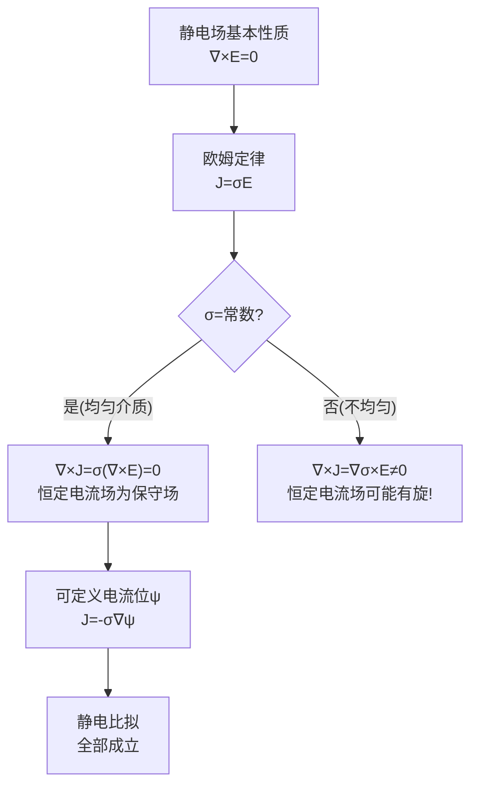

# 思考题：恒定电流场为什么是保守场
**关键词**：思考题, 预习, 概念检验, 恒定电流场

📌 **一句话本质**：恒定电流场的保守性（∇×E=0）来自恒定条件下∂B/∂t=0——均匀介质中J的旋度也为零，但不均匀介质中J可以有旋

🏷️ **重要度**：⚪ | 考试：★ | 题型：简

## 教科书原题

> 4-8 为什么均匀导电介质中的恒定电流场是无旋场（保守场）？这与静电场的保守性有何异同？

## 费曼4步解题法

### 第1步：明确问题核心

在静电场中，无旋性（$$\nabla\times\mathbf{E}=0$$）来源于库仑力是中心力这一基本事实。但在恒定电流场中，电流密度 $$\mathbf{J}$$ 的无旋性（$$\nabla\times\mathbf{J}=0$$）是如何来的？它不是直接来自"力"的性质，而是来自电场无旋性和欧姆定律的组合推导。

### 第2步：推导过程

**逻辑链**：

1. 均匀导电介质中，欧姆定律：$$\mathbf{J} = \sigma\mathbf{E}$$（$$\sigma$$ = 常数）
2. 对电流密度取旋度：$$\nabla\times\mathbf{J} = \nabla\times(\sigma\mathbf{E})$$
3. 均匀介质中 $$\sigma$$ 为常数：$$\nabla\times\mathbf{J} = \sigma(\nabla\times\mathbf{E})$$
4. 恒定条件下，电荷分布不随时间变化，电场为静电场：$$\nabla\times\mathbf{E} = 0$$
5. 因此：$$\boxed{\nabla\times\mathbf{J} = 0}$$

**结论**：均匀导电介质中恒定电流场的无旋性**并非独立的基本方程**，而是**静电场的无旋性 + 欧姆定律（均匀介质）** 的推论！

### 第3步：深入对比

| 方面 | 静电场 | 恒定电流场 |
|------|--------|-----------|
| 无旋条件 | $\nabla\times\mathbf{E} = 0$$（基本方程） | $\nabla\times\mathbf{J} = 0$$（导出方程） |
| 来源 | 库仑力为中心力 | 欧姆定律 $$\mathbf{J}=\sigma\mathbf{E}$$ + $$\nabla\times\mathbf{E}=0$ |
| 适用范围 | 所有静电情况 | 仅均匀导电介质（$$\sigma$$ = 常数） |
| 若不均匀？ | 仍然 $$\nabla\times\mathbf{E} = 0$ | $\nabla\times\mathbf{J} \neq 0$$！ |
| 可定义位函数 | 电位 $$\phi$$：$$\mathbf{E} = -\nabla\phi$ | 电流位 $$\psi$$：$$\mathbf{J} = -\sigma\nabla\psi$ |
| 位满足方程 | 泊松方程 $$\nabla^2\phi = -\rho/\varepsilon$ | 拉普拉斯方程 $$\nabla^2\psi = 0$ |

### 第4步：非均匀介质中的"破缺"

**关键情况——不均匀介质**：

当 $$\sigma(\mathbf{r})$$ 不是常数时：
$$\nabla\times\mathbf{J} = \nabla\times(\sigma\mathbf{E}) = \nabla\sigma\times\mathbf{E} + \sigma(\nabla\times\mathbf{E}) = \nabla\sigma\times\mathbf{E}$$

因为 $$\nabla\times\mathbf{E}=0$$ 仍然成立（恒定条件），但 $$\nabla\sigma\times\mathbf{E} \neq 0$$！

**物理含义**：在电导率不均匀的介质中，即使电场是无旋的，电流密度也可以有旋度。这是因为电流在跨越不同电导率区域时会发生"偏折"（类似光折射），偏折的累积可以形成"漩涡"状电流分布。

## 常见误区

1. **恒定电流场在任何情况下都是无旋的**：仅在**均匀导电介质**中成立。不均匀介质中 $$\nabla\times\mathbf{J} \neq 0$$。
2. **电流场的保守性意味着电流做功与路径无关**：对恒定电流场而言，$$\oint\mathbf{J}\cdot d\mathbf{l}=0$$ 意味着"单位电荷绕闭合路径一圈，外源提供的净能量为零"——但这不等于电流不做功！焦耳热（$$\sigma E^2$$）源源不断地消耗能量，需要外源（电池/发电机）不断补充。
3. **混淆"无旋"和"保守"的物理含义**：恒定电流场不像静电场那样"保守能量"——它有持续的能量耗散（焦耳热），只是电流密度矢量本身"不走回头路"（无旋）。

## 概念导航

- **前置**：[[恒定电流场的基本方程 MOC]]、[[欧姆定律的微分形式]]
- **核心**：[[恒定电流场与静电场的比拟 MOC]]
- **延伸**：[[非均匀介质中的电流场]]

## 自己理解

恒定电流场的"保守性"是一个需要小心使用既有理论体系来解释清楚的概念。它告诉我们：在均匀混凝土（均匀导电介质）中，地下电流的流动模式可以用静电学方法（镜像法！）来预测——这是接地系统设计的理论基础。但如果地下土壤分层（不均匀介质），电流的旋度就不为零，"保守场"的简化不再成立——这是为什么复杂地质条件下的接地设计需要数值模拟的原因。

> 📖 参见：[[§4-3 恒定电流场的基本方程]]

## 费曼深度讲解

恒定电流场为什么是保守场（∇×E=0）？关键在"恒定"二字——所有的电荷分布和电流分布不随时间变化。虽然电流在流动（有电子在漂移），但任何空间点的电荷密度ρ在恒定条件下不变（∂ρ/∂t=0）。麦克斯韦-法拉第方程∇×E=−∂B/∂t在恒定条件下∂B/∂t=0（电流恒定→磁场恒定→磁通不变），所以∇×E=0。因此恒定电流场也像静电场一样是无旋场——引入的电势V满足E=−∇V。

为什么在恒定电流场中可以像静电场一样用电位来描述？因为两者在恒定条件下满足相同的数学结构：源域方程$E=-\nabla V$和域内方程$\nabla\cdot J=0$→$\nabla\cdot(\sigma E)=0$→（均匀σ时）$\nabla^2 V=0$（拉普拉斯方程）。电位满足拉普拉斯方程意味着静电场的所有求解方法——分离变量法、镜像法、有限元法——都可以直接用于恒定电流场的电位计算。这是"比拟法"的基础：只需把ε替换成σ，把D替换成J，所有静电场的结果自动变成恒定电流场的结果。

恒定电流场的保守性在物理上的表现：在恒定电流场中，两点之间的电位差（电压）与路径无关——这就是为什么电路理论中KVL（电压回路定律）对直流电路严格成立（$\sum V_i=0$）。如果你在电路中走一圈回到起点，电位总和为零——无论电流在路径中经过什么元件。这个性质在交流情况下就不严格成立（因为时变磁场产生的涡旋电场有非零环量→KVL不成立，必须用法拉第定律修正）。

## 更多费曼检验

1. 在恒定直流电路中KVL是否严格成立？为什么交流电路中KVL是近似的（在什么条件下近似成立）？

2. 推导恒定电流场从∇×E=0出发得到E=−∇V，证明V满足∇²V=0（假设均匀σ）。这如何说明静电比拟法有效？

