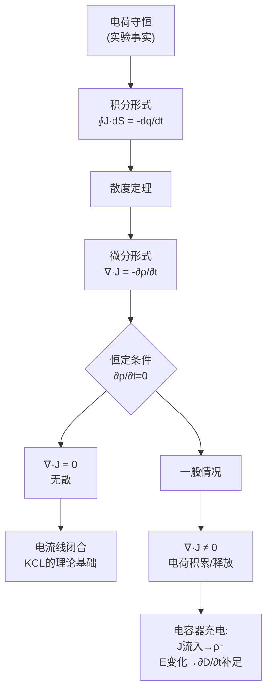
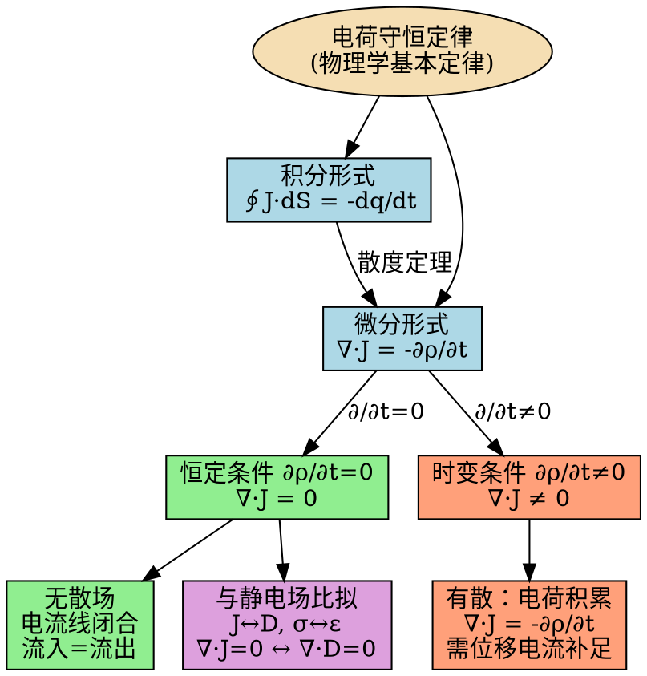

# 思考题：电流连续性的物理含义
**关键词**：思考题, 预习, 概念检验, 恒定电流场

📌 **一句话本质**：∇·J=-∂ρ/∂t是电荷守恒的场论表达——任何体积内电荷的减少率等于流出该体积的净电流

🏷️ **重要度**：⚪ | 考试：★ | 题型：简

## 教科书原题

> 4-2 电流连续性方程的物理含义是什么？在恒定电流条件下，它简化为什么形式？

## 费曼4步解题法

### 第1步：明确问题核心

电流连续性方程 $\nabla\cdot\mathbf{J} = -\partial\rho/\partial t$ 是**电荷守恒定律**在电磁场理论中的数学表达。它告诉我们：电荷不会凭空产生也不会凭空消失——空间中某处的电荷减少，必然伴随着电流从该处流出。

### 第2步：从电荷守恒到连续性方程

**物理事实**：电荷是守恒的——任何体积内电荷的变化只能由电荷流出或流入引起。

**数学翻译**：
- 闭合面内电荷变化率：$dq/dt = \frac{d}{dt}\int_V \rho\, dV$
- 流出闭合面的净电流：$\oint_S \mathbf{J}\cdot d\mathbf{S}$

电荷守恒要求：流出 = 内部减少
$$\oint_S \mathbf{J}\cdot d\mathbf{S} = -\frac{dq}{dt} = -\frac{d}{dt}\int_V \rho\, dV$$

对固定体积（积分与时间的次序可交换）：
$$\oint_S \mathbf{J}\cdot d\mathbf{S} = -\int_V \frac{\partial\rho}{\partial t}dV$$

应用散度定理（$\oint_S \mathbf{J}\cdot d\mathbf{S} = \int_V \nabla\cdot\mathbf{J}\, dV$），由于体积任意：
$$\boxed{\nabla\cdot\mathbf{J} = -\frac{\partial\rho}{\partial t}}$$

这就是**电流连续性方程的微分形式**。

### 第3步：恒定条件下的简化

**恒定电流的条件**：电荷分布不随时间变化 → $\partial\rho/\partial t = 0$

此时连续性方程简化为：
$$\boxed{\nabla\cdot\mathbf{J} = 0}$$

**物理含义**：
- 流入任意体积的净电流为零——流入 = 流出
- 电流线是闭合的——没有电流的"源"或"汇"
- 在整个回路中，电流处处相等（这是基尔霍夫电流定律KCL的场论基础）

### 第4步：三种表述的对照

| 表述层次 | 形式 | 说明 |
|---------|------|------|
| 积分形式（一般） | $\oint_S \mathbf{J}\cdot d\mathbf{S} = -\frac{dq}{dt}$ | 流出闭合面的净电流 = 内部电荷减少率 |
| 微分形式（一般） | $\nabla\cdot\mathbf{J} = -\frac{\partial\rho}{\partial t}$ | 任意点电流密度的散度 = 电荷密度的时间减少率 |
| 恒定条件 | $\nabla\cdot\mathbf{J} = 0$ | 电流如不可压缩流体，无源无汇 |

## 常见误区

1. **$\nabla\cdot\mathbf{J}=0$ 意味着没有电流**：无散意味着电流线连续不断，不意味着电流为零。直流稳态电路中，虽然 $\nabla\cdot\mathbf{J}=0$，电流依然很大。
2. **电流连续性方程和电荷守恒是不同的定律**：它们是同一个定律的两种表述——电流连续性方程就是电荷守恒定律在电磁场中的场论表述。
3. **电容器中电流不连续**：传导电流 $J_c$ 的确在电容器极板间中断，但加上位移电流 $J_d = \partial D/\partial t$ 后，全电流 $J_c + J_d$ 仍然是连续的——这正是麦克斯韦引入位移电流的关键动机。
4. **连续性方程只对总电流成立**：对单一类型的电流（如传导电流），$\nabla\cdot\mathbf{J}_c \neq 0$ 是允许的——只要其他类型电流（如位移电流）补足即可。

## 概念导航

- **关联**：[[恒定电流场的基本方程 MOC]]、[[位移电流假说]]、[[电流密度J的定义]]
- **延伸**：[[全电流连续性]]、[[麦克斯韦方程组的散度一致性]]

## 自己理解

电流连续性方程是电磁学中连接"电荷动力学"和"场论"的桥梁。它的美妙之处在于：用仅依赖于场的语言（$\mathbf{J}$ 和 $\rho$）表达了物质世界的深层事实（电荷守恒）。在恒定情况下它简化为 $\nabla\cdot\mathbf{J}=0$——这就把复杂的时间依赖问题降维为你熟悉的"稳恒流动"问题，从而使电流场能够与静电场建立一一对应的比拟关系。

> 📖 参见：[[§4-1 电流与电流密度]], [[§4-1 电流与电流密度]]

## 连续性方程在不同条件下的形式

> 📖 参见：[[§4-1 电流与电流密度]], [[§4-1 电流与电流密度]]
