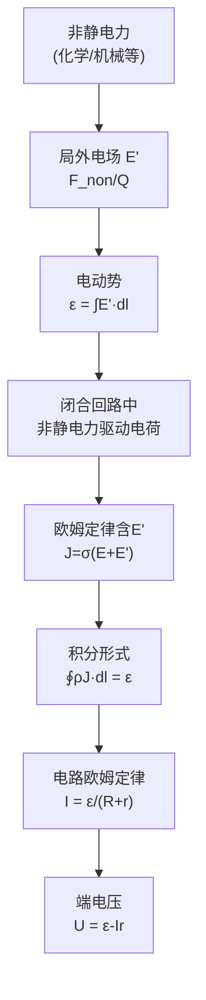

# 电动势 MOC

## 教科书原文

> 📖 参见：[[§4-2 电动势]]

## 概念定义（费曼一句话）

电动势是"电源内部将其他形式的能量（化学能、机械能等）转换为电能的能力"——它是非静电力对单位正电荷做的功，用伏特(V)来度量，就像一座水泵的"扬程"——水泵必须提供足够的水压（电动势）来克服水管中的阻力（电阻）。

## 类比与直觉

**类比1：水泵的扬程**。电动势e就像是水泵的扬程——水泵将水从低处抽到高处（克服重力），使水获得势能。电池的电动势将正电荷从低电位端（负极）搬运到高电位端（正极），使电荷获得电势能。扬程越大=电动势越高；水管阻力越大=电阻越大。欧姆定律 $$I = e/(R+r)$$ 完全类似水的流动公式。

**类比2：电梯的电能-势能转换**。电梯把乘客从低楼层（低电位）提升到高楼层（高电位），需要电机做功。电池中发生的化学反应就像"电梯电机"——将化学能转换为电荷的电势能。电动势是"每单位电荷获得的能量"，单位是 J/C = V。

## 核心公式详释

**电动势的定义**：
$$\boxed{e = \int_{N}^{P} \mathbf{E}' \cdot d\mathbf{l}}$$

**闭合回路中的总电动势**：
$$e = \oint_l \mathbf{E}' \cdot d\mathbf{l}$$

**欧姆定律（含电动势）**：
$$\mathbf{J} = \sigma(\mathbf{E} + \mathbf{E}')$$

**积分形式**（非均匀截面导体）：
$$\oint_l \rho\mathbf{J}\cdot d\mathbf{l} = \oint_l \mathbf{E}'\cdot d\mathbf{l} = e$$

**端电压与电动势的关系**：
$$U = e - Ir$$

| 物理量 | 符号 | 单位 | 含义 |
|--------|------|------|------|
| 电动势 | $e$ | V | 电源将非电能转换为电能的能力 |
| 局外电场强度 | $\mathbf{E}'$ | V/m | 非静电力对单位电荷的等效电场 |
| 端电压 | $U$ | V | 电源输出端之间的电位差 |
| 内阻 | $r$ | $\Omega$ | 电源内部的等效串联电阻 |
| 电流 | $I$ | A | 通过回路的电流 |

## 推导脉络

## 常见误区

1. **电动势等于端电压**：仅在开路（I=0）时成立。有负载时 $$U = e - Ir$$，内阻r上的压降使端电压小于电动势。旧电池的e可能变化不大，但内阻增大，带载后端电压大幅下降。
2. **电动势只存在于电池中**：电动势广泛存在于各种能量转换装置中——发电机（机械能→电能）、热电偶（热能→电能）、太阳能电池（光能→电能）都提供电动势。
3. **混淆电动势和电位差**：电动势是"非静电力做功"的结果（单向提升），电位差是"静电场中两点间的电位差"。在电源内部，$$\mathbf{E}'$$ 方向从负极指向正极（提升电位），而静电场 $$\mathbf{E}$$ 从正极指向负极（电位降低）。

## 费曼检验

1. 一节1.5V的干电池"没电"了，测开路电压仍是1.4V。为什么带负载后电压骤降到0.5V？请用内阻模型解释。
2. 法拉第电磁感应定律 $$e = -d\Phi/dt$$ 中的e也是电动势。这个电动势的"非静电力"来源于什么？
3. 在恒定电流场的微分欧姆定律 $$\mathbf{J} = \sigma(\mathbf{E} + \mathbf{E}')$$ 中，$$\mathbf{E}'$$ 只存在于电源内部还是整个回路？为什么？

## 概念导航

- **前置**：[[欧姆定律的微分形式]]、[[电流与电流密度 MOC]]
- **后继**：[[恒定电流场的基本方程 MOC]]、[[法拉第电磁感应定律 MOC]]
- **关联**：[[感生电动势与动生电动势的本质区别]]

## 自己理解

电动势是"能量转换"在电磁场理论中的数学化身。$$\mathbf{E}'$$（局外电场）是电磁场统一框架中一个特殊的存在——它不属于静电场，也不属于感应电场，而是代表"所有其他形式的力折算成等效电场"。认识到这一点，就能理解为什么法拉第定律中的感应电动势 $$\oint(\mathbf{v}\times\mathbf{B})\cdot d\mathbf{l}$$ 也可以看作一种"等效的 $$\mathbf{E}'$$"——洛伦兹力就是动生电动势中的"非静电力"。

> 📖 参见：[[§4-2 电动势]]
