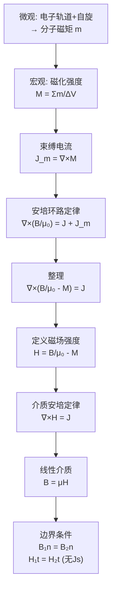

# 介质的磁化 MOC

## 教科书原文

> 📖 参见：[[§5-4 介质的磁化]]

## 概念定义（费曼一句话）

磁化是物质内部微观磁矩（电子轨道磁矩 + 自旋磁矩）在外磁场作用下趋于有序排列的宏观表现——磁化强度 $$\mathbf{M}$$（A/m）度量了这种取向度，其旋度给出了等效的束缚电流密度 $$\mathbf{J}_m = \nabla\times\mathbf{M}$$，这正是"介质中的磁场"区别于"真空中的磁场"的物理根源。

## 类比与直觉

**类比1：指南针阵列的集体偏转**。想象空间中散布着无数微小的指南针（分子磁矩），在没有外磁场时它们杂乱无章（$$\mathbf{M}=0$$）。外磁场一加上，每个小指南针都偏转趋向于外场方向——这种集体偏转的"密度"就是磁化强度 $$\mathbf{M}$$。小指南针偏转的"边界效应"（相邻指南针的旋转差异）等效为束缚电流 $$\mathbf{J}_m = \nabla\times\mathbf{M}$$。

**类比2：停车场的汽车排列**。分子磁矩就像停车场中的汽车——无组织时（无外场），汽车朝向四面八方（$$\mathbf{M}=0$$）。停车场管理员（外磁场）来了后，所有汽车统一朝同一个方向——这就是磁化。汽车排成环状（旋度不为零）等效于形成了一个"车流环"（束缚电流）。

## 核心公式详释

**磁化强度的定义**：
$$\boxed{\mathbf{M} = \lim_{\Delta V\to 0}\frac{\sum\mathbf{m}}{\Delta V}}$$

**束缚电流密度（体）**：
$$\boxed{\mathbf{J}_m = \nabla\times\mathbf{M}}$$

**面束缚电流密度**：
$$\boxed{\mathbf{J}_{sm} = \mathbf{M}\times\mathbf{n}}$$

**磁场强度H的定义**：
$$\boxed{\mathbf{H} = \frac{\mathbf{B}}{\mu_0} - \mathbf{M}}$$

**安培环路定律（介质中）**：
$$\nabla\times\mathbf{H} = \mathbf{J} \quad \text{（J仅为自由电流）}$$

**介质中的本构关系**（线性各向同性）：
$$\mathbf{B} = \mu_0(\mathbf{H} + \mathbf{M}) = \mu_0(1+\chi_m)\mathbf{H} = \mu_0\mu_r\mathbf{H} = \mu\mathbf{H}$$

| 磁介质类型 | $\mu_r$ | $\chi_m$ | 例子 |
|------|:---:|:---:|------|
| 抗磁质 | <1 (~0.99999) | <0, ~$$-10^{-5}$ | Cu, Au, H₂O, 生物体 |
| 顺磁质 | >1 (~1.00001) | >0, ~$$10^{-5}$ | Al, Pt, O₂, Na |
| 铁磁质 | $\gg 1$$ (100~100000) | $\gg 0$ | Fe, Co, Ni, 铁氧体 |
| 亚铁磁质 | 10~1000 | 正且大 | MnZn铁氧体, NiZn铁氧体 |

## 推导脉络

## 常见误区

1. **H比B更"基本"**：在物理上，B才是更基本的量——它决定运动电荷受到的力（$$d\mathbf{F}=I d\mathbf{l}\times\mathbf{B}$$）。H是"数学便利"，它将自由电流和束缚电流分开处理。
2. **所有物质都有磁化**：所有物质在外磁场中都会磁化——抗磁质和顺磁质也有微弱的磁响应（$$\chi_m \sim \pm 10^{-5}$$），日常生活中"非磁性"只是说它们不表现出强磁性。
3. **$$\mathbf{J}_m = \nabla\times\mathbf{M}$$ 的类比是 $$\rho_p = -\nabla\cdot\mathbf{P}$$（束缚电荷）**：两者在数学上相似但物理量化不同——电介质极化的散度产生束缚电荷，磁介质磁化的旋度产生束缚电流。

## 费曼检验

1. 一个均匀磁化的永磁棒（$$\mathbf{M}$$ = 常数），内部的 $$\mathbf{J}_m = \nabla\times\mathbf{M} = 0$$。那么束缚电流在哪里？
2. 超导体是完美抗磁体（迈斯纳效应），内部 $$\mathbf{B}=0$$。这对应 $$\chi_m = -1$$ 或 $$\mu_r = 0$$。用磁化理论如何理解？
3. 在两种不同磁介质的界面处，如果 $$\mathbf{M}_1 \neq \mathbf{M}_2$$，面束缚电流密度如何计算？

## 概念导航

- **前置**：[[真空中的恒定磁场 MOC]]、[[磁矩的基本概念]]
- **后继**：[[介质中的恒定磁场 MOC]]、[[恒定磁场的边界条件 MOC]]
- **核心文件**：[[磁化强度的物理意义]]、[[抗磁性顺磁性铁磁性的微观机制]]

## 自己理解

磁化的物理本质是"微观电流环的宏观取向"。理解了 $$\mathbf{J}_m = \nabla\times\mathbf{M}$$ 的来源（相邻位置的分子电流环不完全抵消的净电流），就能自然过渡到 $$\mathbf{H} = \mathbf{B}/\mu_0 - \mathbf{M}$$ 这个定义——H是我们"假装"只由自由电流激发的"净磁场"，而B包含了所有微观电流环（束缚电流）的贡献。

> 📖 参见：[[§5-4 介质的磁化]]
