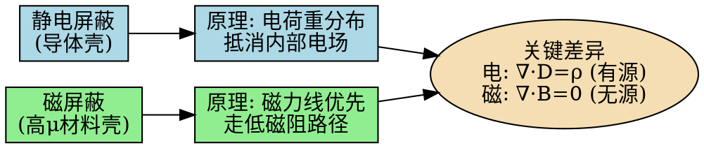

# 磁屏蔽原理
**关键词**：恒定磁场的应用

## 教科书原文

> 📖 参见：[[§5-5 介质中的恒定磁场]], [[§5-6 恒定磁场的边界条件]]

## 磁屏蔽与静电屏蔽的对比

静电屏蔽只需导体壳，磁屏蔽需要高磁导率材料。根本原因：没有"磁单极子"——磁力线没有起点和终点，总是闭合的，因此无法被"导走"。

```graphviz
digraph G {
    rankdir=LR;
    node [shape=box, style=filled];
    A [label="静电屏蔽\n(导体壳)", fillcolor=lightblue];
    B [label="原理: 电荷重分布\n抵消内部电场", fillcolor=lightblue];
    C [label="磁屏蔽\n(高μ材料壳)", fillcolor=lightgreen];
    D [label="原理: 磁力线优先\n走低磁阻路径", fillcolor=lightgreen];
    E [label="关键差异\n电: ∇·D=ρ (有源)\n磁: ∇·B=0 (无源)", shape=ellipse, fillcolor=wheat];
    A -> B;
    C -> D;
    B -> E;
    D -> E;
}
```

> 📖 参见：[[§5-7 电感]]
