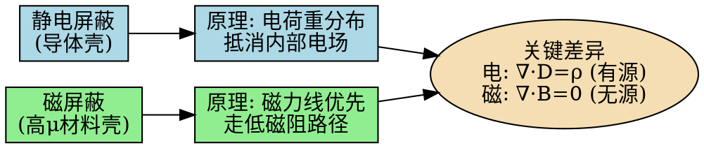

# 磁屏蔽原理
**关键词**：恒定磁场的应用

📌 **一句话本质**：磁屏蔽用高磁导率材料引导磁力线绕道——低磁阻路径像给磁通修了条"高速公路"，内部空间免受磁场干扰

🏷️ **重要度**：🟡 | 考试：★★ | 题型：简

🔧 **工程/实际场景**：精密仪器磁屏蔽室——MRI扫描室用多层坡莫合金+铝板构建磁屏蔽。若接缝处理不当（未实现磁路连续搭接），屏蔽效能从80dB降至40dB，外部地磁场的微小波动（50nT级）就足以干扰脑磁图（MEG）的测量。

## 教科书原文

> 📖 参见：[[§5-5 介质中的恒定磁场]], [[§5-6 恒定磁场的边界条件]]

## 🧠 类比与直觉

**类比：给房子修防洪堤**。磁屏蔽像给房子修一圈高堤（高μ材料壳）——洪水（磁力线）会优先从堤外侧的低阻力通道流过，房子里面几乎保持干燥（低场）。静电屏蔽则像给房子上防水涂料（导体壳）——电荷直接在表面重新分布把电场"抵消"掉。

**口诀**：磁屏蔽靠高μ引路，静电屏蔽靠电荷重布

## 磁屏蔽与静电屏蔽的对比

静电屏蔽只需导体壳，磁屏蔽需要高磁导率材料。根本原因：没有"磁单极子"——磁力线没有起点和终点，总是闭合的，因此无法被"导走"。

## ✂️ 可跳过

> 本节是磁屏蔽原理的定性理解，若已掌握高μ材料引导磁力线和静电/磁屏蔽的根本差异（有源场vs无源场），可直接跳至下一个概念。

> 📖 参见：[[§5-7 电感]]
