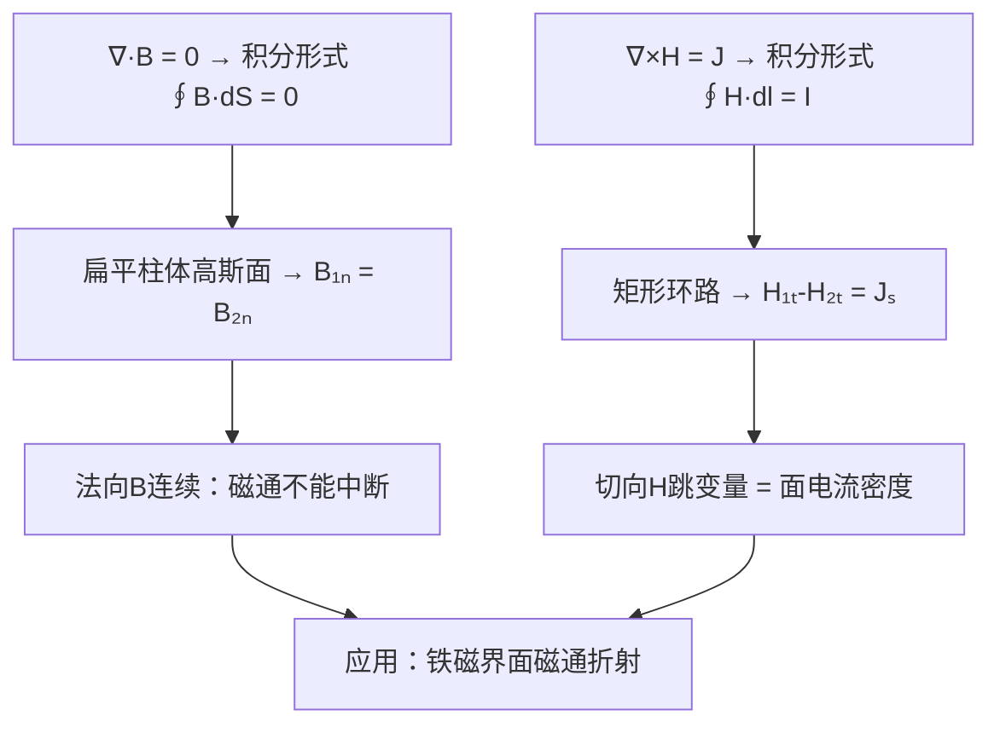

# B的法向与H的切向边界条件
**关键词**：边界条件, D法向, E切向, ρₛ, 介质分界面

📌 **一句话本质**：磁场过界面时法向B连续——磁通不能断；切向H的跳变量等于面电流密度——电流层两边H不一样

🏷️ **重要度**：🔴 | 考试：★★★ | 题型：计

🔧 **工程/实际场景**：变压器铁芯叠片间的气隙——若气隙处法向B连续但切向H跳变处理不当，漏磁通计算偏差会导致绕组损耗估算偏小20%，变压器实际运行温度超出设计值引发绝缘老化。

## 教科书原文

> 📖 参见：[[§5-6 恒定磁场的边界条件]]

## 🧠 类比与直觉

**类比：高速公路收费站**。法向B连续就像收费站的车道——进入收费站的车流量必须等于出去的车流量（磁通不灭），车道数变（截面积变）但总车数守恒。切向H跳变就像收费站两边的限速牌——有"面电流"就像中间隔了一条公交车专用道（电流层），两边的"速度规则"（H）会有一个突变。

**口诀**："法向B连磁通不断，切向H跳变看面电流"

## ⚠️ 常见误区

1. **法向B连续 ≠ 法向H连续**：B₁ₙ=B₂ₙ但H₁ₙ/H₂ₙ=μ₂/μ₁——介质磁导率突变导致法向H跳变。在铁磁-空气界面，空气侧H法向分量是铁芯侧的μᵣ倍。
2. **切向H跳变 = Jₛ×\hat{n}，方向是关键**：Jₛ×\hat{n}不是Jₛ·\hat{n}——叉积决定跳变方向沿切向且垂直于面电流。
3. **无面电流时切向H连续**：这是最常用情况——Jₛ=0时H₁ₜ=H₂ₜ。但B₁ₜ/B₂ₜ=μ₁/μ₂，所以B切向在界面跳变。

## ❓ 费曼检验

1. 一块μᵣ=1000的铁块放在均匀磁场B₀中，求铁块内外的B和H。铁块内B约为B₀的多少倍？（提示：法向B连续+切向H连续）
2. 两个区域间有一层面电流Jₛ，写出分界面两侧H₁和H₂满足的完整边界条件。如果Jₛ=0，B线的折射定律是什么？
3. 为什么法向B连续源于∇·B=0，而切向H跳变源于∇×H=J？用积分形式的推导验证。

## 🔗 概念导航
- 前置概念：[[磁通密度B的定义]]、[[安培环路定律及其对称性应用]]
- 后续概念：[[铁磁介质表面的磁场分布]]、[[自感与互感的定义与计算]]
- 关联概念：[[法向边界条件]]、[[切向边界条件]]（静电场边界条件的对称比较）

## 💻 MATLAB 可视化提示词

生成代码：绘制磁场线在μᵣ=1000的矩形铁块周围的折射分布。用contour绘制B线，展示铁块内部B线密集（磁通集中），外部B线稀疏。标注界面处B线的折射角符合tanθ₁/tanθ₂=μᵣ₁/μᵣ₂。

## 📐 推导脉络

## ✂️ 可跳过

> 本节是恒定磁场边界条件的入门，若已掌握B₁ₙ=B₂ₙ和H₁ₜ-H₂ₜ=Jₛ的物理含义，可直接跳至下一个概念。
