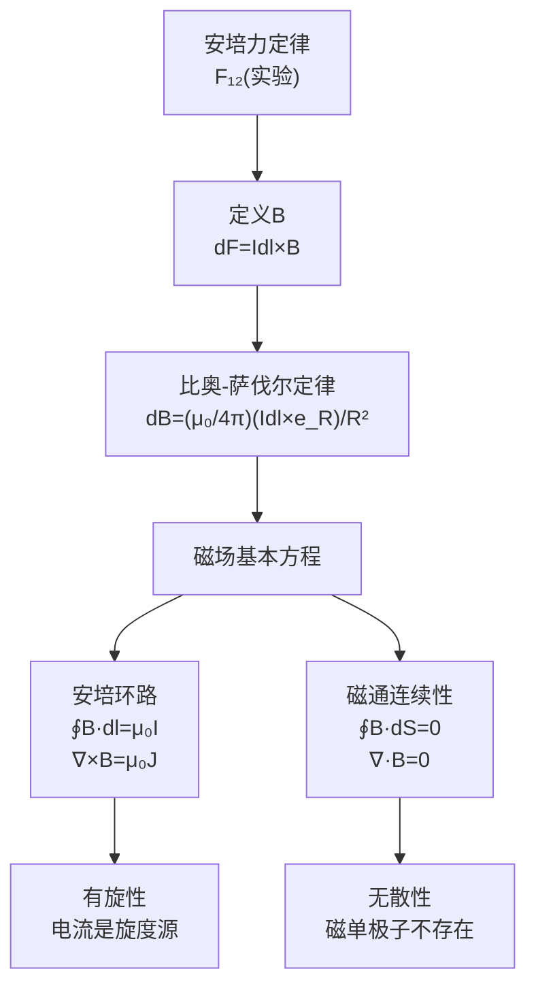

# 思考题：5-1至5-5 磁通密度与恒定磁场方程
**关键词**：思考题, 预习, 概念检验, 恒定磁场

📌 **一句话本质**：真空中恒定磁场的五道核心概念题——从B的定义到安培环路定律，再到与静电场的完整类比

🏷️ **重要度**：⚪ | 考试：★ | 题型：简

## 教科书原题

> 5-1 磁通密度B是如何定义的？它的单位是什么？
> 5-2 比奥-萨伐尔定律的内容是什么？
> 5-3 为什么恒定磁场是无散场？磁通连续性原理说明了什么？
> 5-4 安培环路定律的积分形式和微分形式分别是什么？
> 5-5 试对比奥-萨伐尔定律和库仑定律的相似性和差异性。

## 费曼4步解题法

### 第1步：明确问题结构

这5道思考题构建了真空中恒定磁场的完整理论知识链：磁通密度的定义（5-1）→ 计算磁场的基本方法（5-2）→ 磁场的基本性质—无散性（5-3）→ 磁场的另一基本方程—安培环路定律（5-4）→ 与静电场的类比（5-5）。

### 第2步：逐题详解

**5-1 磁通密度B的定义**

由安培力定律导出：电流元 $$I d\mathbf{l}$$ 在磁场中受力 $$d\mathbf{F} = I d\mathbf{l} \times \mathbf{B}$$

$$\mathbf{B}$$ 是描述磁场力效应的矢量场，单位：T（特斯拉），1 T = 1 N/(A·m)

**5-2 比奥-萨伐尔定律**

$$\mathbf{B}(\mathbf{r}) = \frac{\mu_0}{4\pi}\oint_{l'} \frac{I d\mathbf{l}' \times \mathbf{e}_R}{R^2}$$

电流元产生的元磁场垂直于电流元和位置矢量所在平面，大小反比于距离平方，与库仑定律类似但方向由叉乘决定。

**5-3 磁场为何无散？**

$$\nabla\cdot\mathbf{B}=0$$ 是磁场最本质的性质——反映**磁单极子不存在**的实验事实。磁力线永远闭合，没有起点和终点。对应的积分形式：$$\oint_S \mathbf{B}\cdot d\mathbf{S} = 0$$——穿过任何闭合面的净磁通为零（磁通连续性原理）。

根本原因：$$\mathbf{B} = \nabla\times\mathbf{A}$$（磁矢位的旋度），而恒等式 $$\nabla\cdot(\nabla\times\mathbf{A}) \equiv 0$$ 自动保证无散性。磁场的源是"旋度"（电流），不是"散度"（磁荷不存在）。

**5-4 安培环路定律**

| | 积分形式 | 微分形式 |
|---|---------|---------|
| 真空 | $\oint_l \mathbf{B}\cdot d\mathbf{l} = \mu_0 I$ | $\nabla\times\mathbf{B} = \mu_0\mathbf{J}$ |
| 介质 | $\oint_l \mathbf{H}\cdot d\mathbf{l} = I_{\text{自由}}$ | $\nabla\times\mathbf{H} = \mathbf{J}_{\text{自由}}$ |

物理含义：磁场的旋度由电流激发——电流周围磁场形成"旋涡"。

**5-5 比奥-萨伐尔 vs 库仑定律**

| | 库仑定律 | 比奥-萨伐尔 |
|---|---------|-----------|
| 源 | 电荷 $$dq$$（标量） | 电流元 $$I d\mathbf{l}$$（矢量） |
| 方向 | 径向（$$d\mathbf{E}\parallel\mathbf{e}_R$$） | 叉乘方向（$$d\mathbf{B}\perp I d\mathbf{l}$$ 且 $$\perp\mathbf{e}_R$$） |
| 散度 | 有散（$$\nabla\cdot\mathbf{E}=\rho/\varepsilon_0$$） | 无散（$$\nabla\cdot\mathbf{B}=0$$） |
| 旋度 | 无旋（$$\nabla\times\mathbf{E}=0$$） | 有旋（$$\nabla\times\mathbf{B}=\mu_0\mathbf{J}$$） |

### 第3步：恒定磁场方程体系

### 第4步：与静电场方程对比

| 方程性质 | 静电场（真空） | 恒定磁场（真空） |
|---------|--------------|----------------|
| 散度方程 | $\nabla\cdot\mathbf{E}=\rho/\varepsilon_0$ | $\nabla\cdot\mathbf{B}=0$ |
| 旋度方程 | $\nabla\times\mathbf{E}=0$ | $\nabla\times\mathbf{B}=\mu_0\mathbf{J}$ |
| "源"类型 | 标量源（电荷$$\rho$$） | 矢量源（电流密度$$\mathbf{J}$$） |

## 常见误区

1. **安培环路定律对称地适用于任何情况**：和静电场的高斯定律一样，安培环路定律虽然普遍成立，但只有在高对称性（无限长直导线、螺线管、环形线圈）时才能直接用于求解B。
2. **比奥-萨伐尔和安培环路定律是独立的**：两者等价——比奥-萨伐尔定律可以从安培环路定律导出（反之亦然），都是恒定磁场的基本规律在积分和微分层面的不同表达。

## 概念导航

- **前置**：[[磁通密度与安培力定律 MOC]]、[[向量积的右手定则]]
- **关联**：[[介质的磁化 MOC]]、[[恒定磁场的边界条件 MOC]]
- **习题**：[[习题：安培环路定律应用]]、[[习题：第5章 恒定磁场]]

## 自己理解

恒定磁场的两条基本方程揭示了电场和磁场在结构上的深刻对偶：电场有散无旋（从电荷出发），磁场有旋无散（围绕电流旋转）。这种"互为表里"的对偶性是麦克斯韦方程组最优雅的特征之一，也是为什么在工程中可以从一个场的解法直接类比得到另一个场的解法（静电比拟）。

> 📖 参见：[[§5-1 磁通密度]], [[§5-3 磁位]]
