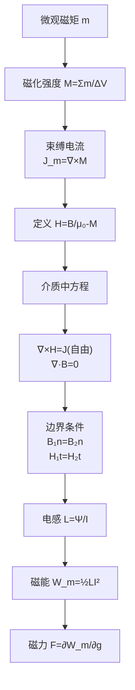

# 思考题：5-6至5-12 磁化介质中磁场与边界条件
**关键词**：思考题, 预习, 概念检验, 恒定磁场

📌 **一句话本质**：介质中恒定磁场的七道核心概念题——从磁化M到H的引入、边界条件，再到电感能量和磁力的完整应用链

🏷️ **重要度**：⚪ | 考试：★ | 题型：简

## 教科书原题

> 5-6 什么是磁化强度M？磁化电流与M有什么关系？
> 5-7 磁场强度H是如何定义的？引入H有什么好处？
> 5-8 介质中恒定磁场的基本方程是什么？
> 5-9 两种磁介质分界面上的边界条件如何表示？
> 5-10 电感是如何定义的？有哪些影响因素？
> 5-11 磁场能量密度如何表示？
> 5-12 如何计算磁场力？

## 费曼4步解题法

### 第1步：明确问题结构

这7道思考题覆盖了介质中恒定磁场的完整应用：磁化（5-6, 5-7）→ 介质中方程+边界条件（5-8, 5-9）→ 电感能量力（5-10~5-12）。从"微观磁化"到"宏观应用"，构成完整的知识链。

### 第2步：逐题详解

**5-6 磁化强度M与磁化电流的关系**

$$\mathbf{M} = \frac{\sum\mathbf{m}}{\Delta V}$$（单位体积内分子磁矩矢量和，单位A/m）

磁化电流（束缚电流）密度：
- 体束缚电流：$$\mathbf{J}_m = \nabla\times\mathbf{M}$$
- 面束缚电流：$$\mathbf{J}_{sm} = \mathbf{M}\times\mathbf{n}$$

**5-7 磁场强度H的定义与好处**

$$\boxed{\mathbf{H} = \frac{\mathbf{B}}{\mu_0} - \mathbf{M}}$$

好处：$$\nabla\times\mathbf{H} = \mathbf{J}_{\text{自由}}$$——H的旋度只依赖于自由电流，M的影响被"封装"。这使得介质中的安培环路定律和真空中的形式上一致（H↔B/μ₀, J自由↔J总量）。

**5-8 介质中恒定磁场的基本方程**

| 方程 | 微分形式 | 积分形式 |
|------|---------|---------|
| 安培环路 | $\nabla\times\mathbf{H} = \mathbf{J}$ | $\oint\mathbf{H}\cdot d\mathbf{l} = I_{\text{自由}}$ |
| 磁通连续性 | $\nabla\cdot\mathbf{B} = 0$ | $\oint\mathbf{B}\cdot d\mathbf{S} = 0$ |
| 本构关系 | $\mathbf{B} = \mu\mathbf{H}$ | (线性各向同性) |

**5-9 磁介质分界面边界条件**

| | 法向条件 | 切向条件 |
|---|---------|---------|
| 无表面电流 | $B_{1n} = B_{2n}$ | $H_{1t} = H_{2t}$ |
| 折射定律 | $\frac{\tan\theta_1}{\tan\theta_2} = \frac{\mu_1}{\mu_2}$ | |

从高磁导率介质（$$\mu_1 \gg \mu_2$$）进入低磁导率介质时，磁力线几乎垂直于界面射出——这就是为什么磁通被约束在铁心内（铁心$$\mu_r$$很大，空气$$\mu_r\approx1$$）。

**5-10 电感的定义与影响因素**

自感：$$L = \frac{\Psi}{I}$$（磁链/电流），单位：H（亨利）

影响因素：线圈匝数N、几何形状（长短粗细）、磁芯材料（$$\mu_r$$）。

**5-11 磁场能量密度**

$$\boxed{w_m = \frac{1}{2}\mathbf{B}\cdot\mathbf{H} = \frac{1}{2}\mu H^2 = \frac{B^2}{2\mu}}$$

总磁能：$$W_m = \frac{1}{2}\int\mathbf{B}\cdot\mathbf{H}\,dV = \frac{1}{2}LI^2$$

**5-12 磁场力的计算**

同电场力：虚位移法 $$F = -\left.\frac{\partial W_m}{\partial g}\right|_{\Psi=\text{const}} = +\left.\frac{\partial W_m}{\partial g}\right|_{I=\text{const}}$$

### 第3步：介质磁场方程全景

### 第4步：电与磁的完美对偶

| | 电场（介质中） | 磁场（介质中） |
|---|-------------|-------------|
| 辅助场 | $\mathbf{D} = \varepsilon_0\mathbf{E} + \mathbf{P}$ | $\mathbf{H} = \mathbf{B}/\mu_0 - \mathbf{M}$ |
| 散度 | $\nabla\cdot\mathbf{D} = \rho$ | $\nabla\cdot\mathbf{B} = 0$ |
| 旋度 | $\nabla\times\mathbf{E} = 0$ | $\nabla\times\mathbf{H} = \mathbf{J}$ |
| 能量密度 | $w_e = \frac{1}{2}\mathbf{D}\cdot\mathbf{E}$ | $w_m = \frac{1}{2}\mathbf{B}\cdot\mathbf{H}$ |

## 常见误区

1. **H比B更基本**：B是物理上可直接测量的场（通过力），H是"辅助场"——它的定义是为了方便处理介质问题。两者的关系类似D和E。
2. **铁心磁导率无穷大**：$$\mu_r$$ 很大但有限。铁心磁饱和后 $$\mu$$ 急剧下降，此时线性假设不成立。
3. **电感L是常数**：有铁磁材料时L可能随电流而变化（磁饱和效应），只有在无铁磁介质或线性假设下L才是常数。

## 概念导航

- **前置**：[[介质的磁化 MOC]]、[[真空中的恒定磁场 MOC]]
- **核心**：[[介质中的恒定磁场 MOC]]、[[恒定磁场的边界条件 MOC]]
- **关联**：[[电感 MOC]]、[[磁场的能量 MOC]]、[[磁场力 MOC]]

## 自己理解

介质中的恒定磁场理论是对真空理论的"升级"——H矢量像D矢量一样，是一种巧妙的"封装"：把复杂的微观磁化效应全部吸收进M，让宏观工程师只需要关注自由电流和H的关系（$$\nabla\times\mathbf{H}=\mathbf{J}_{\text{自由}}$$）。这种"分层抽象"的思维贯穿了整个电磁场的工程应用：处理变压器（铁心磁路）时用H，处理电磁力时用B。

> 📖 参见：[[§5-4 介质的磁化]], [[§5-9 磁场力]]
