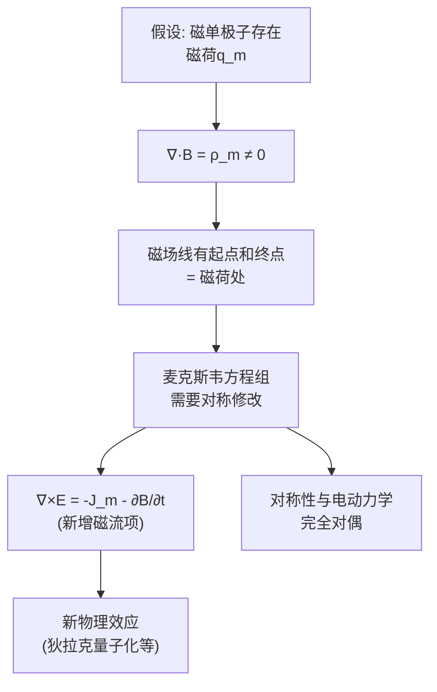

# 思考题：为什么磁场是无散场
**关键词**：思考题, 预习, 概念检验, 恒定磁场

## 教科书原题

> 5-3 为什么恒定磁场是无散场？磁通连续性原理说明了什么？

## 费曼4步解题法

### 第1步：明确问题核心

这道题追问的是磁场最本质的性质——$$\nabla\cdot\mathbf{B}=0$$（无散性/磁通连续性原理）。它追问的不只是"是什么"（公式），而是"为什么"（物理根源）和"说明什么"（物理含义）。

### 第2步：物理根源分析

**"为什么"——两个层次的回答**：

**层次1（实验事实）**：迄今为止，所有实验都表明**不存在磁单极子**（独立的磁荷）。电场线从正电荷出发、终止于负电荷（因为电荷是电场的源和汇）。但磁场线永远是闭合的——没有起点也没有终点。比奥-萨伐尔定律 $$d\mathbf{B} = \frac{\mu_0}{4\pi}\frac{I d\mathbf{l}\times\mathbf{e}_R}{R^2}$$ 给出的磁场自动满足 $$\nabla\cdot\mathbf{B}=0$$（可以数学验证）。

**层次2（数学来源）**：磁通密度由磁矢位 $$\mathbf{A}$$ 的旋度定义：$$\mathbf{B} = \nabla\times\mathbf{A}$$。根据矢量恒等式 $$\nabla\cdot(\nabla\times\mathbf{A}) \equiv 0$$（旋度场的散度恒为零），$$\nabla\cdot\mathbf{B}$$ 必然为零。这意味着——只要磁场由矢量位导出，无散性是自动满足的，是"定义"而非"推导"出的性质。

**对比**：
| | 电场 $$\mathbf{E}$ | 磁场 $$\mathbf{B}$ |
|------|------|------|
| 散度 | $\nabla\cdot\mathbf{E} = \rho/\varepsilon_0$$（有散） | $\nabla\cdot\mathbf{B} = 0$$（无散） |
| 力线 | 始于正电荷，终于负电荷（开放） | 永远闭合（无首尾） |
| 源 | 电荷 $$\rho$$（标量源） | 无标量源（无磁单极子） |
| 导出方式 | $\mathbf{E} = -\nabla\phi$$（梯度导出） | $\mathbf{B} = \nabla\times\mathbf{A}$$（旋度导出） |

### 第3步："说明什么"——三个物理含义

1. **磁通守恒**：穿过任何闭合面的净磁通为零 $$\oint_S \mathbf{B}\cdot d\mathbf{S} = 0$$——进入的磁力线数 = 出去的磁力线数。这是"磁路"分析中基尔霍夫磁通定律的基础。

2. **磁力线闭合性**：每一条磁力线（B线）都构成闭合环路。这与电场线形成鲜明对比——电场线可以在电荷处断开。在变压器中，磁力线在铁心中形成闭合回路，这才是能量有效传递的根本保证。

3. **磁矢位的存在性**：$$\nabla\cdot\mathbf{B}=0$$ 保证了存在矢量函数 $$\mathbf{A}$$ 使得 $$\mathbf{B} = \nabla\times\mathbf{A}$$。磁矢位在电磁辐射、天线理论中有核心应用。

### 第4步：如果磁单极子存在会怎样？



但迄今为止，所有寻找磁单极子的实验都给出了零结果。磁场的无散性是现代物理学中最坚实的实验事实之一。

## 常见误区

1. **"磁通连续性"意味着B处处相等**：在变截面的磁路中，截面小的地方B大（磁力线密集），但$$\oint\mathbf{B}\cdot d\mathbf{S}=0$$仍然满足。连续性是指**磁通**（不是B本身）在空间中的守恒。

2. **认为 $$\nabla\cdot\mathbf{B}=0$$ 只在恒定磁场中成立**：这一方程在时变场中也成立（麦克斯韦方程组第四条），表明即使磁场随时间变化，磁单极子依然不存在。

3. **混淆 $$\nabla\cdot\mathbf{B}=0$$ 和 $$\nabla\cdot\mathbf{H}=0$$**：在介质中 $$\nabla\cdot\mathbf{B}=0$$ 恒成立，但 $$\nabla\cdot\mathbf{H} = -\nabla\cdot\mathbf{M}$$ 一般不为零——因为磁化强度的散度等效于"束缚磁荷"。但这不是真正的磁荷，是数学等效。

## 概念导航

- **关联**：[[真空中的恒定磁场 MOC]]、[[磁通连续性原理]]、[[比奥-萨伐尔定律]]
- **延伸**：[[磁矢位 A]]、[[磁单极子假设与狄拉克量子化]]

## 自己理解

磁场的无散性（$$\nabla\cdot\mathbf{B}=0$$）可能是电磁学中最"省心"的一条方程——它告诉你：甭管多复杂的磁场分布，穿过任何闭合曲面的净磁通一定是零。这就像水流过一堆管道网——流进去的水量一定等于流出来的水量（不可压缩流体），磁通也一样：在磁场中"磁通不灭"。这条规则在设计变压器、电机和磁路时是基础中的基础。

> 📖 参见：[[§5-1 磁通密度]], [[§5-1 磁通密度]]

## 磁通连续性原理的数学根源

$\nabla\cdot\mathbf{B}=0$ 的根本原因是：**不存在磁单极子**。所有磁力线都是闭合的——进入某体积的磁力线数必然等于离开的数目。

对比电场：$\nabla\cdot\mathbf{D}=\rho$（自由电荷是D的"源"），但$\nabla\cdot\mathbf{B}=0$（没有磁荷"源"）。

```wavedrom
{signal: [
  {name: '电场线', wave: '2.2.2.2.', data: ['起于+q', '终于-q', '不闭合', '']},
  {name: '磁场线', wave: '3.3.3.3.', data: ['闭合', '无起点终点', '∮B·dS=0', '']},
]}
```

> 📖 参见：[[§5-1 磁通密度]], [[§5-1 磁通密度]]
