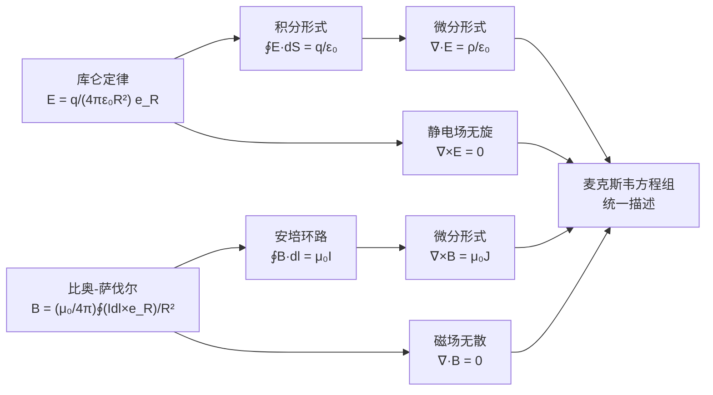

# 思考题：比奥-萨伐尔定律与库仑定律的类比
**关键词**：思考题, 预习, 概念检验, 恒定磁场

📌 **一句话本质**：比奥-萨伐尔与库仑定律的形式类比——都是1/R²衰减但方向性截然不同（径向vs叉乘），根源是源的标量vs矢量差异

🏷️ **重要度**：⚪ | 考试：★ | 题型：简

## 教科书原题

> 5-5 试对比奥-萨伐尔定律和库仑定律的相似性和差异性。

## 费曼4步解题法

### 第1步：明确问题核心

这道思考题要求深入比较电磁学中最基本的两个"力定律"——库仑定律（静电力的基本规律）和比奥-萨伐尔定律（静磁力的基本规律）。两者的数学结构惊人相似，但物理内涵截然不同。理解这种"形式统一、本质不同"的关系，是掌握电磁场理论对偶性思维的关键。

### 第2步：逐项对比分析

**数学形式对比**：

| 方面 | 库仑定律 | 比奥-萨伐尔定律 |
|------|----------|----------------|
| 源 | 电荷 $$dq$$（标量） | 电流元 $$I d\mathbf{l}$$（矢量） |
| 场 | $\mathbf{E}$$（矢量场） | $\mathbf{B}$$（矢量场） |
| 公式 | $d\mathbf{E} = \frac{dq}{4\pi\varepsilon_0}\frac{\mathbf{e}_R}{R^2}$ | $d\mathbf{B} = \frac{\mu_0}{4\pi}\frac{I d\mathbf{l}\times\mathbf{e}_R}{R^2}$ |
| 距离依赖 | $\propto 1/R^2$ | $\propto 1/R^2$ |
| 方向 | **径向**（$$d\mathbf{E} \parallel \mathbf{e}_R$$） | **叉乘方向**（$$d\mathbf{B} \perp I d\mathbf{l}$$ 且 $$\perp \mathbf{e}_R$$） |
| 叠加方式 | 标量方向 × 矢量叠加 | 叉乘方向 × 矢量叠加 |
| 常数 | $1/(4\pi\varepsilon_0)$ | $\mu_0/(4\pi)$ |

**物理本质对比**：

| 性质 | 库仑场 E | 比奥-萨伐尔场 B |
|------|---------|----------------|
| 散度 | $\nabla\cdot\mathbf{E} = \rho/\varepsilon_0$$（有散） | $\nabla\cdot\mathbf{B} = 0$$（无散） |
| 旋度 | $\nabla\times\mathbf{E} = 0$$（无旋） | $\nabla\times\mathbf{B} = \mu_0\mathbf{J}$$（有旋） |
| 力线 | 始于正电荷，终于负电荷 | 永远是闭合环 |
| 保守性 | 保守场（可定义电位 $$\phi$$） | 非保守场（需用矢量位 $$\mathbf{A}$$） |
| 做功 | 电场力做功（与路径无关） | 磁力不做功（总是垂直于速度） |

### 第3步：相似性的深层原因

**为什么都是 $$1/R^2$$？**

两者都是三维空间中标量场的梯度——在三维空间中，点源产生的"通量守恒"必然导致 $$1/R^2$$ 衰减。对于电场，是 $$\oint\mathbf{E}\cdot d\mathbf{S} = q/\varepsilon_0$$（高斯定律）；对于磁场，虽然 $$\oint\mathbf{B}\cdot d\mathbf{S} = 0$$，但比奥-萨伐尔定律中的电流元可看作"旋量源"，其方向性导致相同的 $$1/R^2$$ 距离依赖。

**为什么一个径向、一个叉乘？**

根源在于"源"的性质不同：电荷是**标量源**（产生径向的梯度场），电流是**矢量源**（产生叉乘方向的旋度场）。这导致了散度和旋度性质的根本对立——库仑场无旋有散，比奥-萨伐尔场有旋无散。

### 第4步：统一在麦克斯韦框架下

## 常见误区

1. **认为库仑定律和比奥-萨伐尔定律"完全类似"**：数学形式上都是 $$1/R^2$$ + 积分，但方向性完全不同。库仑力沿径向（中心力），磁力沿叉乘方向——这是"有散"和"有旋"两种不同矢量场的最根本差别。
2. **忘记比奥-萨伐尔定律只适用于恒定电流**：库仑定律对静止和运动电荷都适用（广义库仑定律），但比奥-萨伐尔定律只描述恒定电流产生的**静态**磁场。时变电流产生的磁场需要通过推迟势（Jefimenko方程）计算。
3. **混淆 $$1/(4\pi\varepsilon_0)$$ 和 $$\mu_0/(4\pi)$$ 的数量级**：库仑常数 $$k = 1/(4\pi\varepsilon_0) \approx 9 \times 10^9$$ N·m²/C²，而磁常数 $$\mu_0/(4\pi) = 10^{-7}$$ N/A²。前者远大于后者，说明静电力远远强于磁力（在同等"源强度"比较下）。

## 概念导航

- **关联**：[[库仑定律与电场强度]]、[[比奥-萨伐尔定律的应用]]、[[真空中的恒定磁场 MOC]]
- **延伸**：[[对偶性原理]]（电与磁的对称性）

## 自己理解

库仑定律和比奥-萨伐尔定律的关系就像一对镜像双胞胎——长相相似（都是 $$1/R^2$$），但性格相反（一个径向、一个叉乘）。这种对立统一关系贯穿整个电磁场理论：凡电场"散"的地方磁场必"旋"，凡电场"无旋"的地方磁场必"无散"。理解了这种对偶性，就拿到了理解麦克斯韦方程组的钥匙。

> 📖 参见：[[§5-2 真空中的恒定磁场]]
