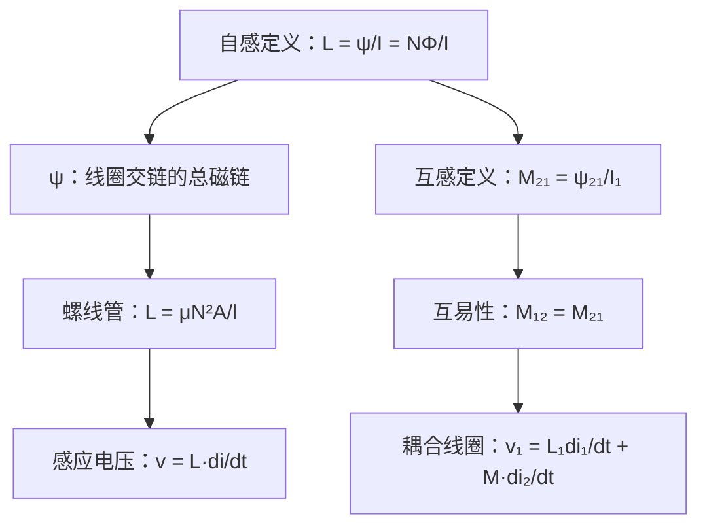

# 自感与互感的定义与计算
**关键词**：自感, 互感, L, M, 磁链, ψ=LI

📌 **一句话本质**：电感衡量线圈储存磁能的能力——电流变化1安每秒产生多少感应电压

🏷️ **重要度**：🔴 | 考试：★★★ | 题型：计

🔧 **工程/实际场景**：Buck电路功率电感——感值算小导致电流纹波超限烧毁MOSFET；算大则瞬态响应慢使负载掉电。

## 教科书原文

> 📖 参见：[[§6-2]]

## 🧠 类比与直觉

**类比：水库的蓄水能力**。自感L就像水库的蓄水容量——库容越大（L越大），水位变化一个单位储存/释放的水量越多（电流变化产生的磁链变化越大）。互感M就像是两个联通水库之间的"联动效应"——一个水库水位变化通过连通管影响另一个水库的水位。

**口诀**："自感磁链比电流，互感磁链跨线圈"

## ⚠️ 常见误区

1. **自感L不是常数**：铁芯线圈的L随电流变化（饱和效应），只有空心线圈L才是常数。
2. **互感M₁₂=M₂₁（互易性）**：两个线圈的互感总是对称的——线圈1对线圈2的互感等于线圈2对线圈1的互感。
3. **同名端判断**：两线圈电流都从同名端流入时，互感磁通与自感磁通方向相同（相助）；一进一出则相反（相消）。

## ❓ 费曼检验

1. 一个N匝线圈绕在磁导率μ的环形铁芯（长l，截面积A）上，推导其自感L的表达式。如果铁芯中开了一个小气隙，L如何变化？
2. 两个共轴圆环线圈相距d，如何判断它们的同名端？感应电压v₂=M·di₁/dt的符号与同名端有什么关系？
3. 写出用磁链ψ定义互感的公式：M₂₁=ψ₂₁/i₁，并解释为什么ψ₂₁是线圈1的电流i₁在线圈2中产生的磁链。

## 🔗 概念导航
- 前置概念：[[磁通密度B的定义]]、[[安培环路定律及其对称性应用]]、[[磁场能量密度的推导]]
- 后续概念：[[诺伊曼公式]]、[[回路能量表达式]]
- 关联概念：[[电容的定义与计算方法]]（L与C的对偶关系）

## 💻 MATLAB 可视化提示词

生成代码：计算两个共轴圆环线圈的互感随距离的变化曲线。用毕奥-萨伐尔定律数值积分求一个线圈在另一个线圈每匝处产生的B，再积分得磁链。绘制M(d)曲线，标注近区（M大，耦合强）和远区（M∝1/d³衰减）。

## 📐 推导脉络

## ✂️ 可跳过

> 本节是电感定义的入门，若已掌握ψ=LI、v=Ldi/dt和同名端的基本概念，可直接跳至下一个概念。
