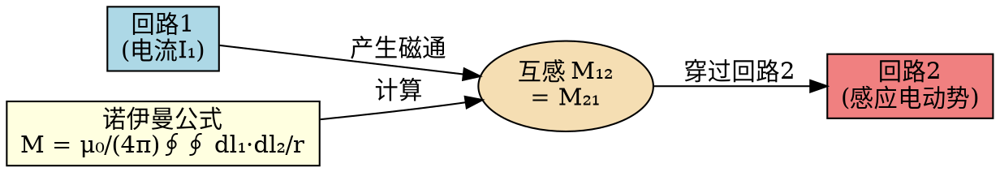

# 诺伊曼公式

## 教科书原文

> 📖 参见：[[§6-2]]

## 诺伊曼公式的应用场景

诺伊曼公式适用于任意形状的回路间互感计算——将两回路分别离散为小段，数值积分即可。对于规则形状，可解析求解。

```graphviz
digraph G {
    rankdir=LR;
    node [shape=box, style=filled];
    A [label="回路1\n(电流I₁)", fillcolor=lightblue];
    B [label="回路2\n(感应电动势)", fillcolor=lightcoral];
    C [label="互感 M₁₂\n= M₂₁", shape=ellipse, fillcolor=wheat];
    D [label="诺伊曼公式\nM = μ₀/(4π)∮∮ dl₁·dl₂/r", fillcolor=lightyellow];
    A -> C [label="产生磁通"];
    C -> B [label="穿过回路2"];
    D -> C [label="计算"];
}
```

> 📖 参见：[[§5-3 磁位]]
