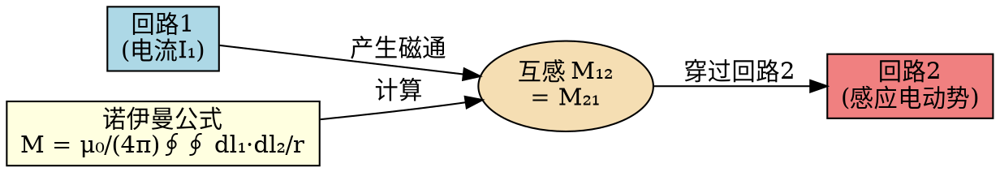

# 诺伊曼公式
**关键词**：诺伊曼公式, 互感, M, 双回路积分

📌 **一句话本质**：诺伊曼公式M=μ₀/(4π)∮∮dl₁·dl₂/r给出任意两回路间的互感——两回路积分，每个微元对的距离倒数加权

🏷️ **重要度**：🟡 | 考试：★★ | 题型：计

🔧 **工程/实际场景**：PCB差分对线间耦合——用诺伊曼公式计算两条微带线之间的互感M。若忽略回路长度方向的不均匀性（假设M处处相等），差分信号共模噪声估算偏差达40%，EMC测试超标。

## 🧠 类比与直觉

**类比：两圈任意形状的篱笆之间的"相互影响"**。诺伊曼公式就像计算两圈形状任意的篱笆之间每根篱笆条对另一圈的"平均影响力"——每个小段dl₁和dl₂之间有一个"亲密程度"（dl₁·dl₂/r），全部配对求和（四重线积分形式上是双重环路积分）就得到了互感M。

**口诀**：诺伊曼双环积分求互感，点乘除距全域加和

## ✂️ 可跳过

> 本节是诺伊曼公式的入门，若已掌握M₁₂=μ₀/(4π)∮₁∮₂(dl₁·dl₂)/r的双重路径积分形式及其对称性M₁₂=M₂₁，可直接跳至下一个概念。

## 教科书原文

> 📖 参见：[[§6-2]]

## 诺伊曼公式的应用场景

诺伊曼公式适用于任意形状的回路间互感计算——将两回路分别离散为小段，数值积分即可。对于规则形状，可解析求解。

> 📖 参见：[[§5-3 磁位]]
