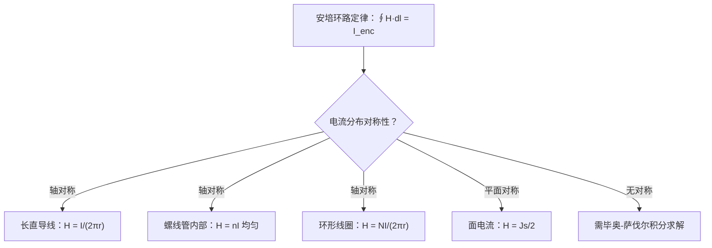

# 安培环路定律及其对称性应用
**关键词**：真空中的恒定磁场

📌 **一句话本质**：安培环路定律说磁场沿闭合路径的环量等于穿过路径的总电流乘μ₀——电流是磁场的环量源

🏷️ **重要度**：🔴 | 考试：★★★ | 题型：计

🔧 **工程/实际场景**：电机定子绕组磁路设计——环路积分路径若漏计一匝，磁动势偏小，铁芯会饱和导致激磁电流暴增最终绕组烧毁。

## 教科书原文

> 📖 参见：[[§5-2 真空中的恒定磁场]]

## 可视化图表

```wavedrom
{
  "signal": [
    {"name": "∮H·dl=I 长直导线", "wave": "23", "period": 4, "data": ["H=I/2πr", "H=I/2πr", "H=I/2πr", "H=I/2πr", "H=I/2πr", "H=I/2πr", "H=I/2πr", "H=I/2πr"]},
    {"name": "螺线管内部 H=NI/l", "wave": "2", "period": 4, "data": ["B=μ₀nI 均匀", "B=μ₀nI 均匀", "B=μ₀nI 均匀", "B≈0 外部", "B≈0 外部", "B≈0 外部", "B≈0 外部", "B≈0 外部"]},
    {"name": "环形线圈 H=NI/2πr", "wave": "3", "period": 4, "data": ["H∝1/r", "H∝1/r", "H∝1/r", "H∝1/r", "H∝1/r", "H∝1/r", "H∝1/r", "H∝1/r"]},
    {"name": "∮H·dl=0 (不包围I)", "wave": "2", "period": 4, "data": ["H≠0但总环量为0", "H≠0但总环量为0", "H≠0但总环量为0", "H≠0但总环量为0", "H≠0但总环量为0", "H≠0但总环量为0", "H≠0但总环量为0", "H≠0但总环量为0"]},
    {"name": "无限大面电流 H=Js/2", "wave": "2", "period": 4, "data": ["H=Js/2 方向与Js⊥", "H=Js/2 方向与Js⊥", "H=Js/2 方向与Js⊥", "H=Js/2 方向与Js⊥", "H=Js/2 方向与Js⊥", "H=Js/2 方向与Js⊥", "H=Js/2 方向与Js⊥", "H=Js/2 方向与Js⊥"]}
  ],
  "head": {
    "text": "安培环路定律: ∮H·dl=ΣI  四种典型路径 §5-3",
    "tick": 0
  },
  "foot": {
    "text": "适用条件: 稳恒电流+对称性  右手定则确定H方向"
  }
}

```

## 🧠 类比与直觉

**类比：漩涡环量的水流版**。安培环路定律就像测量漩涡的强弱——你在河流中画一个闭合圈，沿圈测量水流的切向分量总和（环量），这个总和正比于圈内"源头"的强度。电流就是磁场的"漩涡源"，电流越大，环绕它的磁场环量越大。

**口诀**："磁环量等于流乘μ₀"

## ⚠️ 常见误区

1. **∮H·dl=I永远对，但只有对称性能提取H**：安培环路定律是普遍成立的，但只有电流分布具有对称性时，才能将H从积分号中提出。非对称分布下积分照样成立但无法解析求解。
2. **电流方向与环量符号**：右手定则确定正方向——右手四指沿环路方向，拇指指向为电流正方向。反方向电流为负。
3. **螺线管外部B≈0是"无限长"近似**：真实有限长螺线管两端有漏磁，外部B不为零。

## ❓ 费曼检验

1. 一个无限长同轴电缆，内导体半径a载流+I，外导体半径b载流-I。求r<a、a<r<b、r>b三个区域的H分布。
2. 安培环路定律的对称性条件与高斯定律的对称性条件有何异同？为什么都有"球对称、轴对称、平面对称"这三种？
3. 如果积分路径只包围部分电流（比如螺线管中只包围3/4的截面），∮H·dl等于多少？

## 🔗 概念导航
- 前置概念：[[比奥-萨伐尔定律的矢量形式]]、[[磁通密度B的定义]]
- 后续概念：[[B的法向与H的切向边界条件]]、[[标量磁位与矢量磁位]]
- 关联概念：[[高斯定律的对称性应用技巧]]（静电场的对称性方法体系）

## 💻 MATLAB 可视化提示词

生成代码：对比绘制四种安培环路定律对称性应用的磁场分布——(a)长直导线B=μ₀I/(2πr)，(b)螺线管内部均匀B=μ₀nI，(c)环形线圈B∝1/r，(d)无限大面电流B=μ₀Jₛ/2。用四个子图展示，quiver绘制H矢量，标注环路路径。

## 📐 推导脉络



## ✂️ 可跳过

> 本节是安培环路定律的对称性应用入门，若已熟练掌握四种典型对称路径（长直导线、螺线管、环形线圈、面电流）的积分方法和右手定则，可直接跳至下一个概念。
