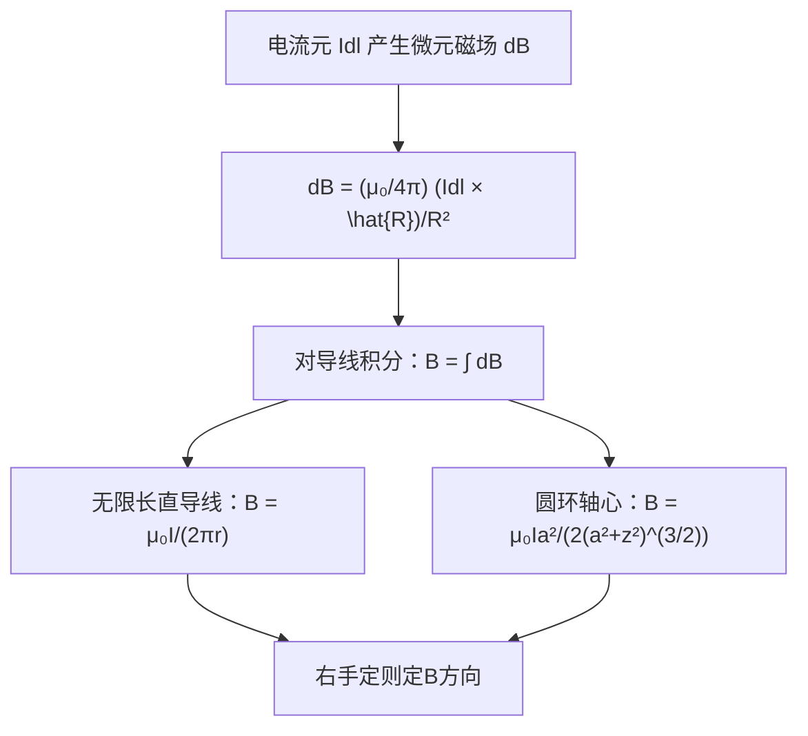

# 比奥-萨伐尔定律的矢量形式
**关键词**：真空中的恒定磁场

📌 **一句话本质**：毕奥-萨伐尔定律算电流元在某点产生的磁通密度——电流元叉乘方向除以距离平方

🏷️ **重要度**：🔴 | 考试：★★★ | 题型：计

🔧 **工程/实际场景**：高速PCB差分线串扰——用毕奥-萨伐尔算相邻差分对产生的耦合磁场，算错串扰量级会导致误码率超标。

## 教科书原文

> 📖 参见：[[§5-2 真空中的恒定磁场]]

## 可视化图表

```vega-lite
{
  "$schema": "https://vega.github.io/schema/vega-lite/v5.json",
  "description": "无限长直导线磁场: B(r)=μ₀I/(2πr) 1/r衰减",
  "width": 400,
  "height": 300,
  "mark": "line",
  "encoding": {
    "x": {"field": "r", "type": "quantitative", "title": "距导线中心距离 r [m]"},
    "y": {"field": "B_mag", "type": "quantitative", "title": "B [μT]"},
    "color": {"field": "current", "type": "nominal", "scale": {
      "domain": ["I=1A", "I=5A", "I=10A"],
      "range": ["#3498db", "#2ecc71", "#e74c3c"]
    }, "title": "电流"}
  },
  "data": {
    "values": [
      {"r": 0.01, "B_mag": 20.00, "current": "I=1A"},
      {"r": 0.02, "B_mag": 10.00, "current": "I=1A"},
      {"r": 0.05, "B_mag": 4.00, "current": "I=1A"},
      {"r": 0.10, "B_mag": 2.00, "current": "I=1A"},
      {"r": 0.20, "B_mag": 1.00, "current": "I=1A"},
      {"r": 0.50, "B_mag": 0.40, "current": "I=1A"},
      {"r": 1.00, "B_mag": 0.20, "current": "I=1A"},
      {"r": 0.01, "B_mag": 100.00, "current": "I=5A"},
      {"r": 0.02, "B_mag": 50.00, "current": "I=5A"},
      {"r": 0.05, "B_mag": 20.00, "current": "I=5A"},
      {"r": 0.10, "B_mag": 10.00, "current": "I=5A"},
      {"r": 0.20, "B_mag": 5.00, "current": "I=5A"},
      {"r": 0.50, "B_mag": 2.00, "current": "I=5A"},
      {"r": 1.00, "B_mag": 1.00, "current": "I=5A"},
      {"r": 0.01, "B_mag": 200.00, "current": "I=10A"},
      {"r": 0.02, "B_mag": 100.00, "current": "I=10A"},
      {"r": 0.05, "B_mag": 40.00, "current": "I=10A"},
      {"r": 0.10, "B_mag": 20.00, "current": "I=10A"},
      {"r": 0.20, "B_mag": 10.00, "current": "I=10A"},
      {"r": 0.50, "B_mag": 4.00, "current": "I=10A"},
      {"r": 1.00, "B_mag": 2.00, "current": "I=10A"}
    ]
  },
  "title": "无限长直导线磁场: B=μ₀I/(2πr) 右手螺旋 §5-3"
}

```

## 🧠 类比与直觉

**类比：水管洒水器**。毕奥-萨伐尔定律就像计算一段弧形水管每个位置喷出的水量——电流元Idl是"水源"，距离越远水越散（B∝1/R²），方向由水管弯曲方向和位置共同决定（叉积）。

**口诀**："电流元叉向除以距离平方，积出总磁场"

## ⚠️ 常见误区

1. **dB不是B**：毕奥-萨伐尔定律给出的是电流元Idl产生的微元dB，要求总B必须对整个电流路径积分。直接拿dB当B是典型错误。
2. **叉积方向用左手还是右手**：Idl × \hat{R}用右手定则——四指从Idl方向弯向\hat{R}方向，拇指指向dB方向。记住：电流方向→位置矢量方向→右手拇指。
3. **1/R²衰减是到电流元的距离**：不是到导线中点的距离，每个电流元到观察点的R都不同。

## ❓ 费曼检验

1. 一段直导线载流I，用毕奥-萨伐尔定律推导距离导线垂直距离为r处的B。结果为什么与r成反比（B∝1/r）而非1/r²？
2. 圆形电流环轴线上中心点的B方向如何？如果把电流方向反过来呢？
3. 为什么不直接用毕奥-萨伐尔定律求解任意形状电流回路——有限元软件中它是怎么用的？

## 🔗 概念导航
- 前置概念：[[磁通密度B的定义]]、[[向量与标量的本质区别]]
- 后续概念：[[安培环路定律及其对称性应用]]、[[标量磁位与矢量磁位]]
- 关联概念：[[库仑定律与点电荷]]（1/r²定律的磁场对应版）

## 💻 MATLAB 可视化提示词

生成代码：计算并绘制一段直导线在空间中产生的磁场矢量场。导线沿z轴从-L到L，在x-y平面上用quiver绘制B矢量分布，磁通密度大小用颜色映射，标注导线位置和电流方向。

## 📐 推导脉络



## ✂️ 可跳过

> 本节是毕奥-萨伐尔定律的矢量形式入门，若已熟练掌握电流元Idl、位置矢量R、叉积方向和1/R²衰减的基本含义，可直接跳至下一个概念。
