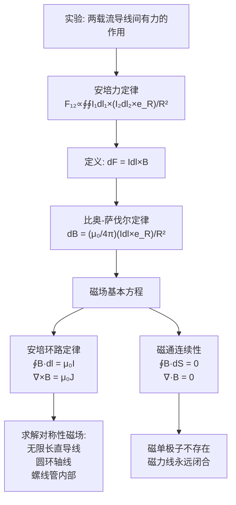
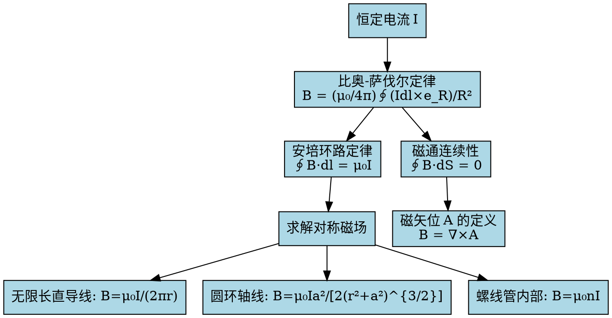

# 真空中的恒定磁场 MOC

## 教科书原文

> 📖 参见：[[§5-1 磁通密度]], [[§5-2 真空中的恒定磁场]]

## 概念定义（费曼一句话）

真空中的恒定磁场是："恒定电流在周围空间激发的、对运动电荷和电流元施加安培力的矢量场"——它由比奥-萨伐尔定律定量描述，服从安培环路定律 $$\oint \mathbf{B}\cdot d\mathbf{l} = \mu_0 I$$，其基本性质是**无散**（$$\nabla\cdot\mathbf{B}=0$$，磁单极子不存在）。

## 类比与直觉

**类比1：每根导线都是一台"鼓风机"**。想象你身边有一根通电导线——它像一台无形的鼓风机，喷出的不是空气而是"磁力线"。安培力定律告诉我们，这根导线对另一根带电粒子的"吹力"正比于两者的电流乘积，反比于距离的平方。两根同向电流的导线互相吸引（气流同向合并），反向电流互相排斥（气流对冲）。

**类比2：比奥-萨伐尔定律 vs 库仑定律**。库仑定律：$$d\mathbf{E} = \frac{dq}{4\pi\varepsilon_0 R^2}\mathbf{e}_R$$——电荷元产生的电场沿径向，标量性质。而比奥-萨伐尔定律：$$d\mathbf{B} = \frac{\mu_0 I d\mathbf{l} \times \mathbf{e}_R}{4\pi R^2}$$——电流元产生的磁场沿**叉乘方向**（右手定则），矢量性质。这一本质区别导致电场线始于正电荷终于负电荷（有散），而磁力线永远闭合（无散）。

## 核心公式详释

**安培力定律（两电流回路间的作用力）**：
$$\mathbf{F}_{12} = \frac{\mu_0}{4\pi}\oint_{l_1}\oint_{l_2} \frac{I_1 d\mathbf{l}_1 \times (I_2 d\mathbf{l}_2 \times \mathbf{e}_{R_{12}})}{R_{12}^2}$$

**磁通密度B的定义**：$$d\mathbf{F} = I d\mathbf{l} \times \mathbf{B}$$

**比奥-萨伐尔定律（B由I计算）**：
$$\mathbf{B}(\mathbf{r}) = \frac{\mu_0}{4\pi}\oint_{l'} \frac{I d\mathbf{l}' \times (\mathbf{r} - \mathbf{r}')}{|\mathbf{r} - \mathbf{r}'|^3} = \frac{\mu_0}{4\pi}\oint_{l'} \frac{I d\mathbf{l}' \times \mathbf{e}_R}{R^2}$$

**安培环路定律**：
$$\oint_l \mathbf{B}\cdot d\mathbf{l} = \mu_0 I$$
$$\nabla\times\mathbf{B} = \mu_0\mathbf{J}$$

**磁通连续性原理（磁场高斯定律）**：
$$\oint_S \mathbf{B}\cdot d\mathbf{S} = 0$$
$$\nabla\cdot\mathbf{B} = 0$$

| 物理量 | 符号 | 单位 | 对应电场量 |
|--------|------|------|-----------|
| 磁通密度（磁感应强度） | $\mathbf{B}$ | T (特斯拉) | $\mathbf{E}$ |
| 真空磁导率 | $\mu_0$ | $4\pi\times10^{-7}$$ H/m | $\varepsilon_0$ |
| 电流 | $I$ | A | $q$ |
| 电流元 | $I d\mathbf{l}$ | A·m | $dq$ |

## 推导脉络



## 常见误区

1. **认为B是"基本场"而H是"辅助场"**：在真空中 $$\mathbf{B} = \mu_0\mathbf{H}$$，两者等价。B以力的效果定义（作用于运动电荷），H以源的强度定义。在有介质时两者不同。

2. **混淆比奥-萨伐尔定律中叉乘的方向**：$$d\mathbf{B}$$ 方向由 $$I d\mathbf{l} \times \mathbf{e}_R$$（右手定则）决定，不是 $$\mathbf{e}_R \times I d\mathbf{l}$$。反序会颠倒方向！

3. **忘记 $$\mu_0/(4\pi)$$ 因子**：类似库仑定律的 $$1/(4\pi\varepsilon_0)$$，比奥-萨伐尔定律中的 $$\mu_0/(4\pi)$$ 来自单位制。真空中 $$\mu_0/(4\pi) = 10^{-7}$$ H/m，这是一个精确值（由安培的定义确定）。

## 费曼检验

1. 如果磁单极子存在，$$\nabla\cdot\mathbf{B}$$ 会等于什么？磁力线会有什么不同？
2. 一根无限长直导线在距离r处产生的磁场大小为 $$B = \mu_0 I/(2\pi r)$$。如何用安培环路定律直接推导这个结果？
3. 比奥-萨伐尔定律中的被积函数含有 $$1/R^2$$，为什么无限长直导线的总磁场只按 $$1/r$$ 衰减而不是 $$1/r^2$$？

## 概念导航

- **前置**：[[静电场 MOC]]、[[向量基础 MOC]]
- **后继**：[[介质的磁化 MOC]]、[[恒定磁场的边界条件 MOC]]
- **核心**：[[磁通密度B的定义]]、[[比奥-萨伐尔定律的应用]]、[[安培环路定律的对称性条件]]

## 自己理解

真空中的恒定磁场是电磁场理论中最"对称"的部分之一：它在数学结构上与静电场形成"对偶"——电场有散（源=电荷）、磁场无散（源=无）；电场无旋（保守场）、磁场有旋（非保守场）。这种对偶性不仅优雅，而且在工程上提供了强大的类比推理工具。理解了真空中的磁场方程，介质中的推广就只是"加上磁化效应"而已。



> 📖 参见：[[§5-1 磁通密度]], [[§5-3 磁位]]

## 可视化图表

```vega-lite
{
  "$schema": "https://vega.github.io/schema/vega-lite/v5.json",
  "description": "螺线管横截面B场分布: 内部均匀 外部接近零",
  "width": 400,
  "height": 300,
  "layer": [
    {
      "mark": "bar",
      "encoding": {
        "x": {"field": "position", "type": "nominal", "sort": ["中心", "1/4R", "1/2R", "3/4R", "内壁", "外壁", "1.5R", "2R"], "title": "径向位置"},
        "y": {"field": "B_norm", "type": "quantitative", "title": "B [归一化]"},
        "color": {"field": "region", "type": "nominal", "scale": {"domain": ["内部均匀区", "壁附近过渡", "外部衰减区"], "range": ["#2ecc71", "#f39c12", "#e74c3c"]}, "title": "区域"}
      }
    },
    {
      "mark": {"type": "rule", "color": "#3498db", "strokeDash": [5, 5]},
      "encoding": {
        "y": {"field": "ref", "type": "quantitative"}
      }
    }
  ],
  "data": {
    "values": [
      {"position": "中心", "B_norm": 1.0, "region": "内部均匀区", "ref": 1.0},
      {"position": "1/4R", "B_norm": 1.0, "region": "内部均匀区", "ref": 1.0},
      {"position": "1/2R", "B_norm": 0.99, "region": "内部均匀区", "ref": 1.0},
      {"position": "3/4R", "B_norm": 0.97, "region": "内部均匀区", "ref": 1.0},
      {"position": "内壁", "B_norm": 0.85, "region": "壁附近过渡", "ref": 1.0},
      {"position": "外壁", "B_norm": 0.30, "region": "外部衰减区", "ref": 1.0},
      {"position": "1.5R", "B_norm": 0.10, "region": "外部衰减区", "ref": 1.0},
      {"position": "2R", "B_norm": 0.02, "region": "外部衰减区", "ref": 1.0}
    ]
  },
  "title": "螺线管横截面B场: B=μ₀nI (内部均匀) 外部≈0 §5-4"
}

```
