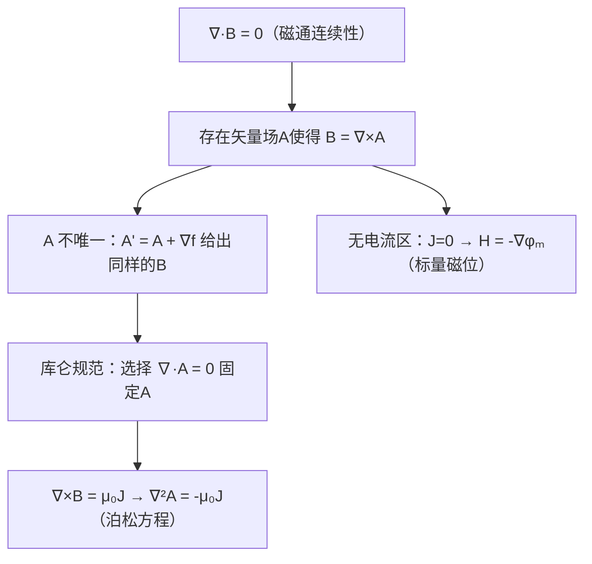

# 标量磁位与矢量磁位
**关键词**：矢量磁位, A, B=∇×A, 标量磁位, 库仑规范

📌 **一句话本质**：磁矢位A是磁场的矢势——B=∇×A，天然满足∇·B=0

🏷️ **重要度**：🔴 | 考试：★★★ | 题型：计

🔧 **工程/实际场景**：ANSYS Maxwell有限元——磁矢位A是基本求解量。A的规范没选对（散度不为零），求解器不收敛报错。

## 教科书原文

> 📖 参见：[[§5-3 磁位]]

## 🧠 类比与直觉

**类比：地形等高线vs流线**。磁矢位A就像地形的等高线图（等高线方向即A的方向），而磁场B就是等高线的"坡度陡峭度"（旋度——等高线越密B越大）。标量磁位φₘ像温度场，而A像流场——前者是标量，后者是矢量。

**口诀**："B是A的旋度，库仑规范散度零"

## ⚠️ 常见误区

1. **A不是唯一确定的——规范自由度**：给A加任意标量函数的梯度∇f，B=∇×(A+∇f)=∇×A不变。这就是规范自由度，意味着同一个B对应无穷多个A。
2. **库仑规范∇·A=0是约定而非物理定律**：选择这个规范是为了让泊松方程化简，选别的规范也行但方程会变复杂。
3. **标量磁位φₘ只在无电流区域有定义**：因为∇×H=J，有J处H不是保守场，不能写成标量梯度。只有在J=0的区域才能定义H=-∇φₘ。

## ❓ 费曼检验

1. 如果B=∇×A，证明∇·B=0自动成立。（提示：旋度的散度恒为零）
2. 给定一个均匀磁场B₀沿z方向，写出一个可能的A的表达式。（提示：B=∂A_y/∂x - ∂A_x/∂y，A=(-B₀y/2, B₀x/2, 0)满足条件）
3. 为什么在ANSYS Maxwell中磁矢位A是基本求解量而不是B或H？这与亥姆霍兹定理有什么关系？

## 🔗 概念导航
- 前置概念：[[磁通密度B的定义]]、[[比奥-萨伐尔定律的矢量形式]]、[[安培环路定律及其对称性应用]]
- 后续概念：[[磁位满足的微分方程]]、[[B的法向与H的切向边界条件]]
- 关联概念：[[电位的定义与等位面]]（电位φ与磁矢位A的对称性比较）

## 💻 MATLAB 可视化提示词

生成代码：给定圆环电流，用毕奥-萨伐尔定律数值积分求A的分布，再通过curl算B，验证∇×A=B。在x-z平面上绘制A的矢量场和B的contour图对比，展示A的规范自由度（加∇f后B不变）。

## 📐 推导脉络

## ✂️ 可跳过

> 本节是磁矢位的入门定义，若已掌握B=∇×A和库仑规范∇·A=0的基本含义，可直接跳至下一个概念。
