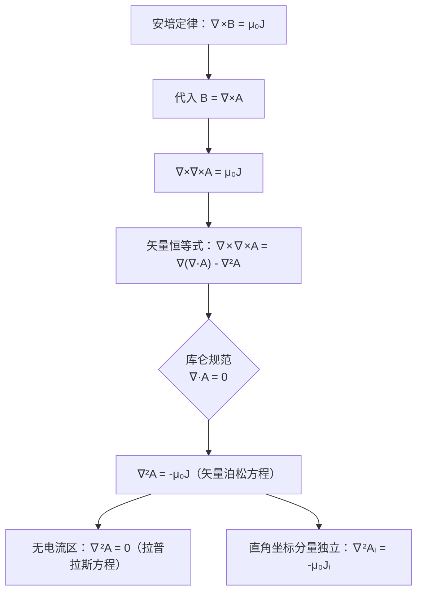

# 磁位满足的微分方程
**关键词**：矢量磁位, A, B=∇×A, 标量磁位, 库仑规范

📌 **一句话本质**：磁矢位A满足泊松方程∇²A=-μ₀J——电流分布J是A的源，就像电荷ρ是电位φ的源

🏷️ **重要度**：🔴 | 考试：★★★ | 题型：计

🔧 **工程/实际场景**：电机电磁场有限元分析——用泊松方程∇²A=-μ₀J数值求解电机槽内磁场分布。如果网格剖分不够细（忽略了气隙区域的快速变化），转矩计算结果偏差可超过15%，导致样机测试不达标。

## 教科书原文

> 📖 参见：[[§5-3 磁位]]

## 🧠 类比与直觉

**类比：沙地上的鼓面模型**。磁矢位A的泊松方程就像在沙地上撑开的鼓面——电流J是压在鼓面上的手指（向下压的力），A是鼓面的形变（抬升高度）。电流越大（压得力大），鼓面形变越大（A越大）；没有电流的区域（无J），鼓面是平的（拉普拉斯方程∇²A=0）。

**口诀**："A的泊松源是电流，无J时变拉普拉斯"

## ⚠️ 常见误区

1. **∇²A是矢量拉普拉斯**：不是简单的每个分量∇²乘以标量——在直角坐标下每个分量独立满足∇²Aᵢ=-μ₀Jᵢ，但在柱/球坐标系中∇²A的分量是耦合的。
2. **库仑规范是推导前提**：∇²A=-μ₀J的推导用了∇·A=0（库仑规范），不用这个规范会导致方程更复杂。
3. **标量磁位泊松方程只在无电流区**：∇²φₘ=0（拉普拉斯方程）只在J=0区域成立，与电位的∇²φ=-ρ/ε₀不同——磁荷不存在（∇·B=0）。

## ❓ 费曼检验

1. 从∇×B=μ₀J出发，代入B=∇×A，利用矢量恒等式∇×∇×A=∇(∇·A)-∇²A，在库仑规范∇·A=0下推导泊松方程∇²A=-μ₀J。
2. 写出一段沿z轴无限长直导线（载流I）的A的表达式，并验证∇×A给出正确的B。
3. 与电位泊松方程∇²φ=-ρ/ε₀对比：为什么A的泊松方程有μ₀而φ的有1/ε₀？这意味着什么物理差异？

## 🔗 概念导航
- 前置概念：[[标量磁位与矢量磁位]]、[[安培环路定律及其对称性应用]]
- 后续概念：[[自感与互感的定义与计算]]、[[磁场能量密度的推导]]
- 关联概念：[[电位的定义与等位面]]（电位泊松方程∇²φ=-ρ/ε₀与A的泊松方程对称性）

## 💻 MATLAB 可视化提示词

生成代码：用有限差分法求解二维∇²A=-μ₀J。设定矩形区域边界A=0，内有一矩形载流导体（J≠0），用surf绘制A的分布，用quiver叠加B=∇×A的矢量场，对比无电流区A满足拉普拉斯方程的平滑性。

## 📐 推导脉络

## ✂️ 可跳过

> 本节是磁位泊松方程的推导，若已掌握∇²A=-μ₀J的矢量形式和库仑规范条件，可直接跳至下一个概念。
