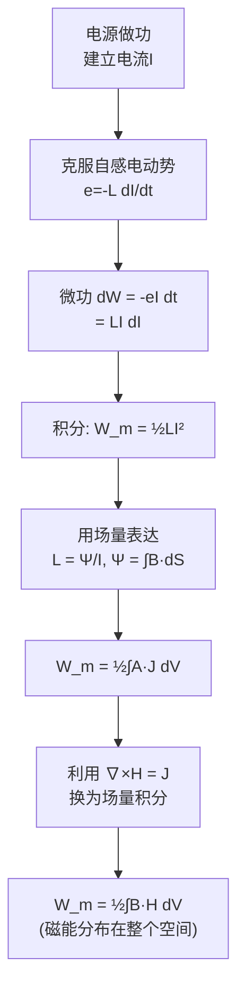

# 磁场的能量 MOC

## 教科书原文

> 📖 参见：[[§5-8]]

## 概念定义（费曼一句话）

磁场能量是"建立磁场时电源所做的功转化而来的储存能量"——它分布在磁场所占据的全部空间中，密度为 $$\frac{1}{2}\mathbf{B}\cdot\mathbf{H}$$。这个能量既可以表示为场量（B和H）的体积分，也可以表示为回路量（电流和磁链）的求和。两种表示方式是等价的——它们是同一物理量在不同"语言"下的表达。

## 类比与直觉

**类比1：压缩弹簧储存的弹性势能**。建立磁场就像压缩一根弹簧——你需要克服"磁惯性"做功（对电感充电），所做的功没有消失，而是储存在磁场中，就像弹簧被压缩后储存了势能。当电流减小时，磁场"弹回"（自感电动势试图维持电流），释放储存的磁能。

**类比2：水库的水位势能**。电感L类比于水库的"惯性"（截面积），电流I类比于水位高度。磁场能量 $$W_m = \frac{1}{2}LI^2$$ 完全类似于水库的势能 $$E = \frac{1}{2}C_{水}H^2$$。电感越大（水库越宽），储存同样的"水流"需要越多的能量。

## 核心公式详释

**磁场能量密度**：
$$\boxed{w_m = \frac{1}{2}\mathbf{B}\cdot\mathbf{H}}$$

**总磁场能量（场量形式）**：
$$W_m = \frac{1}{2}\int_V \mathbf{B}\cdot\mathbf{H}\; dV = \frac{1}{2}\int_V \mu H^2\; dV = \frac{1}{2}\int_V \frac{B^2}{\mu}\; dV$$

**总磁场能量（回路形式）**：
$$W_m = \frac{1}{2}\sum_k I_k\Psi_k = \frac{1}{2}\sum_{i,j} L_{ij}I_iI_j$$

**单回路能量**：
$$\boxed{W_m = \frac{1}{2}LI^2}$$

**两回路系统**：
$$W_m = \frac{1}{2}L_1I_1^2 + \frac{1}{2}L_2I_2^2 + MI_1I_2$$

| 物理量 | 符号 | 公式 | 类比电场 |
|--------|------|------|----------|
| 磁能密度 | $w_m$ | $\frac{1}{2}\mathbf{B}\cdot\mathbf{H}$ | $w_e = \frac{1}{2}\mathbf{D}\cdot\mathbf{E}$ |
| 总磁能 | $W_m$ | $\frac{1}{2}\int\mathbf{B}\cdot\mathbf{H}dV$ | $W_e = \frac{1}{2}\int\mathbf{D}\cdot\mathbf{E}dV$ |
| 电感 | $L$ | $\Psi/I$ | 电容 $$C = q/\phi$ |
| 单回路能量 | $W_m$ | $\frac{1}{2}LI^2$ | $W_e = \frac{1}{2}C\phi^2$ |

## 能流推导

## 常见误区

1. **认为磁场能量集中在铁心中**：实际上，$$\frac{1}{2}\mathbf{B}\cdot\mathbf{H}$$ 分布在所有有磁场的空间中，包括空气。变压器铁心中的气隙虽然体积小，但H值极大（因为 $$\mu_0 \ll \mu_{铁}$$），往往储存了变压器的大部分磁能。

2. **混淆 $$\frac{1}{2}LI^2$$ 和 $$\frac{1}{2}CV^2$$ 中的1/2因子来源**：两者的1/2都来自线性系统的积分：$$\int_0^I Li\; di = \frac{1}{2}LI^2$$ 和 $$\int_0^V Cv\; dv = \frac{1}{2}CV^2$$。如果系统非线性（如铁磁饱和），1/2不适用。

3. **忽略互感能量**：多回路系统的总能量不是各回路自感能量的简单相加——还有互感项 $$MI_1I_2$$。两个同向电流的线圈互感能为正（互相增强），反向为负（互相削弱）。

## 费曼检验

1. 为什么通电线圈断开瞬间会产生很高的电压？用磁场能量的观点解释。
2. 一个理想变压器的铁心磁导率 $$\mu \to \infty$$，请问铁心中储存的磁能密度 $$w_m = B^2/(2\mu)$$ 是多少？磁场能量主要储存在哪里？
3. 从 $$W_m = \frac{1}{2}\int\mathbf{A}\cdot\mathbf{J}dV$$ 出发，如何过渡到 $$W_m = \frac{1}{2}\int\mathbf{B}\cdot\mathbf{H}dV$$？

## 概念导航
- **前置**：[[真空中的恒定磁场 MOC]]、[[电感 MOC]]
- **后续**：[[磁场力 MOC]]（能量法求力）、[[电磁感应 MOC]]
- **关联**：[[电场能量 MOC]]（电场和磁场能量公式的对称性）

## 自己理解（费曼复述）

磁能密度公式 $$w_m = \frac{1}{2}\mathbf{B}\cdot\mathbf{H}$$ 和电能密度 $$w_e = \frac{1}{2}\mathbf{D}\cdot\mathbf{E}$$ 在形式上的对称性令人惊叹——这是电磁场理论对偶性的又一个体现。但要注意关键区别：静电场能量可以表示为 $$\frac{1}{2}\int\rho\phi dV$$（电荷×电位），是"非局域"的；而磁能 $$\frac{1}{2}\int\mathbf{B}\cdot\mathbf{H}dV$$ 必须"局域"看待——磁能真实地分布在场所在的空间中，没有"磁荷"来承担非局域表达。

> 📖 参见：[[§5-8 磁场的能量]]
