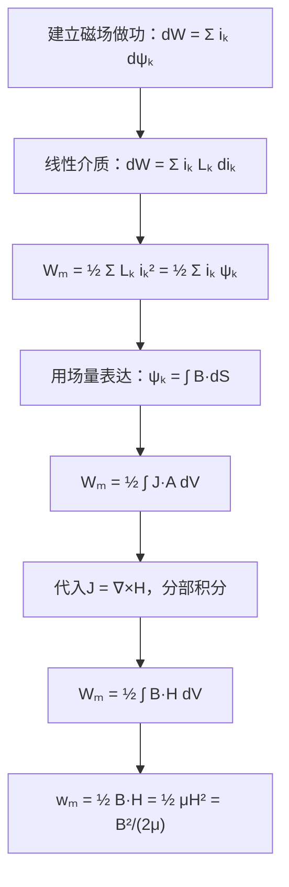

# 磁场能量密度的推导
**关键词**：磁场的能量

📌 **一句话本质**：磁场能量密度是½BH——磁场每立方米存了多少焦耳

🏷️ **重要度**：🔴 | 考试：★★★ | 题型：计

🔧 **工程/实际场景**：电磁铁设计——气隙储能占总能90%，气隙长度多算0.1mm，吸力不够导致电磁铁掉负载。

## 教科书原文

> 📖 参见：[[§5-7]], [[§5-8]]

## 🧠 类比与直觉

**类比：压缩弹簧的能量**。磁场能量就像压缩弹簧储存的弹性能——B是弹簧的形变量，H是弹簧的劲度（反抗形变的力），½BH就是弹簧储存的总弹性能。弹簧越硬（μ越大）形变越小（H越大B不变），但储存的能量密度一样取决于两者的乘积。

**口诀**："磁场能量密度½BH"

## ⚠️ 常见误区

1. **wₘ=½BH只在B-H线性关系下严格成立**：非线性介质（铁磁材料）中严格表达式是wₘ=∫H·dB，仅在μ常数时退化为½BH。
2. **½BH的三种等价形式不总等价**：wₘ=½BH=½μH²=B²/(2μ)——线性介质中三者等价，但已知参数不同时选最方便的形式。
3. **能量存在场中而非电流中**：Wₘ=½∫B·H dV——能量储存在整个磁场空间中，不是"存在线圈里"。这一观点是理解能量传输（坡印廷矢量）的基础。

## ❓ 费曼检验

1. 一个长螺线管（n匝/m，载流I，截面积A）内部的磁场能量密度是多少？总储能是多少？结果是否等于½LI²？
2. 两块永磁体从远处靠近时，磁场总能量是增加还是减少？为什么永磁体会相互吸引？（提示：考虑两块磁体间气隙中B·H的变化）
3. 对比电场能量密度½D·E和磁场能量密度½B·H——它们结构对称，但为什么电场可以"独立存在"（静电场储能）而恒定磁场必须有持续电流维持？

## 🔗 概念导航
- 前置概念：[[磁通密度B的定义]]、[[磁场强度H的引入]]、[[自感与互感的定义与计算]]
- 后续概念：[[回路能量表达式]]、[[虚位移法求磁场力]]
- 关联概念：[[电场能量密度的推导]]（½D·E与½B·H的对偶关系）

## 💻 MATLAB 可视化提示词

生成代码：对于一个矩形截面的环形线圈，用有限元计算其内部和外部的磁场能量密度分布。用surf绘制wₘ=½μ₀H²的空间分布，计算总储能∫½B·H dV并与½LI²对比验证。标注气隙处能量密度最大的区域。

## 📐 推导脉络

## ✂️ 可跳过

> 本节是磁场能量密度的推导，若已掌握wₘ=½BH=½μH²=B²/(2μ)的三种等价形式和能量与电感的关系，可直接跳至下一个概念。
