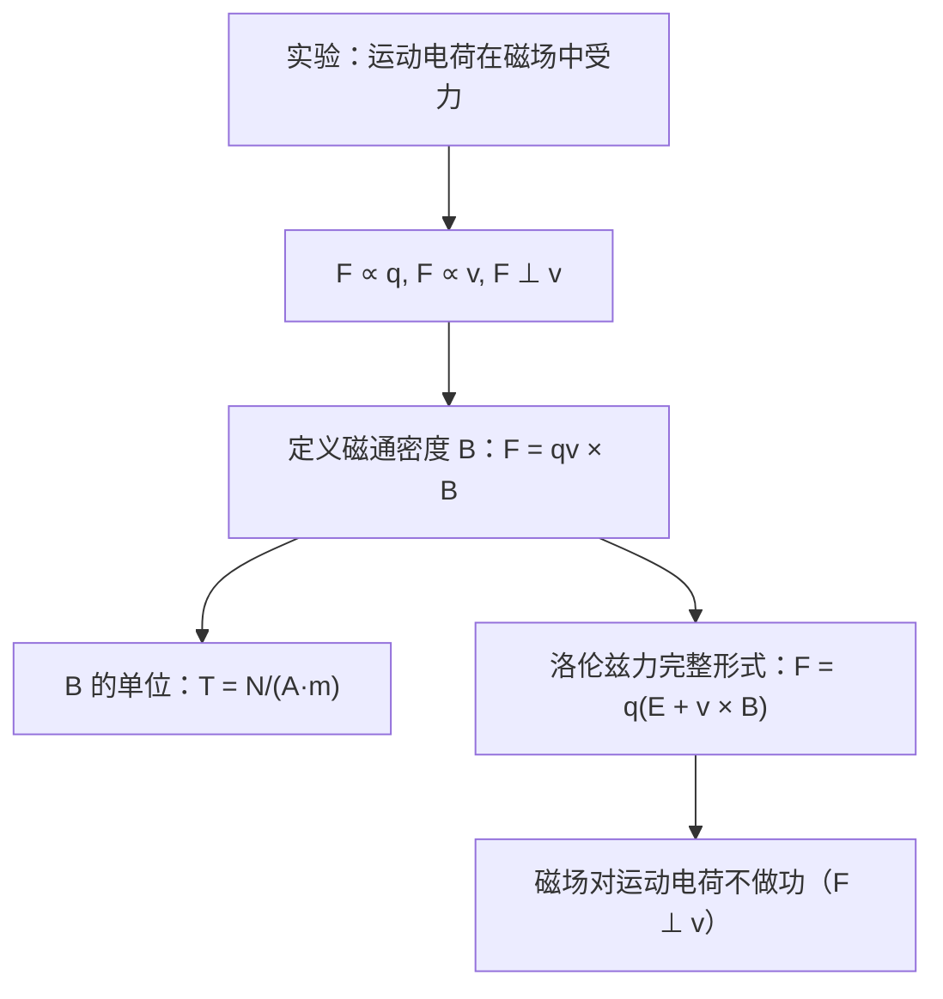

# 磁通密度B的定义
**关键词**：磁通密度, B, 安培力, 洛伦兹力, F=qv×B

📌 **一句话本质**：磁通密度B描述磁场强度和方向——运动电荷受到的最大磁力除以电荷量和速度就是B

🏷️ **重要度**：🔴 | 考试：★★★ | 题型：计

🔧 **工程/实际场景**：电机气隙磁密设计——如果气隙B设计过高（超过1.8T），铁芯进入饱和区，励磁电流指数增长，绕组铜耗急剧上升导致电机过热烧毁；设计过低则转矩不足无法带动负载。

## 教科书原文

> 📖 参见：[[§5-1 磁通密度]]

## 🧠 类比与直觉

**类比：风洞中的旗帜**。B的方向和大小就像风洞中的风向风速——电荷（旗帜）在其中运动会受到力（飘动）。风速越大（B越大），旗帜受力越大；风向改变，旗帜飘动方向也随之改变。洛伦兹力F=qv×B的叉积决定了力始终垂直于速度——就像风吹过旗帜侧面时，旗面不是顺风飘而是横过来。

**口诀**："B是磁力除电荷速度积"

## ⚠️ 常见误区

1. **B和H混淆**：B是磁通密度（T），描述磁场对运动电荷的力效应；H是磁场强度（A/m），与自由电流直接对应。在真空中B=μ₀H，在介质中关系更复杂。
2. **洛伦兹力的方向陷阱**：F=qv×B，力始终垂直于v和B所在平面。静止电荷不受磁力（v=0则F=0），这是磁场与电场的根本区别。
3. **B定义中的"最大磁力"**：B的定义是F_max/(qv)，不是任意方向的力——只有当v⊥B时才取得F_max。

## ❓ 费曼检验

1. 一个质子以速度v沿+x方向运动，经过一个沿+y方向的均匀磁场区域。质子受到的洛伦兹力方向是什么？如果是一个电子呢？
2. 为什么说"磁通密度B的定义依赖于运动电荷"？如果世界上没有运动电荷，我们还能定义B吗？
3. 单位换算：1 T = ? G（高斯），地球磁场大约是多少T？

## 🔗 概念导航
- 前置概念：[[向量与标量的本质区别]]、[[矢量加减法与平行四边形法则]]
- 后续概念：[[比奥-萨伐尔定律的矢量形式]]、[[安培环路定律及其对称性应用]]
- 关联概念：[[电场强度的定义与叠加原理]]（E与B定义的对称性比较）

## 💻 MATLAB 可视化提示词

生成代码：绘制带电粒子在均匀磁场中的螺旋运动轨迹。粒子初速度与B夹角45°，用plot3绘制3D螺旋线，标注B方向矢量，窗口800×600，粒子电荷和质量可调参数。

## 📐 推导脉络

## ✂️ 可跳过

> 本节是磁通密度的基础定义，若已掌握洛伦兹力F=qv×B的矢量叉积运算和右手定则，可直接跳至下一个概念。
