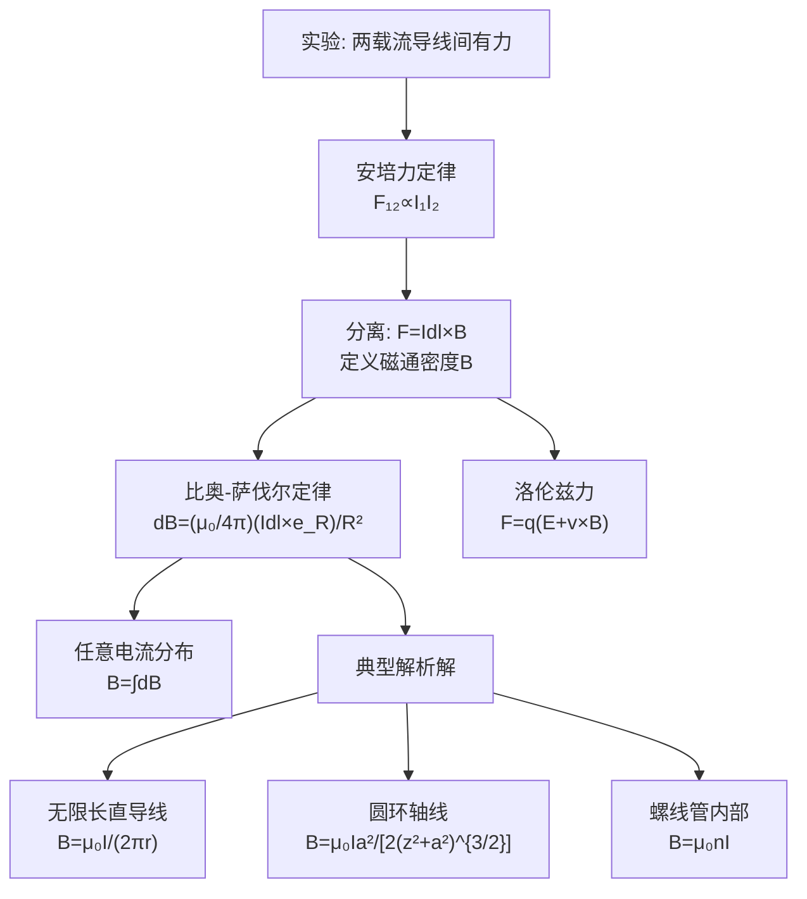

# 磁通密度与安培力定律 MOC

## 教科书原文

> 📖 参见：[[§5-1 磁通密度]], [[§5-2 真空中的恒定磁场]]

## 概念定义（费曼一句话）

磁通密度 $$\mathbf{B}$$（又称磁感应强度）是描述磁场力学效应的核心物理量——它决定了运动电荷和载流导线在磁场中所受的安培力（$$d\mathbf{F} = I d\mathbf{l} \times \mathbf{B}$$），同时满足磁场的无散性（$$\nabla\cdot\mathbf{B}=0$$，无磁单极子）和安培环路定律（$$\nabla\times\mathbf{B}=\mu_0\mathbf{J}$$）。

## 类比与直觉

**类比1：风力与风向标**。$$\mathbf{B}$$ 如同空间中无形的"磁风"，电荷运动（电流）感受到的力 $$q\mathbf{v}\times\mathbf{B}$$ 就像风向标在风中转动——力的方向垂直于运动方向和"磁风"方向（叉乘的右手定则）。这就是为什么在均匀磁场中，运动电荷走的是螺旋线而非直线。

**类比2：重力与"磁重力"**。电场力 $$\mathbf{F}_e = q\mathbf{E}$$ 与电荷运动状态无关（类比重力始终向下），而磁力 $$\mathbf{F}_m = q\mathbf{v}\times\mathbf{B}$$ 与电荷的运动方向有关——只有在运动中才感受得到，且力的方向垂直于运动方向。这就是"磁力不做功"的根源（力与位移始终垂直，$$\mathbf{F}_m\cdot d\mathbf{l} = 0$$）。

## 核心公式详释

**安培力（载流导线元）**：
$$\boxed{d\mathbf{F} = I d\mathbf{l} \times \mathbf{B}}$$

**洛伦兹力（运动电荷）**：
$$\boxed{\mathbf{F} = q(\mathbf{E} + \mathbf{v}\times\mathbf{B})}$$

**比奥-萨伐尔定律**：
$$\mathbf{B}(\mathbf{r}) = \frac{\mu_0}{4\pi}\oint_{l'} \frac{I d\mathbf{l}' \times \mathbf{e}_R}{R^2}$$

**安培力定律（两回路间）**：
$$\mathbf{F}_{12} = \frac{\mu_0}{4\pi}\oint_{l_1}\oint_{l_2} \frac{I_1 d\mathbf{l}_1 \times (I_2 d\mathbf{l}_2 \times \mathbf{e}_{R_{12}})}{R_{12}^2}$$

**B与H的关系（真空中）**：
$$\mathbf{B} = \mu_0\mathbf{H}$$

| 物理量 | 符号 | 单位 | 类比电场量 |
|--------|------|------|-----------|
| 磁通密度 | $\mathbf{B}$ | T (特斯拉) | $\mathbf{E}$ |
| 磁场强度 | $\mathbf{H}$ | A/m | $\mathbf{D}$ |
| 电流元 | $I d\mathbf{l}$ | A·m | $dq$ |
| 安培力 | $\mathbf{F}$ | N | 库仑力 |

## 推导脉络

## 常见误区

1. **比奥-萨伐尔定律和库仑定律完全类似**：形式上相似，但叉乘 $$\times$$ 是关键区别。库仑力沿径向（标量方向），而磁力沿叉乘方向（矢量方向）。这导致磁力线是闭合的（无散），而电场线可以开放（有散）。
2. **认为安培力可以做功**：磁力 $$q\mathbf{v}\times\mathbf{B}$$ 始终垂直于速度方向，对运动电荷不做功。但磁力可以通过洛伦兹力的电分量传递做功——这就是电动机的原理：磁力使导线运动，而维持运动的机械功来自电源。
3. **混淆B和H在真空中**：真空中 $$\mathbf{B} = \mu_0\mathbf{H}$$ 只是相差一个常数，但在介质中两者的物理角色截然不同——B联系着力学效应（安培力），H联系着自由电流的源（安培环路定律）。

## 费曼检验

1. 两根平行无限长直导线通有同向电流I₁和I₂，相距d。它们之间的作用力是吸引力还是排斥力？大小如何？
2. 一个电子以速度v垂直射入均匀磁场B中，其轨迹是什么样的？如果速度有平行于B的分量，轨迹又如何？
3. 比奥-萨伐尔定律中 $$dB \propto 1/R^2$$，为什么无限长直导线的总磁场是 $$B = \mu_0 I/(2\pi r)$$（按1/r衰减）？其中涉及的积分几何因素是什么？

## 概念导航

- **前置**：[[向量积的右手定则]]、[[库仑定律与电场强度]]
- **后继**：[[安培环路定律应用]]、[[介质的磁化 MOC]]
- **核心文件**：[[磁通密度B的定义]]、[[比奥-萨伐尔定律的应用]]

## 自己理解

磁通密度B是电磁学中一个"实操导向"的概念——它与"力"直接挂钩（$$d\mathbf{F} = I d\mathbf{l} \times \mathbf{B}$$），因此是电机、变压器、电磁铁等所有磁性器件的设计基础。理解了B的物理本质（"运动电荷感受到的单位电流-长度力"）就理解了为什么在所有电磁器件中B（而非H）是工程师最关心的量。

> 📖 参见：[[§5-1 磁通密度]], [[§5-2 真空中的恒定磁场]]
